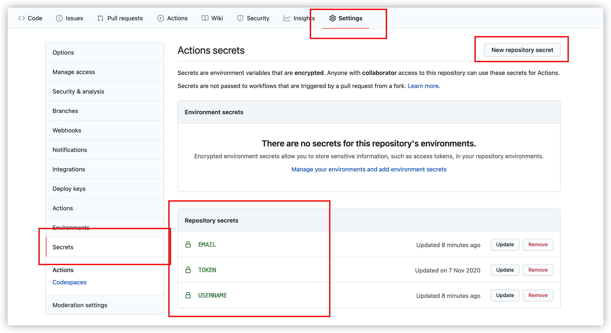
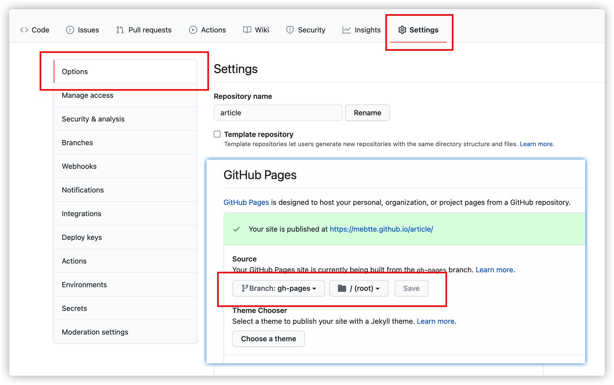

# Answer

MEBTTE's Writing. [https://article.mebtte.com](https://article.mebtte.com)

## Template

This project can be used as template to create article site. Articles written by [Markdown](https://zh.wikipedia.org/wiki/Markdown) on `articles` directory. You can insert any media tag like `audio`/`video`/`iframe` to Markdown and it will parse correctly.

If want to create a article site like this, you can `fork` this project. After this, you should remove all articles and change `scripts/config.js` to fit your mind.

### Requirement

- Node.js >= 14.12.0

### Directory

```txt
|- articles # article list
|- scripts
  |- build.js # build script
  |- config.js # build config
|- src
  |- static # static resource
  |- template # site template
```

### Article structure

Every article need to follow the structure:

```txt
|- articles
  |- aritcle_a
    |- index.md
    |- other files
  |- aritcle_b
    |- index.md
    |- other files
```

The directory's name of aritcle will be a part of url, like `https://article.mebtte.com/aritcle_a`, you can import any file using relative path like:

```txt
|- article_a
  |- index.md
  |- image.png
  |- music.mp3
```

```md
<!-- index.md -->


<audio src="./music.mp3"></audio>
```

You need to fill metadata on `index.md`, for example:

```md
---
title: "Hello world!"
publish_time: "2020-10-01"
updates:
  - time: "2020-10-02"
    description: "update description"
  - time: "2020-10-03"
    description: "update description"
hidden: false
---

article content, article content, article content, article content.
```

The meaning and type of metadata:

```ts
interface Metadata {
  /** article title */
  title: string;
  /** publish time, using YYYY-MM-DD format */
  publish_time: string;
  /** update records */
  updates?: {
    time: string; // update time, using YYYY-MM-DD format
    description: string; // update description
  }[];
  /**
   * Whether to hide article
   * if true, the article is invisible on home page
   * but can visit by url
   */
  hidden?: boolean;
}
```

### Preview

```bash
npm install
npm run serve # http://localhost:9000
```

### Build

```bash
npm install
npm run build
# the build directory is the output
```

You can set environment variable to change behavior:

| variable    | description   | example                             |
| ----------- | ------------- | ----------------------------------- |
| ORIGIN      | public origin | ORIGIN="https://article.mebtte.com" |
| PUBLIC_PATH | public path   | PUBLIC_PATH="/my_article"           |

Also, you can update `scripts/config.js` to do the same thing. If you set environment variable and update `scripts/config.js` both, the environment variable will **cover** `scripts/config.js`'s property.

### GitHub Pages

This project can deploy to `Github Pages` automatically. You should go to `Your repository --> Settings --> Secrets` and add secrets `TOEKN` / `EMAIL` / `USERNAME`.

| Secret   | Descritpion                                                                                |
| -------- | ------------------------------------------------------------------------------------------ |
| TOKEN    | github token, you can generate on [Developer settings](https://github.com/settings/tokens) |
| EMAIL    | git user.email, allow different with github email                                          |
| USERNAME | git user.name, allow different with github name                                            |



The last step, you need to set `gh-pages` branch as `GitHub Pages` on `Your repository --> Settings --> GitHub Pages`.



If you do not want it, just remove `.github` directory.

## License

<a rel="license" href="http://creativecommons.org/licenses/by-nc-sa/4.0/"></a><br />This work is licensed under a <a rel="license" href="http://creativecommons.org/licenses/by-nc-sa/4.0/">Creative Commons Attribution-NonCommercial-ShareAlike 4.0 International License</a>.
