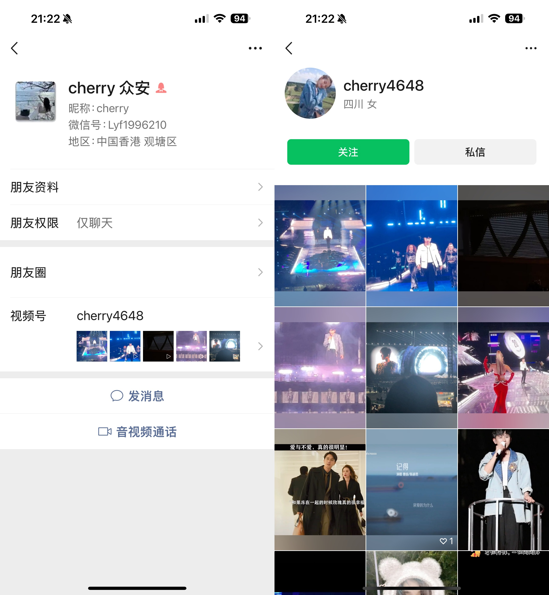
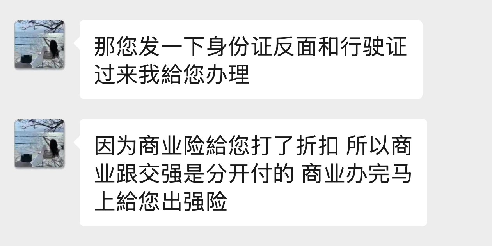
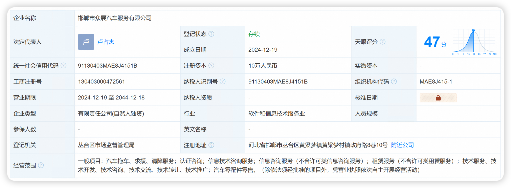
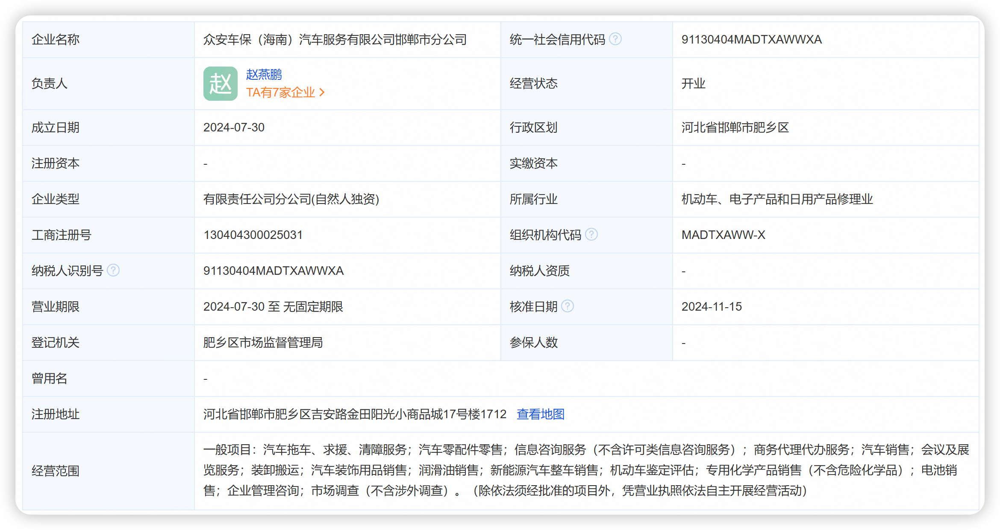
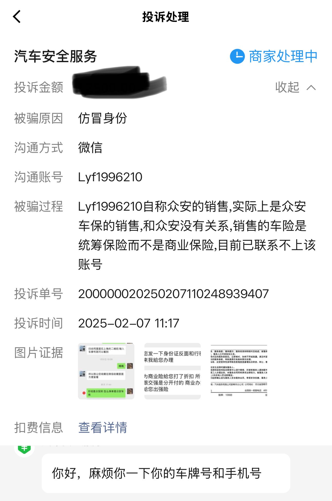
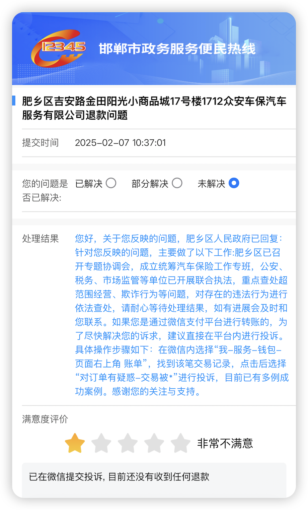
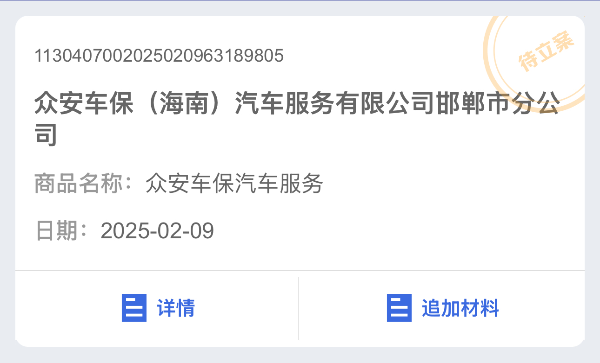
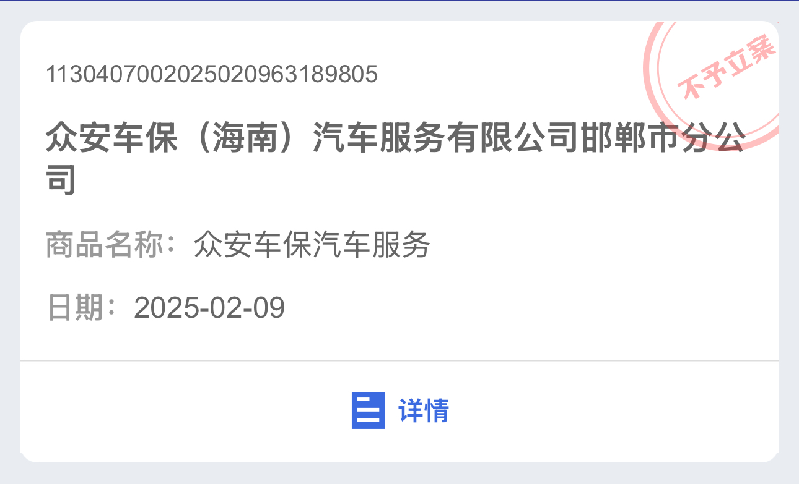
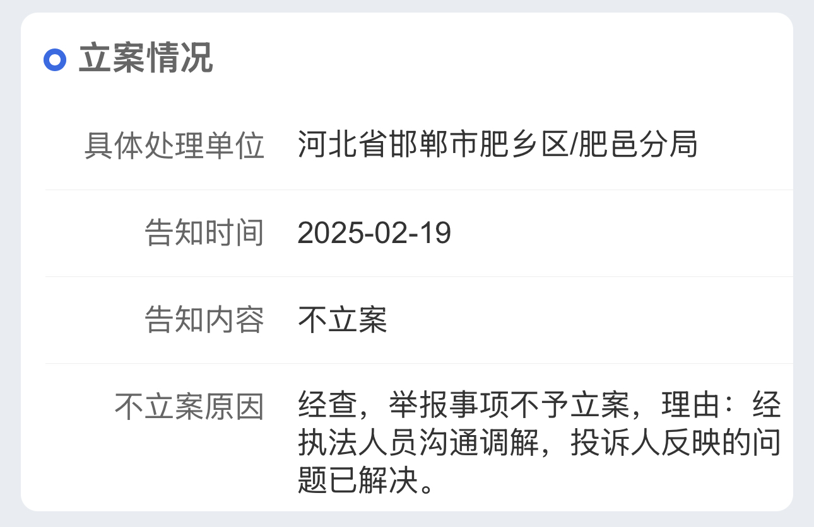

年初的时候车险快要到期, 当时好几个保险销售加我微信给我报价单(好奇怎么知道我信息), 有平安/人保这些, 还有个自称**众安**的销售也给我报了价, 她的报价比其他保险要低 5% 到 10% 这样子.

后面才知道这个自称众安的销售其实是**众安车保**, 众安是正规保险公司, **众安车保**是打着众安旗号的李鬼公司, 而且所谓的车险是统筹保险, 不受保监会监管.

> **统筹保险**是一种非传统的风险分担机制, 通常由行业协会/企业联盟或特定组织发起, 通过成员共同缴纳费用形成资金池, 用于补偿成员在特定风险(如车辆事故/财产损失等)中的经济损失. 其核心是"互助共济", 而非商业化保险运作 -- 来自 DeepSeek

这是车子第二年的保险, 第一年是汽车销售帮买的, 加上自己对车险也没什么了解, 所以就跟这个自称众安的销售买了保险. 还有一个原因是公司买的商业保险也是众安的, 理赔几次都很顺利, 所以对众安有一丝丝好感.

其实整个购买过程也是疑点重重, 但是都被自己的粗心大意忽视了.

## 一. 商业险和交强险是分开购买的, 而且交强险是跳转到平安保险支付的, 商业险是在微信中扫码支付的

## 二. 微信支付过程中有提示风险, 但是被自己强行忽略了 🐶

## 三. 众安 App 上没看到保单, 但是没引起警觉相信了骗子的说法

## 四. 骗子给的 PDF 保单没仔细查看, 与正规商业保险保单完全不同

所以总结下来不是骗子骗术高明, 而是自己智商低. 然后我是怎么过了一个月发现这是个假保险的呢? 说来也巧, 有个朋友突然问我交强险保额有多少, 我也不太记得所以翻了一下骗子给的 PDF 保单, 然后发现保单怪怪的, 于是查了一下就发现上当了 😅

其实保费被骗是小事, 脱保在路上跑了一个月才可怕, 所以发现保单是假的第一时间我就在正规保险的 App 上了险.

本来我是想找那个骗子销售退保的, 结果...

后面在所谓的保单上发现了一个客服电话 **400-900-3566**, 打过去要求退保, 工号 3007 的客服听说是退保就开始不耐烦, 估计是上当退保的人太多了, 就说三天内有人联系我, 我本来还有话要说的, 还没说完她那边就挂了. 后续的话即便退保, 我也会向保监会/消费者协会之类的部门进行投诉举报, 对于这种骗人勾当不能姑息.

> 客服电话小彩蛋, 菜单键 3 <投诉建议>永远打不通

<audio controls src="./unavailable_complaint.m4a"></audio>

最后总结一下这种统筹险的套路, 如果有以下特征就要擦亮双眼:

1. 正规保险公司名字后面带什么**车保**/**车服**, 一般都是李鬼
2. 保费是扫码转账而不是跳转正规 App 付款的
3. 保单上写的不是保险, 而是什么服务/保障的
4. 对比其他保险公司价格特别低

当然, 最稳妥的做法是直接在知名保险 App 里购买或者续保, 不要相信任何主动联系你的人. 虽然直接购买会比销售提供的价格高, 但是至少保证不会被骗.

---

## 02-07 进展

上午有个自称是众安车保售后加了我微信, 让我提供跟销售的聊天截图, 然后说他们会跟进处理.

投诉的话先是打了 **12378** 保监会, 他们表示众安车保所属的**邯郸市众展汽车服务有限公司**是统筹公司, 不属于他们的监管范围, 让我向当地的市场监督管理局投诉.

打电话给邯郸市市场监督管理局 **0310-8066111**, 听说是保险之后他们让我拨打 **12315** 进行投诉, 而且表示已经很多人过来投诉这家公司.

然后拨打 **12315**, 我的所在地是广州, **12315** 表示商家地址不在广州需要拨打当地的 **12345** 投诉.

结果我拨打 **0310-12345** 一直提示忙线, 无法接入.

然后我换了个思路, 拨打 **0310-12315**, 终于接入了客服, 描述详情后需要我提供完整公司名称/地址和电话才能投诉, 好在所谓的保单写了相关信息, 提供之后 **12315** 表示核实后后续会联系我.

我也查了一下收款公司和保单上的公司, 大概率都是皮包公司.

我也在微信支付进行了投诉, 正在等待处理.

## 02-08 进展

邯郸市 **12315** 给了回复, 但都是一些空话, 没有任何实际进展.

## 02-09 进展

重新在 **12315** 小程序上提交了举报, 正在等待处理.

## 02-18 进展

邯郸市市场监督管理局打电话过来询问了一下情况, 并表示他们会督促该企业退款.

## 02-19 进展

早上众安车保的售后联系了我, 问我能不能先撤诉, 退款的问题他会尽快给我处理, 我只能回复退款了自然会撤诉. 然后中午的时候一位自称众安财务的人添加了我微信, 表示给我退款. 她的微信昵称就是**众安财务**, 还在擦边众安.

这位财务表示保险从 01-31 生效, 到今天已经生效 19 天, 需要扣除 19 天的保费. 我说我只能同意退全款或者扣除 6 天的保费, 因为我是 02-06 要求退保的, 最后她那边同意了扣除 6 天的保费, 最后退款是 `保费 - 保费 / 365 * 6`.

下午邯郸市市场监督管理局打了电话回访, 我回复已经收到退款, 然后发现 `12315` 上的举报单状态变成了 `不予立案`, 然后添加了说明:

至此, 假保险事件也算得到解决, 这里也感谢邯郸市市场监督管理局的相关工作人员. 不过我还是希望这种无良公司能受到相应的处罚, 由始至终**众安车保**的态度就是 `没被发现就赚到, 被发现就装死, 被举报就退款`, 没有相应的处罚其实就是变相纵容这种骗局.

### 相关报道

- [警惕“众安车服”车险骗局！后果不堪设想：商业险呈脱保状态而车主自不知](https://www.thepaper.cn/newsDetail_forward_29986917)
- [警惕车险市场陷阱：“交通安全统筹”低价背后的隐患](https://www.sfccn.com/2024/9-30/wMMDE0MDZfMTk1NTUwMg.html)
