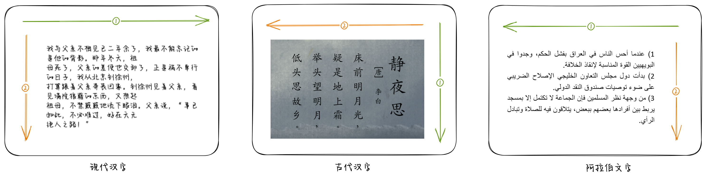
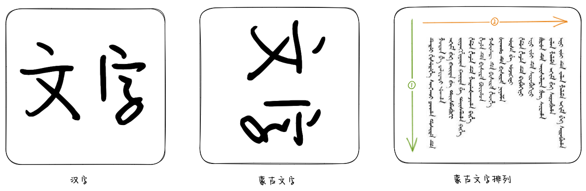
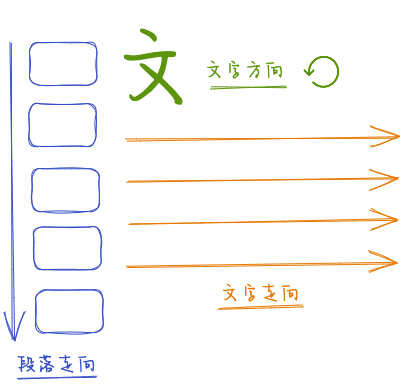
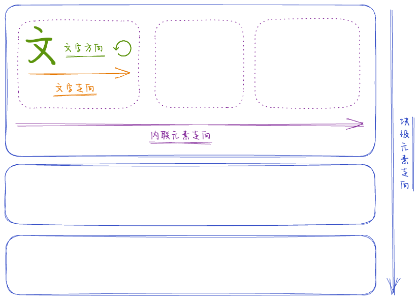
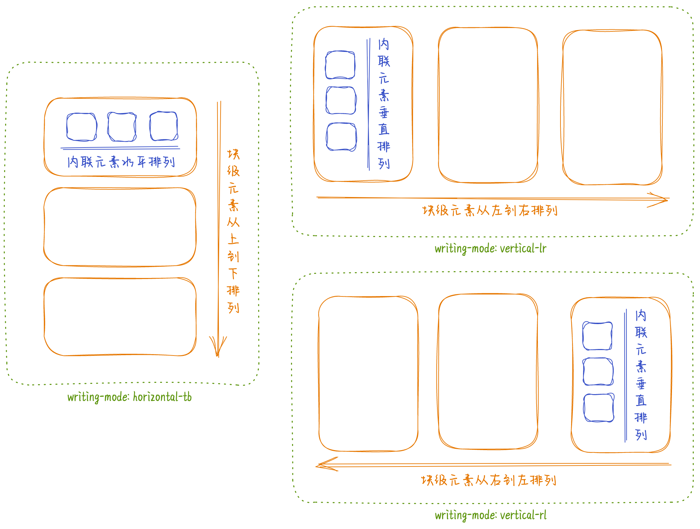
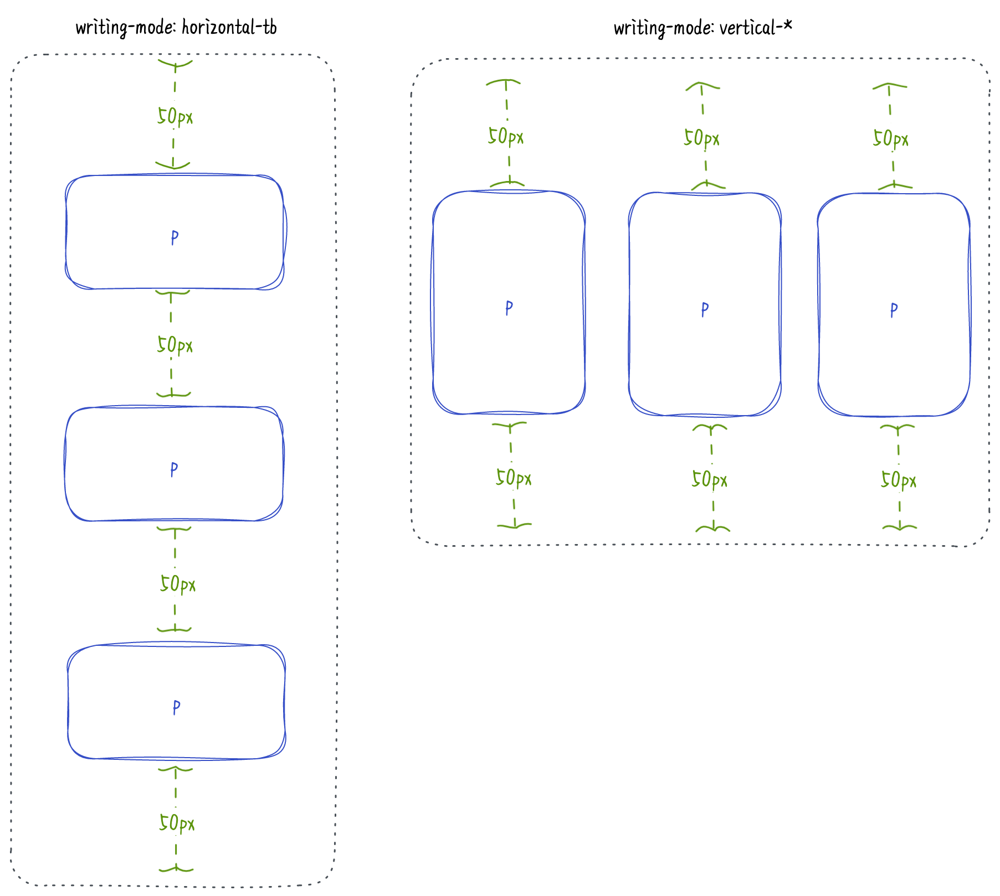
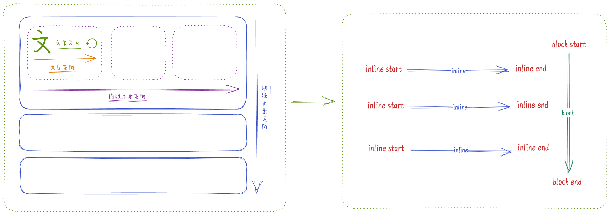
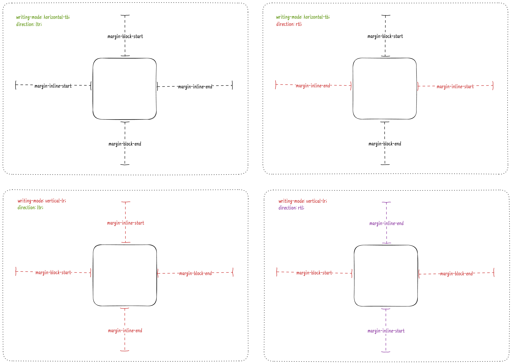
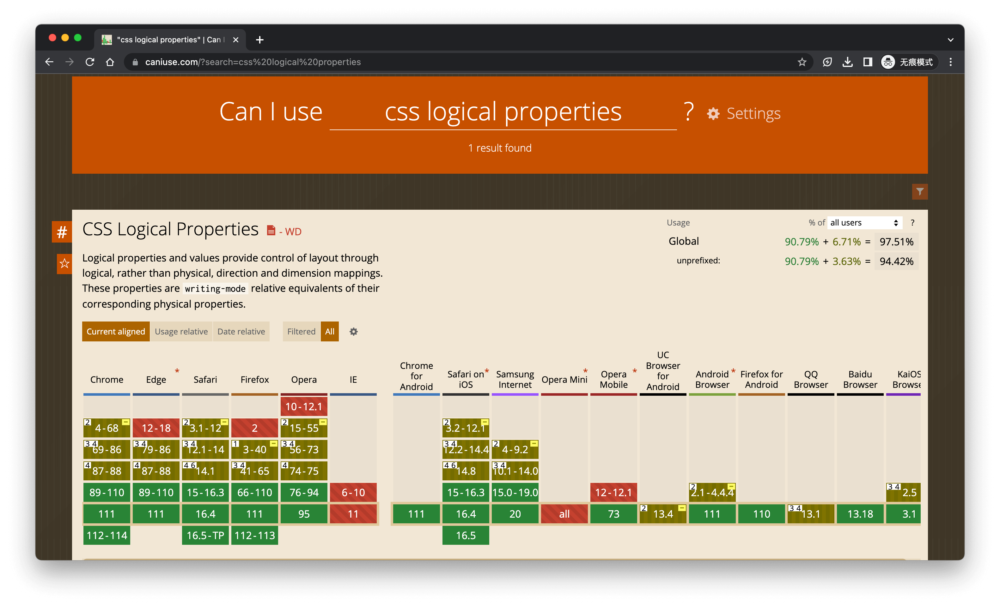

所谓书写模式, 就是文本是如何排版的. 我们写字的时候可能从来没有注意过字与字之间是如何排列的, 都是自然而然地从左往右写满一行然后往下换行, 然而像我们的古人并不是按照这个方式去排列文本的, 他们是从上往下写满一列后再往左换一列.


除了我们古人, 现在的很多语言的文字也不是按照这个方式排列的, 比如阿拉伯文字是从右往左写满一行后往下换行:



甚至有一些语言连文字的方向都和我们不一致, 比如蒙古文字相当于汉字横着排放:



从上面的例子可以看出, 一种文字的排版由`文字方向`/`文字走向`/`段落走向`三部分组成:



在浏览器中, 情况要比上面复杂一点, 因为除了文本, 浏览器还有`内联元素(inline)`/`块级元素(block)`, 所以浏览器的排版可以这样表示:



面对复杂的排版, 我们就需要 CSS [书写模式](https://drafts.csswg.org/css-writing-modes)(Writing Modes) 了.

这里有一个省心的点, 浏览器会自动通过复杂的 unicode 算法来展示不同语言, 总能设置成合适的文字方向和走向, 比如下面的阿拉伯文:

يمكنني التحدث قليلاً باللغة العربية

CSS Writing Modes 有多个 CSS 属性来控制排版, 我们看一下常见的几个:

## [writing-mode](https://developer.mozilla.org/docs/Web/CSS/writing-mode)

`writing-mode` 用来控制内联元素是水平排列还是垂直排列以及控制块级元素的走向, 所以 writing-mode 的值分为两部分, 第一部分表示内联元素是水平排列(horizontal)还是垂直排列(vertical), 第二部分表示块级元素的走向, 当内联元素是水平排列时可以是从上到下(tb, top to bottom), 当内联元素是垂直排列时可以是从左到右(lr, left to right)或者从右到左(rl, right to left).



> 想一想为什么没有 `horizontal-bt` ?

比如我们想要实现古文的效果, 通过 `writing-mode: vertical-rl` 就能够实现了:

<iframe scrolling="no" src="https://codepen.io/mebtte/embed/QWVzKJm?default-tab=css%2Cresult" frameborder="no" loading="lazy" allowtransparency="true" allowfullscreen="true">
  See the Pen <a href="https://codepen.io/mebtte/pen/QWVzKJm">
  traditional_chinese</a> by MEBTTE (<a href="https://codepen.io/mebtte">@mebtte</a>)
  on <a href="https://codepen.io">CodePen</a>.
</iframe>

其实 `writing-mode` 改变的是流的方向, 比如上面的例子我们给 `html` 添加 `writing-mode: vertical-rl`, 可以发现整个文档的滚动方向也变成了从右到左, 或者你可以更改本页面的 `writing-mode` 然后观察一下滚动方向:

<select id="writing-mode">
  <option value="horizontal-tb">horizontal-tb</option>
  <option value="vertical-lr">vertical-lr</option>
  <option value="vertical-rl">vertical-rl</option>
</select>
<script>
  document.querySelector('#writing-mode').addEventListener('change', event => {
    document.documentElement.style.writingMode = event.target.value;
  })
</script>

此外, 还有一个需要注意的点, 我们都知道相邻两个块级元素的上下外边距会重叠合并, 当 `writing-mode` 变成 `vertical-*` 时, 上下外边距重叠合并会变成左右外边距重叠合并:

<iframe scrolling="no" title="margin collapsing" src="https://codepen.io/mebtte/embed/GRXeYgo?default-tab=css%2Cresult" frameborder="no" loading="lazy" allowtransparency="true" allowfullscreen="true">
  See the Pen <a href="https://codepen.io/mebtte/pen/GRXeYgo">
  margin collapsing</a> by MEBTTE (<a href="https://codepen.io/mebtte">@mebtte</a>)
  on <a href="https://codepen.io">CodePen</a>.
</iframe>

## [direction](https://developer.mozilla.org/docs/Web/CSS/direction)

`direction` 用来控制内联元素的走向, 有两个值:

- `ltr`, 从左到右(Left to Right)
- `rtl`, 从右到左(Right to Left)

比如实现从右到左的布局:

<iframe scrolling="no" src="https://codepen.io/mebtte/embed/ExeGNoK?default-tab=html%2Cresult" frameborder="no" loading="lazy" allowtransparency="true" allowfullscreen="true">
  See the Pen <a href="https://codepen.io/mebtte/pen/ExeGNoK">
  traditional_chinese</a> by MEBTTE (<a href="https://codepen.io/mebtte">@mebtte</a>)
  on <a href="https://codepen.io">CodePen</a>.
</iframe>

`direction` 的值个人认为有点歧义, 因为当 `writing-mode` 的值是 `vertical-*` 时, `direction` 表示`左右`变成了表示`上下`:

<iframe scrolling="no" title="vertical direction" src="https://codepen.io/mebtte/embed/VwGgozN?default-tab=css%2Cresult" frameborder="no" loading="lazy" allowtransparency="true" allowfullscreen="true">
  See the Pen <a href="https://codepen.io/mebtte/pen/VwGgozN">
  vertical_direction</a> by MEBTTE (<a href="https://codepen.io/mebtte">@mebtte</a>)
  on <a href="https://codepen.io">CodePen</a>.
</iframe>

## [text-orientation](https://developer.mozilla.org/docs/Web/CSS/text-orientation)

上面说到浏览器会自动识别语言来展示合适的文字方向, 此外我们也可以通过 `text-orientation` 手动控制:

<iframe scrolling="no" title="traditional_chinese" src="https://codepen.io/mebtte/embed/VwGgogZ?default-tab=css%2Cresult" frameborder="no" loading="lazy" allowtransparency="true" allowfullscreen="true">
  See the Pen <a href="https://codepen.io/mebtte/pen/VwGgogZ">
  traditional_chinese</a> by MEBTTE (<a href="https://codepen.io/mebtte">@mebtte</a>)
  on <a href="https://codepen.io">CodePen</a>.
</iframe>

不过目前 `text-orientation` 效果还很有限, 尚未支持任意方向.

## [unicode-bidi](https://developer.mozilla.org/docs/Web/CSS/unicode-bidi)

同样地, 浏览器会根据语言自动调整文字走向, 我们也可以通过 `unicode-bidi` 来覆盖浏览器的默认行为:

<iframe scrolling="no" title="Untitled" src="https://codepen.io/mebtte/embed/BaObBRw?default-tab=html%2Cresult" frameborder="no" loading="lazy" allowtransparency="true" allowfullscreen="true">
  See the Pen <a href="https://codepen.io/mebtte/pen/BaObBRw">
  Untitled</a> by MEBTTE (<a href="https://codepen.io/mebtte">@mebtte</a>)
  on <a href="https://codepen.io">CodePen</a>.
</iframe>

虽然 CSS Writing Modes 能够帮助我们实现不同语言下的排版, 但是在多语言切换的情况下依然会存在一些问题. 比如下面的例子, 我们希望每个段落之间间隔 `50px`, 通过给 `p` 添加 `margin: 50px 0` 可以实现. 但是当 `writing-mode` 从 `horizontal-tb` 变成 `vertical-*` 后, 就和我们预期的样式不一致了:

<iframe scrolling="no" title="p margin" src="https://codepen.io/mebtte/embed/LYJaJEd?default-tab=css%2Cresult" frameborder="no" loading="lazy" allowtransparency="true" allowfullscreen="true">
  See the Pen <a href="https://codepen.io/mebtte/pen/LYJaJEd">
  p margin</a> by MEBTTE (<a href="https://codepen.io/mebtte">@mebtte</a>)
  on <a href="https://codepen.io">CodePen</a>.
</iframe>

原因在于 `margin: 50px 0` 只对 `p` 的上下增加外边距, 当 writing-mode 变成 `vertical-*` 后, 块级元素的走向从上下变成了左右, 而 `p` 左右的外边距是 `0`, 所以最终的效果和我们预期的不符:



我们有很多办法来解决上面的问题, 比如当 `writing-mode` 等于 `vertical-*` 的时候, 我们可以给 `body` 添加 `class`, 然后额外增加样式代码:

```js
document
  .querySelector('#writing-mode')
  .addEventListener('change', (event) => {
    const writingMode = event.target.value;
    document.querySelector('#content').style.writingMode =
      writingMode;

    // body 添加类名 `vertical-writing-mode`
    if (writingMode.startsWith('vertical')) {
      document.body.classList.add('vertical-writing-mode');
    }
    // body 移除类名 `vertical-writing-mode`
    else {
      document.body.classList.remove('vertical-writing-mode');
    }
  });
```

```scss
body {
  p {
    margin: 50px 0;
  }

  // 覆盖 p.margin
  &.vertical-writing-mode {
    p {
      margin: 0 50px;
    }
  }
}
```

不过这种方法既复杂又不优雅, 这时候就该 CSS 逻辑属性(Logical Properties)出场了.

在 CSS 中, 各种属性或者值中的`上下左右`/`宽高`都是基于屏幕的, 这就带来上面 `writing-mode` 变成 `vertical-*` 后样式与我们的预期不符的问题. 所以在 CSS Logical Properties 中推出了基于 Writing Modes 的属性和值.

在 CSS Logical Properties 中, 增加了 `block` 和 `inline` 两个方位, 以及基于 `block` 和 `inline` 的 `start` 和 `end`.



以 `margin` 为例, 新增了以下的 CSS 属性,

- margin-block-start
- margin-block-end
- margin-inline-start
- margin-inline-end

在不同的 Writing Modes 下, 可以这样表示:



此外, 还有提供简写的 margin 逻辑属性:

- margin-block: margin-block-start [margin-block-end]
- margin-inline: margin-inline-start [margin-inline-end]

如果省略 `end` 的值, 那么 `end` 将与 `start` 相等. 目前还有个 `logical` 关键字的提案(还没有浏览器实现), `margin` 如果带有 `logical` 关键字, 那么表示这是基于逻辑的值 `margin: logical block-start [inline-start] [block-end] [inline-end]`, 比如以下的两条规则是等价的:

```css
p {
  margin: logical 1em 2em 3em 4em;
}

p {
  margin-block-start: 1em;
  margin-inline-start: 2em;
  margin-block-end: 3em;
  margin-inline-end: 4em;
}
```

回到上面的例子, 我们只需要把 `margin: 50px 0` 改成 `margin-block: 50px` 就能够保证在不同的 Writing Modes 下样式是一致的:

<iframe scrolling="no" title="p logical margin" src="https://codepen.io/mebtte/embed/KKxLzWq?default-tab=css%2Cresult" frameborder="no" loading="lazy" allowtransparency="true" allowfullscreen="true">
  See the Pen <a href="https://codepen.io/mebtte/pen/KKxLzWq">
  p logical margin</a> by MEBTTE (<a href="https://codepen.io/mebtte">@mebtte</a>)
  on <a href="https://codepen.io">CodePen</a>.
</iframe>

元素尺寸也新增了属性 `block-size`/`inline-size`, 表示块级方向上的尺寸和内联方向上的尺寸, 在 `writing-mode: horizontal-tb` 情况下以下两条规则是等价的:

```css
div {
  width: 100px;
  height: 200px;
}

div {
  inline-size: 100px;
  block-size: 200px;
}
```

尺寸单位也提供了 `vb` 和 `vi`, 分别表示视窗块级方向和内联方向上的 `1%` 长度, 对应已有的 `vh` 和 `vw`.

还有一些 CSS 属性名没有改变, 但是增加了属性值, 比如 `resize` 增加了值 `block` 和 `inline`, 表示块级方向上和内联方向上可以改变大小.

```css
textarea {
  resize: block;
}

input {
  resize: inline;
}
```

除了上面提到的, 与方向有关的 `border`/`padding`/`overflow`/`...` 也支持逻辑属性和值, 详细列表可以参看[这里](https://developer.mozilla.org/docs/Web/CSS/CSS_Logical_Properties#reference).

---

虽然 CSS 书写模式和逻辑属性对于多语言切换的页面非常有用, 但是还是要回到前端老生常谈的话题`兼容性`, 通过 [Can I use](https://caniuse.com) 查询, CSS 书写模式各家浏览器支持都很不错, 可以放心地使用. 不过 CSS 逻辑属性的支持度稍微有点问题, 特别是 Safari, 生产环境需要慎重使用.



#### 参考

- [CSS Writing Modes](https://drafts.csswg.org/css-writing-modes)
- [CSS Writing Modes ◆ 24 ways](https://24ways.org/2016/css-writing-modes)
- [改变 CSS 世界纵横规则的 writing-mode 属性 « 张鑫旭-鑫空间-鑫生活](https://www.zhangxinxu.com/wordpress/2016/04/css-writing-mode)
- [CSS Logical Properties and Values](https://www.w3.org/TR/css-logical-1)
