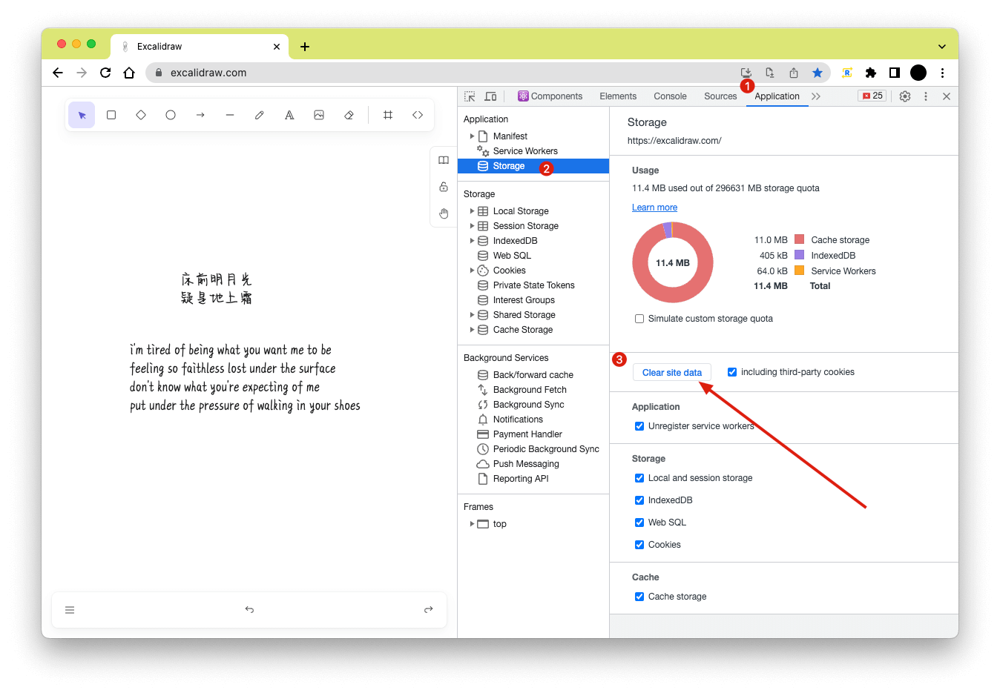

[Excalidraw](https://excalidraw.com) 是一款开源的画板工具, 可以用来绘制带有手写风格的图. 虽然 Excalidraw 本身支持多语言, 但是其手写风格的字体只支持英文, 其他语言会回退到普通字体.

因为 Excalidraw 是开源的, 为了能让其手写风格的字体支持中文, 当时的想法是 [fork](https://github.com/mebtte/excalidraw/tree/7921cb44aaeb9da94d49d371d645510b1e99572c) 之后用支持的中文的手写字体替换原来的, 然后部署在自己的域名下. 这个修改非常简单, 但是带来了几个问题:

- 上游修改需要手动同步到自己的仓库, 自动化拉取无法解决冲突问题
- 一些依赖网络的功能比如实时协作, 因为非官方 Excalidraw 的域名导致无法正常工作

偶然想起页面调试 API 用到过请求拦截工具, 如果拦截并改写手写字体的请求, 这样的话就可以实现支持任意字体, 不仅仅是中文手写字体.

我使用的工具是 [Requestly](https://requestly.io), 登录账号的情况下可以多设备同步数据, 只要在一台设备编辑配置就能同步到其他设备.

首先我们先下载一份喜欢的字体, 需要浏览器支持的格式(ttf/otf/woff/...), 可以在 [Can I use](https://caniuse.com) 查阅字体格式在相关浏览器的兼容性.

然后将字体上传到任意静态资源服务器取得可以访问的 URL, 例如 `https://example.com/favorite.ttf`. 如果没有相关的静态资源服务可以使用 GitHub, 将字体放入 git 仓库然后推送到 GitHub, 就能使用 GitHub 的静态资源服务, 以 Excalidraw 本身为例, Virgil 字体直接访问的链接是 `https://github.com/excalidraw/excalidraw/raw/master/public/Virgil.woff2`.

以 Chrome 为例, 在 DevTools 找到手写字体的请求, 通过预览可以判断手写字体的 URL 是 `https://excalidraw.com/Virgil.woff2`.

在 Requestly 新建 `Redirect Request`, 将 `https://excalidraw.com/Virgil.woff2` 重定向到你的字体链接, 保存后打开该规则的开关. 回到 Excalidraw 的页面, 刷新后应该就能看到你定义的字体.

刷新后字体如果没有生效, 有可能是缓存导致的, 因为 Excalidraw 使用 Service Worker 对资源进行了缓存, 使用 DevTools 删除缓存后重新刷新, 就能够正确显示重定向后的字体了.

> 本文最早发表于 [https://github.com/mebtte/excalidraw](https://github.com/mebtte/excalidraw)
