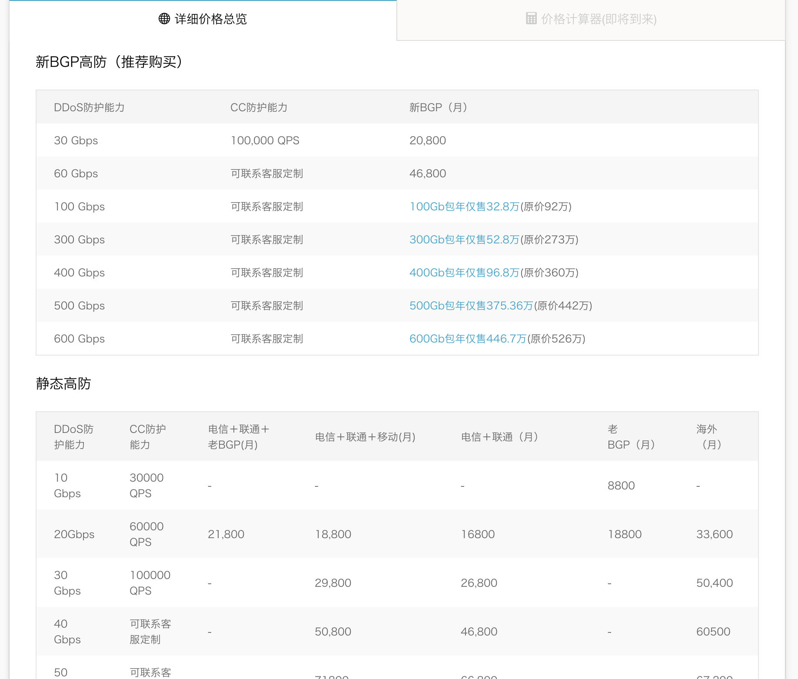
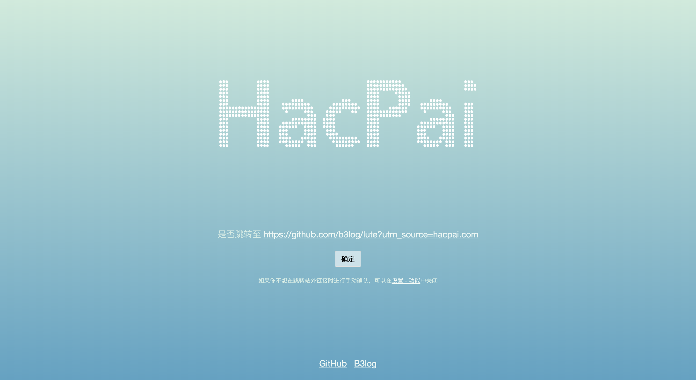

## SQL 注入（SQL Injection）

简单来说，SQL 注入就是服务端有一段 SQL 需要依靠客户端传过来的数据进行构造，当客户端传递给服务端的是恶意数据，就有可能导致 SQL 注入。

以 JS 为例，我们有一段 SQL 根据客户端传过来的关键字进行搜索

```js
const SQL = `SELECT * from music where name = "${keyword}";`;
```

当客户端给我们的 keyword 是`xxx"; DELETE FROM music WHERE name like "%`，我们的 SQL 就会变成

```sql
SELECT * from music where name = "xxx"; DELETE FROM music WHERE name like "%";
```

这样就达到了恶意攻击的目的。

### 解决方案

对于 SQL 注入，不同的技术栈有不同解决方法，但总体来说有几个核心点

#### 1. 参数检查

对于不同的 SQL 语句可能会有不同的参数检查，这个需要根据具体 SQL 定制不同的参数检查。

#### 2. 字符转义

对一些特殊字符进行转义，比如 `;` `"` `\` 这些。一些语言封装了一些转义函数，比如 PHP 中的 `addslashes`。

#### 3. 隐藏数据库细节

像上面的例子，返回数据如果是

```json
{
  "music": {
    "id": 123,
    "name": "xxx"
  }
}
```

攻击者很容易推断出数据库有一个 `music` 表，拥有 `id` 和 `name` 两个字段，已知的信息越多，被攻击成功的概率越大。所以我们可以隐藏一些数据库的细节，比如 `music` 表命名为 `music_xxx`，字段 `id` 改成 `idx`，`name` 改成 `name_x`，然后通过代码层面转换成上面所需要的格式。

## 点击劫持（Clickjacking）

以微博为例，一般的攻击过程大概是

1. 用户被诱导进入恶意网站
2. 恶意网站有一个置顶且透明的 iframe，src 指向 https://weibo.com
3. 恶意网站上有一个诱惑性的按钮（比如“点击领取红包”），按钮位置和 iframe 上的点赞重合，用户点击按钮实际上是点击微博的点赞

[这是一个"示意"例子](/demo/clickjacking.html)，透明的`点赞按钮`"劫持"了`点击就送`按钮。

### 解决方案

点击劫持出现过很多解决方案，但都被证明有漏洞，目前有效的两个方法：

#### 1. [X-Frame-Options](https://developer.mozilla.org/zh-CN/docs/Web/HTTP/X-Frame-Options)

通过 http-header 字段 `X-Frame-Options` 可以改变页面在 frame 中的加载行为。

| 取值              | 加载行为                      |
| ----------------- | ----------------------------- |
| DENY              | 禁止页面在 frame 中加载       |
| SAMEORIGIN        | 允许在同域页面的 frame 中加载 |
| ALLOW-FROM domain | 允许在指定域的 frame 中加载   |

注意，`X-Frame-Options` 须由服务端发送，在 html 中声明 `<meta http-equiv="X-Frame-Options" ... />` 不会生效。

#### 2. 顶层遮罩

window 有个 [top](https://developer.mozilla.org/zh-CN/docs/Web/API/Window/top) 属性返回窗口最顶层的引用，通过 `window !== window.top` 可以判断页面是否在 frame 中，当判断在 frame 中时创建一个 `height: 100%; width: 100%;` 的 div 遮挡页面，达到屏蔽鼠标事件的目的。这种方案的缺点在于页面在 frame 中无法处理鼠标事件。

## 拒绝服务攻击（Denial of Service, DoS）和分布式拒绝服务攻击（Distributed Denial of Service, DDoS）

拒绝服务攻击就是通过恶意程序将服务器的计算资源或带宽资源耗尽。比如有一台服务器每秒钟能处理 100 个请求，当攻击者向服务器发送大量请求，超过服务器能够接受的 100 个请求/秒，就会导致其他正常请求无法被处理。分布式拒绝服务攻击则是攻击者通过控制多台计算机向服务器发起拒绝服务攻击。

### 解决方案

事实上，对于这类攻击没有很好的解决手段，只能在一定程度上缓解攻击带来的影响。

#### 1. 防火墙

当攻击从少数 IP 地址发起的时候，可以通过防火墙阻止这些 IP 发起的通信。对于大规模 DDoS，其实效果并不理想。

#### 2. 黑洞引导

比如服务器只能处理 100 个请求/秒，攻击是 1000 个请求/秒，那直接把服务器升级成处理能力请求大于 1000 个/秒，当攻击是 10000 个/秒时，升级成处理能力大于 10000 个/秒。这其实是一个和攻击者博弈的过程，因为攻击也是需要成本的，当攻击变得无效或者不理想的时候，攻击者自然会取消攻击。当然，像升级服务器这种成本不是一般公司和个人能够承受的，比如，阿里云的 DDoS 防御套餐价格  


## 跨站脚本攻击（Cross Site Scripting, XSS）

跨站脚本攻击就是攻击者通过漏洞在页面插入恶意脚本，从而达到攻击目的。之所以 Cross Site Scripting 的缩写是 XSS，是为了避免与 CSS 重名。

比如，我们的网站有一个评论功能，用户发表的评论保存在数据库，之后渲染在 html 模板上

```js
const html = `
  ...
  <div class="comment">{comment}</div>
  ...
`; // comment是用户输入的内容
```

当用户输入 `这是评论，这是评论！<script src="attack.js"></script>`，html 就会变成

```html
...
<div class="comment">
  这是评论，这是评论！
  <script src="attack.js"></script>
</div>
...
```

当别的用户访问带有这个评论的页面时，恶意脚本就会在用户的浏览器中执行，恶意脚本可以盗取用户信息或者用于其他目的。

### 解决方案

从本质来说，XSS 能够被用于攻击完全是网站自己的漏洞，最简单也是最有效的过滤用户输入，比如对用户输入内容进行转义。

## 开放重定向（Open Redirect）

假如我们有个 url 用来重定向，`https://mebtte.com/?redirect=https://google.com` 中 redirect 参数表示重定向到 `google`。攻击者有个恶意网站 `https://example.com`，利用我们的 url 重定向到恶意网站 `https://mebtte.com/?redirect=https://example.com`，用户会以为恶意网站是属于 `mebtte.com` 上的内容。

### 常用解决方案

#### 1. 只做站内重定向，拒绝重定向到站外

比如，`redirect` 只接受 `mebtte.com` 的重定向，其他网站的重定向一律拒绝。

#### 2. 明确告知用户被重定向的地址，在用户允许的情况下进行重定向

比如，在重定向之前弹窗告知用户即将跳转，在用户确认的情况下才允许跳转。下图是 `https://hacpai.com` 的重定向确认  


## 参考资料

- [《图解 HTTP》](https://book.douban.com/subject/25863515)
- [The Modern JavaScript Tutorial](http://javascript.info)
- [拒绝服务攻击](https://zh.wikipedia.org/wiki/%E9%98%BB%E6%96%B7%E6%9C%8D%E5%8B%99%E6%94%BB%E6%93%8A)
