19 年的 4 月的某一天, 逛淘宝的时候在一家叫"[beex 旗舰店](https://beex.tmall.com)"的天猫店发现了一款"[便携显示器](https://detail.tmall.com/item.htm?id=585080255790)"的产品, 根据它的描述, 它是一款轻薄的显示器, 所以可以放进书包随身携带, 最重要的一点, 它宣称支持连接手机, 老罗的 TNT 的有听过? 没错, 你的手机插上这款显示器, 就能变成一台功能强大的电脑.

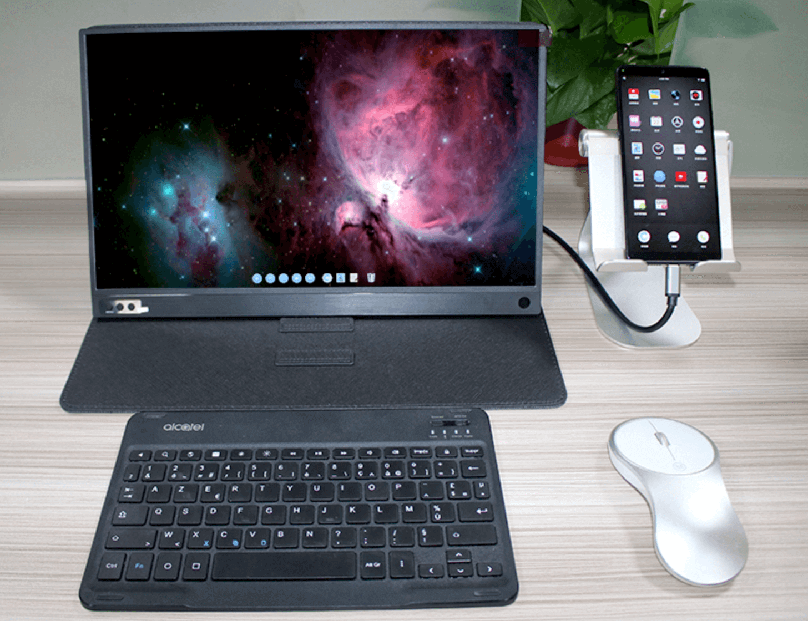

当然, 它并不是支持所有手机, 不然诺基亚的功能机插上也能变电脑, 这也太夸张了. 不过它给出了一个支持手机型号的列表.

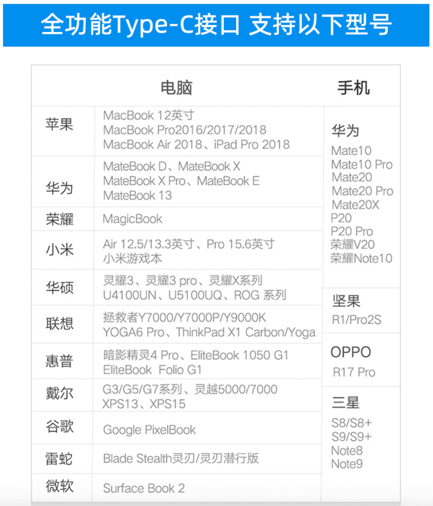

在三星的那一栏, 我发现了 S8. 当时我用的就是三星 Galaxy S8, 没错, 就是三星 Boom 💥7 的下一代, 幸运的是我的 S8 在服役期间没有发生爆炸^\_-||.

> 当时研究了这个手机变电脑的原理, 其实跟这块便携屏幕没有任何关系, 这应该属于手机厂商提供的一个功能. 以三星为例, 三星在基于 Android 封装的 OneUI 上提供了一个叫做 Dex 的服务, 当手机检测到外接显示器的情况下, 会自动打开这个服务, 实际上就是一个桌面版的 Android 系统, 感兴趣的可以在[这里](https://www.samsung.com/global/galaxy/apps/samsung-dex)了解一下.

于是, 我想象了这么一个场景, 外出时可以把沉重的笔记本换成一块轻薄的便携显示器, 聚会玩游戏可以一线把 Switch 的屏幕变大, 因为它在简介里写明了支持 Switch, 平时也可以给笔记本当做第二块显示器, 一切都是这么美好.

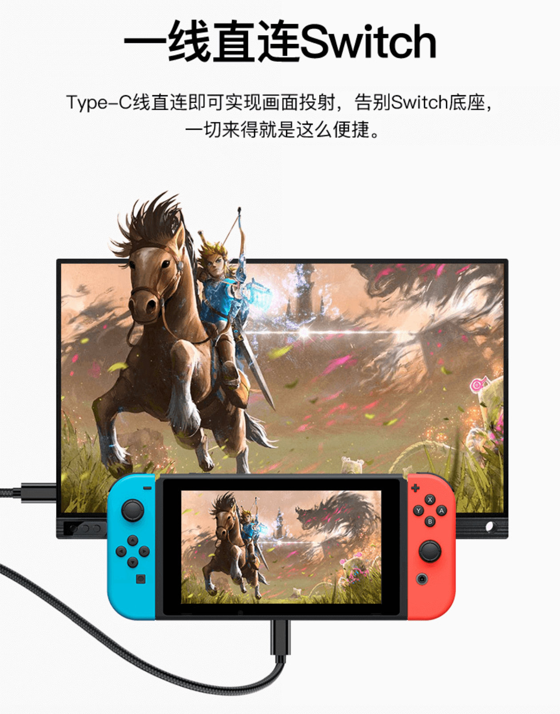

于是, 我下单了.

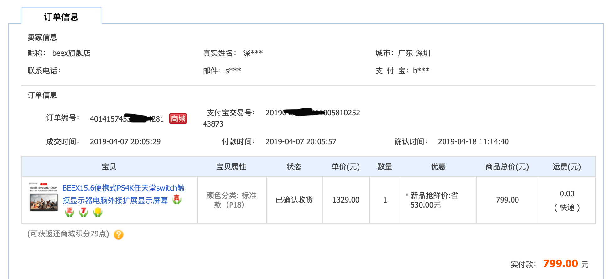

然而事实证明, 这只是我的一个冲动消费, 实际上这块便携显示器并没想象中的那么美好.

首先, 手机加这块显示器是不可能替换笔记本的, 正如上面所说, 所谓的手机变电脑只是一个桌面 Android 系统, 支持的软件有限, 一些常用的 PC 软件手机上根本没有, 作为一个程序员, 手机连一个最基本的 IDE 都没有. 其次, 我忽略了键盘和鼠标这个点, 手机接上外接显示器后自身会变成一个触控板, 但是想通过这块触控板操控电脑有点难度, 所以必须外接键盘鼠标. 第三, 这块便携显示器是没有电池的, 也就是说它消耗的是手机电量, 可想而知, 手机这点电量根本支持不了多久的显示器供电, 所以必须得边充电边用.

从上面可以看出, 如此复杂的一堆东西, 还不如一台笔记本来的轻松.

但是当时收到显示器后我嫌麻烦, 就没有退货, 可以给笔记本当第二块显示器, 因为当时我的笔记本确实需要一块外接显示器一起工作, 虽然这块显示器的分辨率很渣, 但是勉强能用.

因为"嫌麻烦", 所以我"上当了".

也是在 4 月的某一天, 因为忘记拿充电器加上笔记本没电, 于是我想起了手机外接显示器, 但是问题来了, 只要我把音频输出设置成显示器(这款显示器自带扬声器), 显示器就会断开连接(后面我用笔记本测试同样有这个问题). 于是我联系了客服.

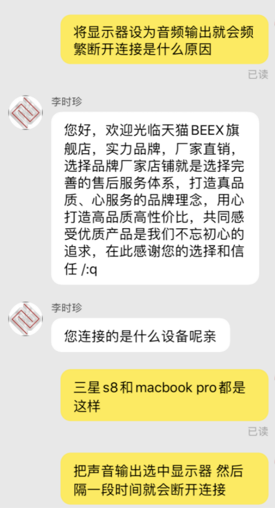
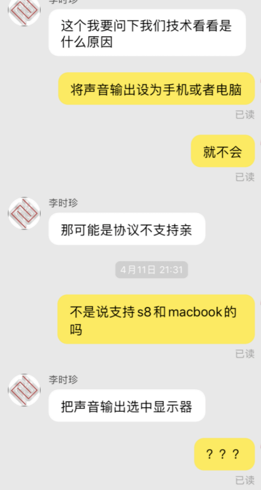
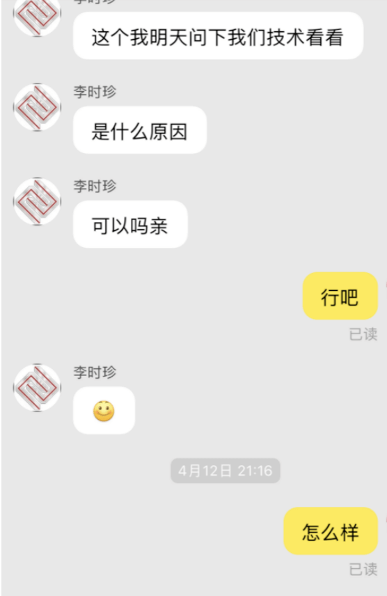
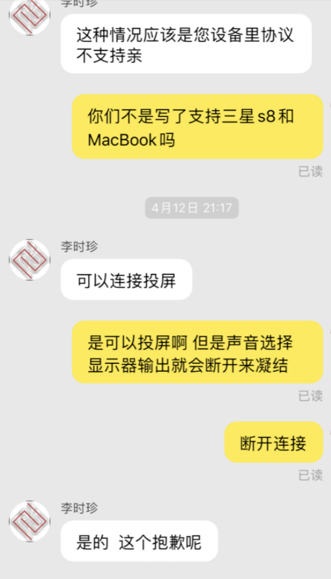

在咨询技术的前提下, 客服给的答案是我的设备不支持他们的显示器.

还记得上面那个支持型号的列表吗? Macbook Pro 和 Galaxy S8 不是清清楚楚地写在那里吗? 行吧, 毕竟退货太麻烦了(事实证明, 嫌麻烦是一切问题的起源), 我不设置音频输出就好了, 至少还能用.

时间过得很快, 转眼我就和这块显示器和平相处到了 9 月(实际上这块显示器显示效果太垃圾了, 4 月到 9 月这段时间我就没用过几次), 某一天我连上了我的笔记本, 但是显示器出了一闪一闪的问题, 根本没有办法正常使用, 我又用 Galaxy S8 测试了一下, 不测不要紧, S8 一连上显示器, 当场阵亡死机(我试了很多方法都无法开机, 后面是连上充电线的情况才能正常重启). 于是, 我再次联系了客服.

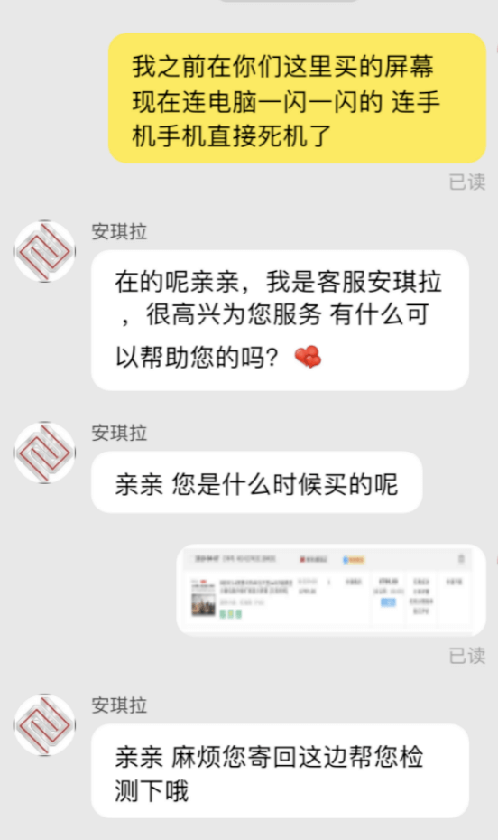

在客服的要求下, 我把显示器, 一根 HDMI 线和一根双向 Type-C 线(这两根线是重点)寄回给了商家检修.

然而我是真的"Too young, too naive", 没有任何戒备就把显示器寄出去了. 在商家签收的第 4 天, 我向客服咨询了检修结果, 在我连续两天的追问下, 客服终于答复了我"需要 15 天才能修好".

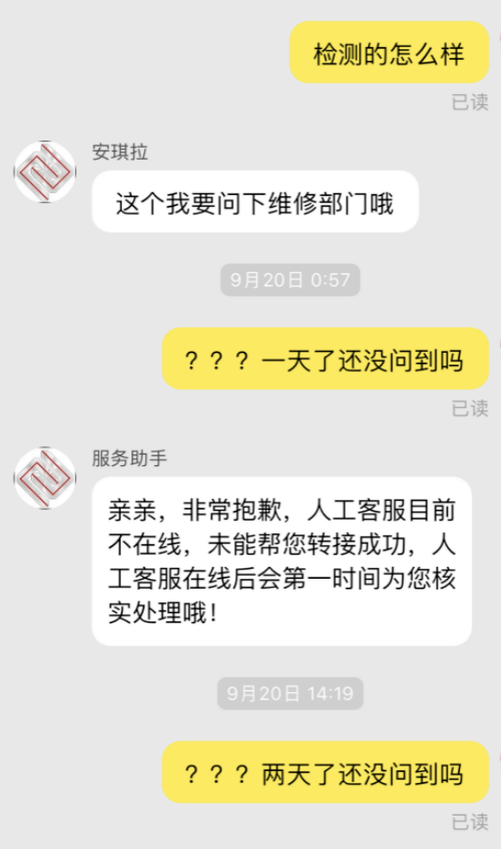

当第 15 天的时候我再次询问客服, 客服答复说是"要 15-30 天才能修好". 这时我已经察觉到有问题了, 但再一次"嫌麻烦", 我选择了继续等 15 天.

终于第 30 天的时候, 我再次询问了客服, 客服表示还需要两周才能修好.

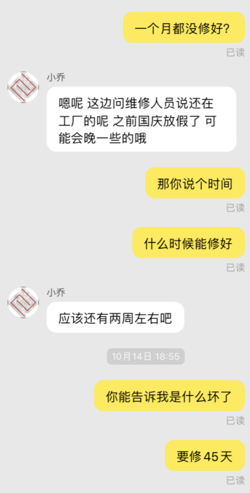

这时我终于明白"我 TM 上当了". 于是, 我直接联系了淘宝客服说明了情况, 具体淘宝客服怎么回复我已经忘了, 他们的大概意思就是让我等到 45 天, 到时候再说.

从商家客服的回复看, 他们显然是在忽悠我, 所以之后我一直没有再去问他们. 过了两周以后, 我依然没有收到我的显示器, 于是我再次联系了淘宝客服, 淘宝客服表示他们会和商家沟通把显示器修好还给我. 此后的几天, 淘宝客服还和我联系了几回.

在淘宝客服的介入下, 在寄回给商家的第 55 天, 我拿回了我的显示器. 但是问题来了, 还记得我把 HDMI 线和双向 Type-C 线也寄回去了吗? 商家没有把线给回我, 加上我没有额外的线以及那几天自己挺忙的, 没有时间去找线来测试显示器是否修好了.

2 天后, 我突然想到, Macbook 的充电线不就是双向 Type-C 吗? 于是我拿出显示器测试, 然而显示器依然是坏的, Macbook 甚至还弹出了 USB 设备警告.

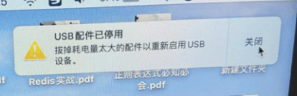

这不是把我当成憨憨了吗? 合着这无良商家就是把显示器放了 55 天, 然后又原样寄回给了我. 老虎不发猫, 你当我是病危啊! 我再次拨打了淘宝客服, 跟客服说明了情况, 客服跟我说了一大堆, 其实可以总结成一个词"无能为力".

既然淘宝客服指望不上, 那么我能想到的只有 [12315](http://www.12315.cn) 了. 这里吐槽一下, 都二十一世纪二十年代了, 12315 还是 HTTP. 很久之前购买的魅族耳机有质量问题, 魅族客服也是忽悠我, 后面通过 12315 才解决.

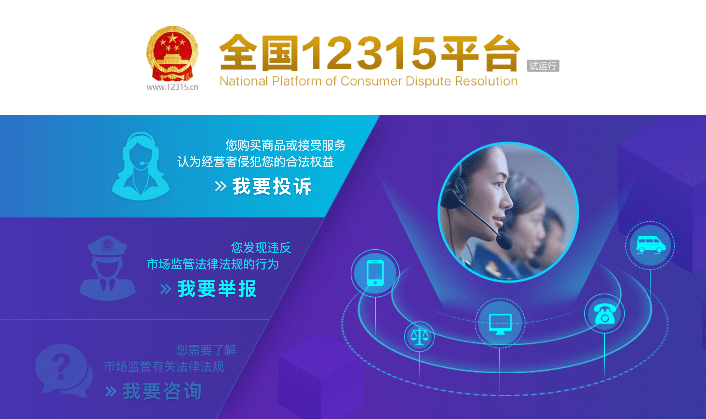

我打开了 12315, 点击"我要投诉". 但是问题来了, 这里需要填写投诉企业信息, 之前投诉魅族因为魅族是个大品牌, 而且是自家产品自己销售, 我直接搜索魅族的资料然后投诉魅族就可以了, 但这个显示器的信息量有点少, 通过天猫旗舰店的 beex 品牌也搜不出什么结果.

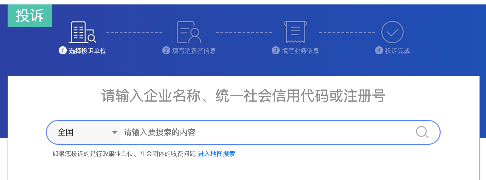

后面通过搜索发现, 在天猫是可以通过店铺信息的企业资质找到店铺的企业信息的. 于是, 我找到了企业信息. 在 11 月 16 日, 我在 12315 提交了投诉信息.

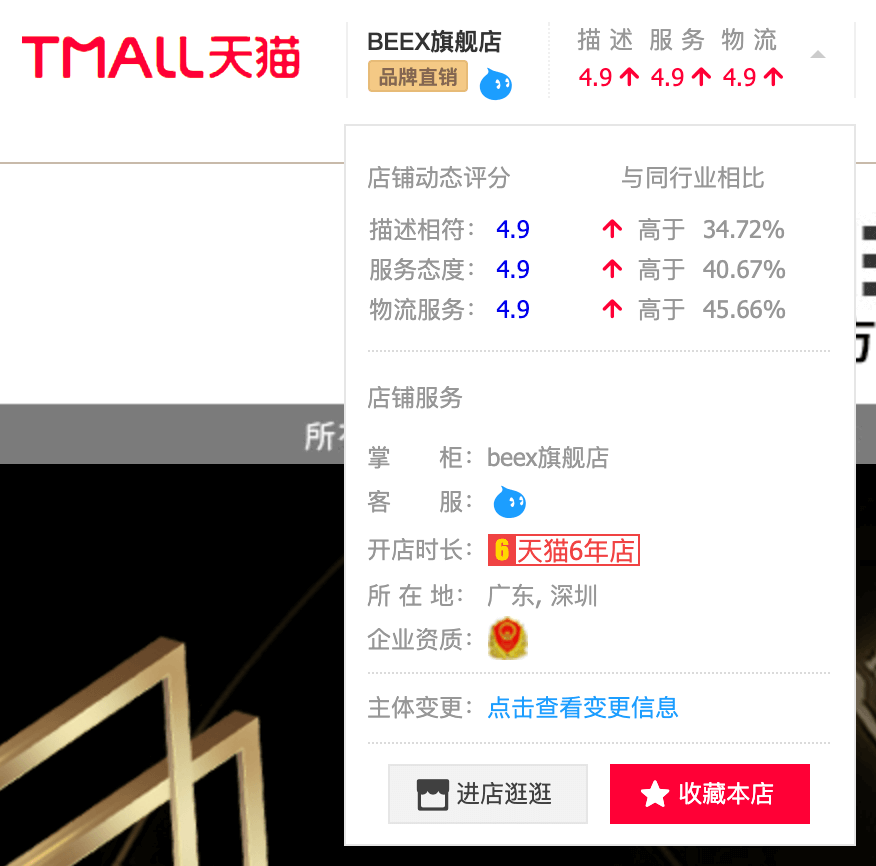
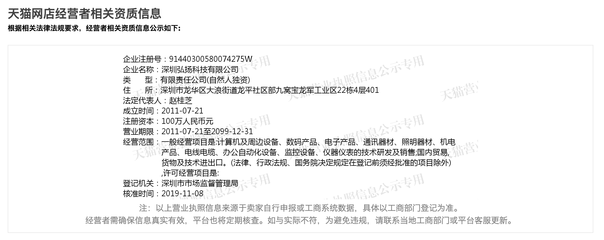
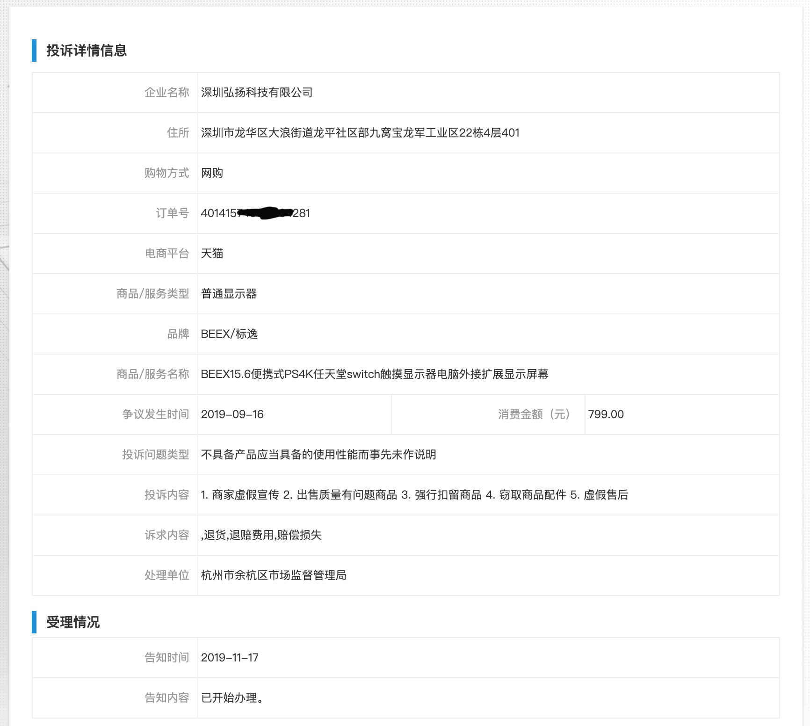

我的投诉内容有 5 个点:

1. 商家虚假宣传. 从客服的回复可知, 这块显示器与 Macbook Pro 和 Galaxy S8 是有兼容性问题的, 但是商家并没有指出反而写在了支持设备中.
2. 出售质量有问题的商品. 这个不用解释了, 这块显示器本身质量有问题才送回维修的.
3. 强行扣留商品. 从一开始的 15 天, 到 30 天, 再到 45 天, 最后第 55 天我通过淘宝客服才拿回商品.
4. 窃取商品配件. 和显示器一起寄回去的数据线并没有退回给我, 当时我是有跟淘宝客服沟通这个问题的, 但商家谎称没有收到我的数据线, 而且寄回去的时候我是没有留下照片或者快递清单这些证据, 所以没有办法证明这一项.
5. 虚假售后. 商家 2 年质量保证, 但有问题商品寄回去在没有维修的情况下重新寄回给我.

之后我又开始了漫长的等待...

- 2019 年 11 月 16 日提交投诉
- 2019 年 11 月 22 日短信告知我受理投诉
- 2019 年 12 月 27 日管理局电话我核实情况, 并告知开始处理投诉

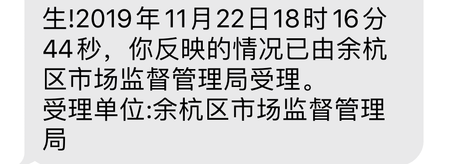

从提交投诉到开始处理投诉经历了 37 天, 我不知道是人手不够还是投诉太多了...

终于在 2020 年的 1 月 14 日(从处理开始又过了 19 天), 我接听到了管理局投诉处理结果的电话. 失望的是, 对方表示他们无法帮我维权. 按照他们的说法, 他们跟商家沟通了, 然后商家拒绝我的退货要求, 理由是超过了"7 天无理由退换", 然后管理局的工作人员表示我还可以通过`司法途径`解决这个问题, 也就是说我可以去法院告这个商家.

至于这个"余杭区市场监督管理局"是如何跟商家沟通的, 我无法得知, 所以我不评价他们的工作. 但是, 显然"7 天无理由退换"不是我投诉的理由, 我的 5 个投诉理由没有一点是和"7 天无理由退换"有关的.

再说说司法途径的问题. 这件商品的价值是人民币 799, 从 19 年 9 月发生故障到 20 年 1 月告知投诉结果这一百三十多天的时间里我已经花费了很多时间在维权, 我很确定我花费时间的价值不止 799, 其次, 通过司法途径意味着我需要花费更多的时间以及额外的金钱, 无论胜诉还是败诉, 我的损失只会越来越多. 所以, 我决定放弃维权.

我总结了一下为什么会维权失败. 第一个原因肯定是商家的无良, 第二我归结为淘宝客服和有关部门没有正确理解我的需求, 第三是我自己的问题, 如果当时发现商品有问题选择退货的话, 就没有后来这些事了.

最后, 我给出的建议是:

1. 谨慎购买三无产品. 这块显示器标的品牌是"BEEX/标逸", 但是我在网上搜索了挺久, 找到的信息不多, 应该是一个十八线贴牌笔记本厂商.
2. 快递保修要谨慎. 我只所以能拿回显示器是因为我保留了寄回去的快递单, 但是寄出的时候没有写清楚快递物品清单, 没有证据证明商家窃取了数据线. 所以, 快递保修一定要写清楚寄出物品以及保留快递单, 当然, 最好的还是选择有线下维修点的.
3. 不要嫌麻烦, 购买到与宣传有出入/有质量问题的商品, 无论价格高低, 一定要选择退货加投诉.

**共建和谐社会, 抵制无良商家**.
