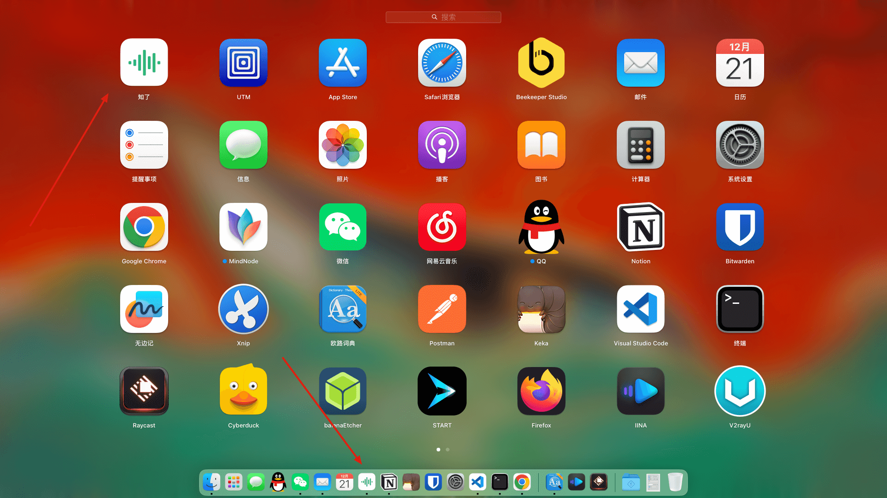
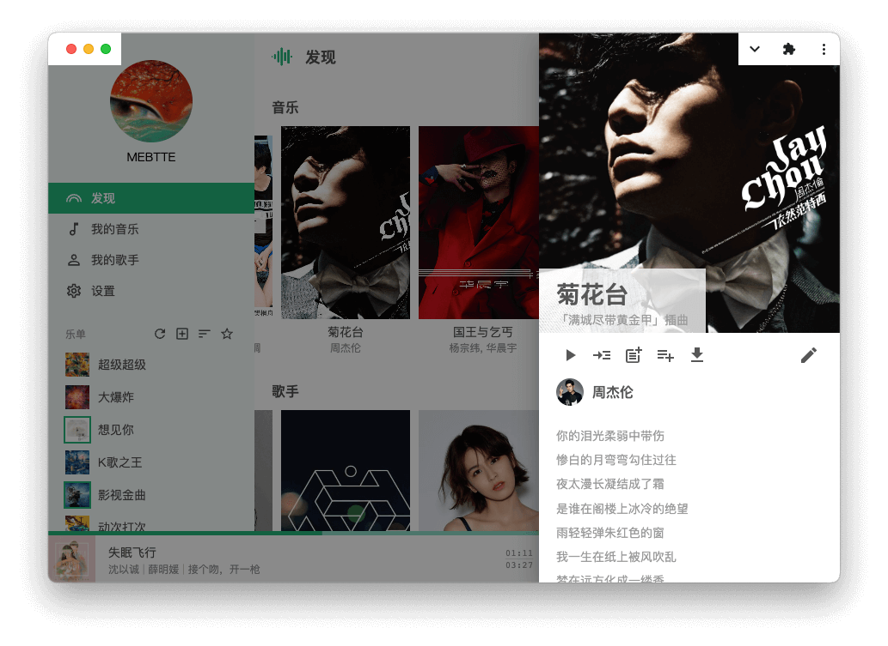
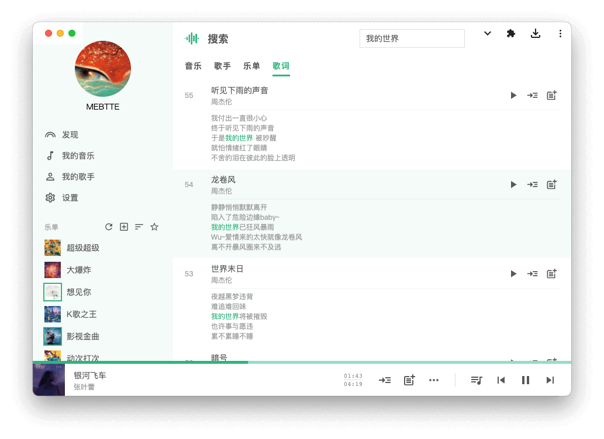
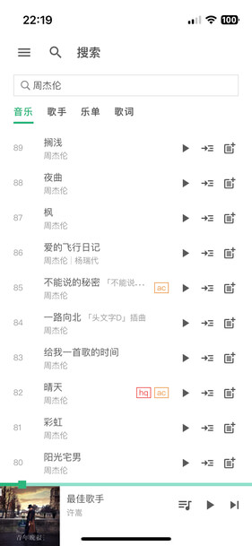
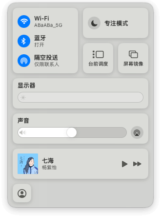
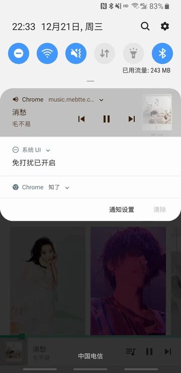
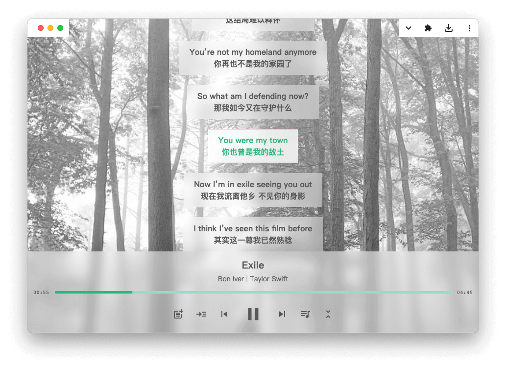
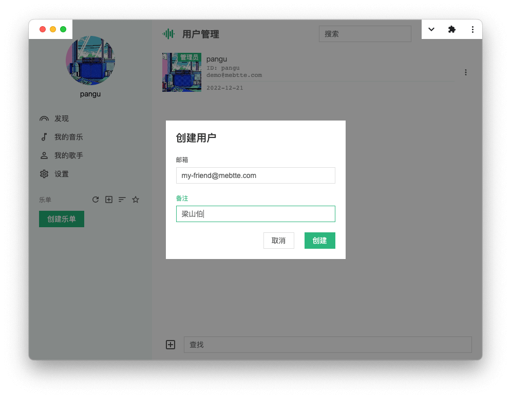
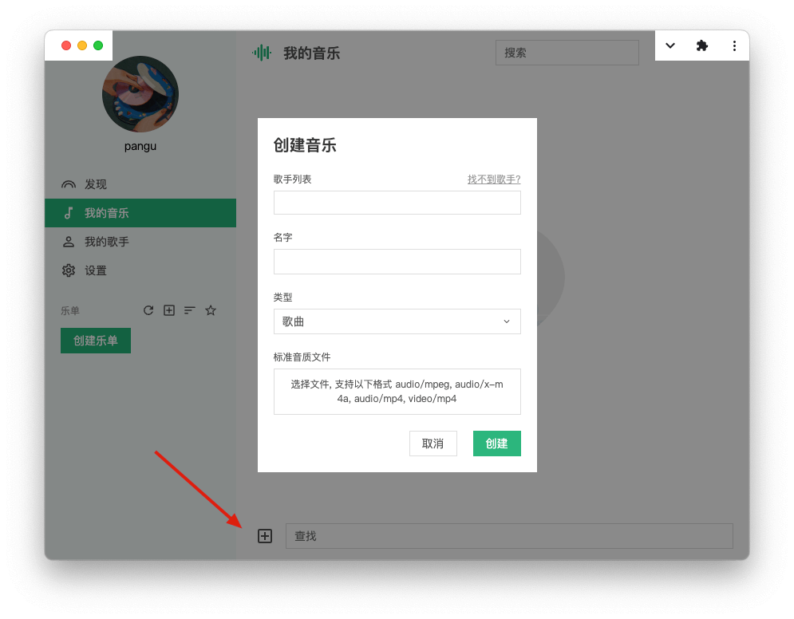

「[知了](https://github.com/mebtte/cicada)」是一个开源的音乐服务, 可以部署在任何 Linux/Windows/macOS 设备上, 主要有以下特点:

### 完全开源和数据完全掌控

知了分为服务端和客户端, 代码完全[开源](https://github.com/mebtte/cicada). 知了上的数据完全保留在本机, 包括数据库(Sqlite). 迁移服务只需要将知了的数据目录迁移即可.

### 支持 [PWA](https://developer.mozilla.org/docs/Web/Progressive_web_apps), 媲美原生应用

PWA 是一种可以将 Web APP 安装到本地的一种技术, 安装之后可以像原生应用出现在系统的应用列表中, 并且启动后有独立的应用窗口. 当然, PWA 能做的不仅仅这些, 不过篇幅过长这里就不再概述了.

> PWA 仅支持 `HTTPS` 或者 `localhost`, 知了目前暂不支持配置 `HTTPS`, 请使用 `nginx` 之类的工具进行 `HTTPS` 反向代理.



### 还算可以的 UI 设计以及适配移动端

因为我本身也不是设计出身, 也没什么设计天赋, 所以知了的 UI 都是按照自己的喜好还有参考其他应用设计出来的, 自以为 UI 上还过得去.





此外还在桌面端的基础上适配了移动端.




### 支持离线访问

得益于 PWA, 知了会把加载过的资源缓存在本地, 即使在断网情况下, 依然可以播放和查看已缓存的数据.

### 系统媒体支持

知了已接入系统媒体, 能够在操控台看到当前正在播放的音乐, 以及使用系统快捷键/键盘快捷键进行操作.





### 多歌词支持



### 多用户

知了对用户数量没有限制, 只要你愿意就可以将知了服务分享给好友使用.



## 如何部署

知了的部署也很简单, 需要准备一个邮箱用于发送邮件, 因为知了的登录和其他部分服务需要依赖邮箱, 将邮箱信息填写到 JSON 或者 JSON5 格式的配置文件中:

```json
{
  "emailHost": "smtp.example.com",
  "emailUser": "example",
  "emailPass": "example-password"
}
```

然后从 [Releases](https://github.com/mebtte/cicada/releases) 页面下载并解压对应平台的包或者[自行编译](https://github.com/mebtte/cicada/blob/master/docs/build/index.md), 使用如下命令启动(以 x64 Linux 为例):

```sh
./cicada-linux-x64 start -c path_to/config.json
```

首次运行知了会要求输入管理员邮箱进行初始化, 初始化完成后访问 `localhost:8000` 或者 `{{ip}}:8000` 就可以访问了.

当然, 首次登入到知了是没有任何数据, 可以前往「我的音乐」页面创建新的音乐, 创建后就可以随时随地地畅听了.



## 起源

接下来说一下为什么会有「知了」这个项目.

曾几何时我也是使用在线音乐服务的, QQ 音乐和网易云音乐我都曾经是会员, 当时只要开通了会员, 你就可以听到任何你想听到的音乐. 后面随着版权大战, 收藏列表的音乐每天都有变灰的, 最夸张的是我的一个歌单三百首竟然灰了一百多首(知了没有使用第三方音乐源的原因).

在线音乐服务能听的歌越来越少是主因, 还有一些其他原因, 比如网易云音乐的播放列表限制一千首(从产品和技术角度我都不明白为什么有这个限制), QQ 音乐中的各种广告(会员还要给我看广告?)以及使用习惯等等.

最开始的知了其实是由 electron 开发的一个单机应用, 有次同学看到我在使用知了并且对知了很感兴趣, 我给了他一份副本, 他使用几天后感觉还可以然后也提出了他的建议"这玩意能做成多端同步吗?"

因为当时我是使用第三方应用在多台电脑进行音乐文件同步的, 如果我把知了做成多端同步不就不需要第三方同步应用了吗? 但是多端同步的实现复杂性和安全性都是个很大的问题, 所以退而求其次我选择了 C/S 架构, 多个客户端连接一个服务端从而省略了多端同步.

这一版的知了积累了二十多个用户后, 有一天有个同学问我"这东西可以做成开源的吗? 这样我也能部署一个". 于是我听从了他的建议才有了现在的知了.

当然知了的开发也不是一路顺风, 我也从中学到了很多新的技术. 比如当初知了是分为 `server` / [pwa](https://github.com/mebtte/cicada_pwa) / [electron](https://github.com/mebtte/cicada_electron) 三个项目的, 后面接触到了 [monorepo](https://monorepo.tools), 于是就有了现在合并后的 [cicada](https://github.com/mebtte/cicada) 项目. 再比如有 electron 客户端是因为我想全局快捷键下实现`播放`/`暂停`/`上一首`/`下一首`操作的, 后面解到 [Media Session API](https://developer.mozilla.org/docs/Web/API/Media_Session_API), 发现接入系统媒体后就不需要全局快捷键了, 所以就把 electron 客户端干掉了.

从知了学到的远远不止这些, 比如 [clrc](https://github.com/mebtte/clrc) 这个包, 就是为了解析 LRC 格式提炼出来的, 还有:

- [react-lrc](https://github.com/mebtte/react-lrc), 用于展示 LRC 格式歌词的 React 组件
- [react-media-session](https://github.com/mebtte/react-media-session)(已归档), 用于配置 Media Session 的 React 组件
- [eventin](https://github.com/mebtte/eventin), 支持 TypeScript 类型约束的事件触发器
- [x-state](https://github.com/mebtte/cicada/blob/master/apps/pwa/src/utils/x_state.tsx), React 状态管理工具

虽然知了已经开发很多年了, 但是仍然处于一个起步阶段, 还有很多方面要完善, 比如:

- 现在 PWA 在移动平台的体验还很差, 所以的话后续打算开发 iOS/Android 客户端
- 提供 Docker 镜像, 更方便地部署
- 开发电台功能, 随机播放音乐, 不用纠结到底要听什么了
- ...

当然, 后续开发的前提是知了得有人用, 所以欢迎大家来使用知了, 使用过程中有问题或者建议的话可以通过 [Issues](https://github.com/mebtte/cicada/issues) 进行反馈.

### 更多

- [项目地址](https://github.com/mebtte/cicada): https://github.com/mebtte/cicada
- [问题反馈](https://github.com/mebtte/cicada/issues): https://github.com/mebtte/cicada/issues
