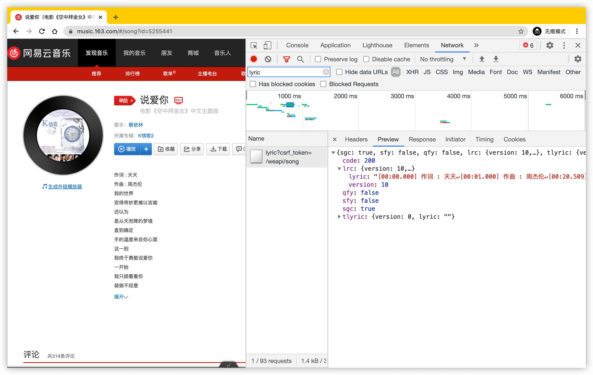
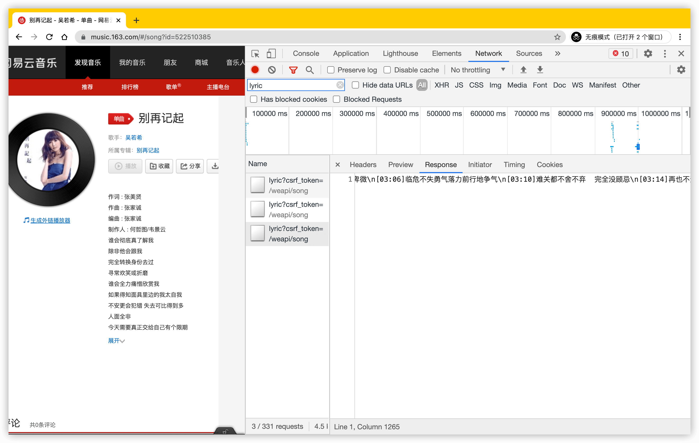
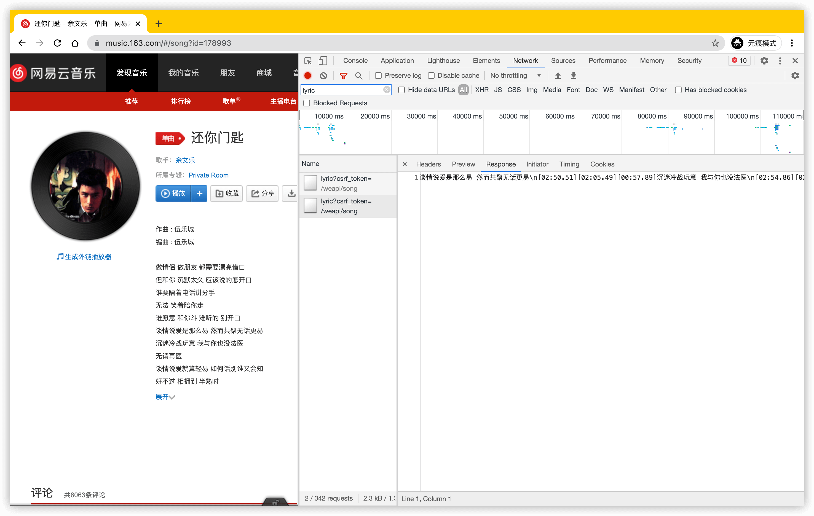
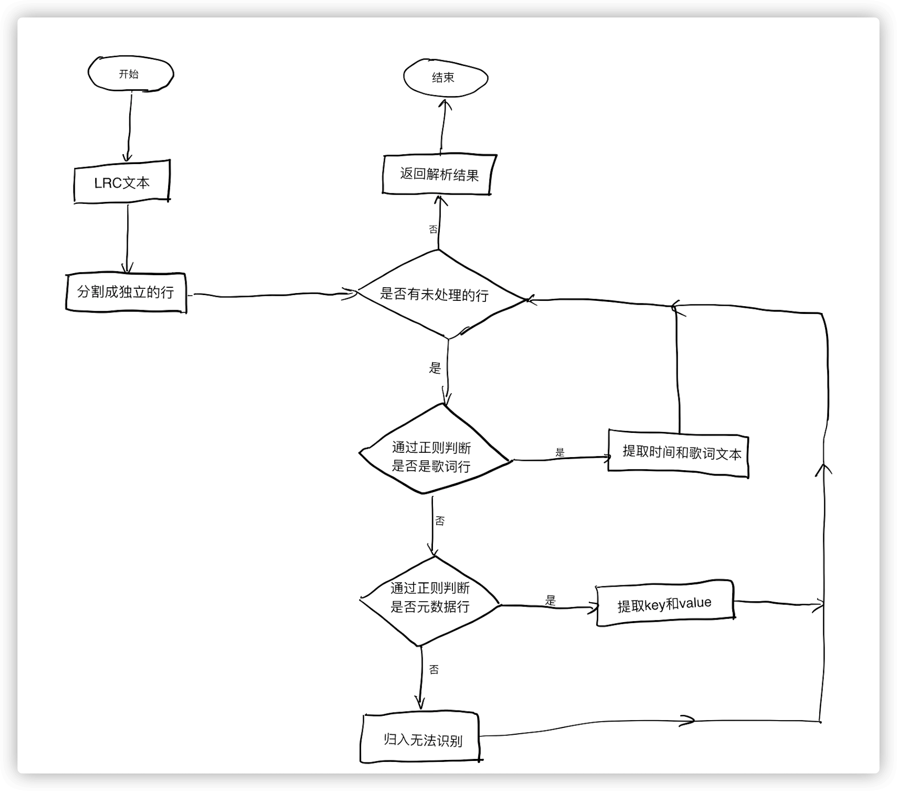

## LRC 格式

LRC 是一种常见的歌词保存格式, 使用文本的形式保存.

> LRC 是 lyric 去掉 y 和 i 后的缩写.

> 为了避免乱码, 所以的文本都应该使用 utf-8 保存.

在 LRC 文本中, 每一行表示一句歌词, 每一行都遵循一下格式:

```txt
[mm:ss.xx]歌词文本
```

`[ ]` 括号的内容表示歌词进入的时间, 其中 `mm` 表示分钟数, `ss` 表示秒数, `xx` 表示百分之一秒, 例如 `[00:20.43]对慢了 爱人会失去可爱` 表示这句歌词在音乐的 0 分 20 秒 430 毫秒处开始. 同时, 歌词文本可以是空字符串.

```txt
[01:58.828]拖着梦寐 说着我想说的梦话
[02:02.709]不停摆
[02:05.569]
[02:06.099]寻找明天
[02:07.450]每一辆飞车彻夜向前开
```

例如上面的第 3 行歌词, 表示第 2 行歌词和第 4 行歌词不是连贯的. 需要注意的是, LRC 并没有规定歌词一定按照时间先后的顺序排列, 也就是说, 后面的歌词可能出现在前面.

LRC 文本还可以添加一些元数据. 元数据使用 `key -> value` 的形式, key 和 value 使用 `:` 分隔, 每一行表示一对元数据:

```txt
[key:value]
```

常见的元数据有:

| key | description    | example         |
| :-- | :------------- | :-------------- |
| al  | 专辑           | [al:范特西]     |
| by  | lrc 文本的作者 | [by:mebtte]     |
| ti  | 音乐的标题     | [ti:听妈妈的话] |
| ar  | 歌手           | [ar:周杰伦]     |

当然, 你还可以创造自己的元数据:

```txt
[author:mebtte]
[copyright:mebtte]
```

LRC 格式除了可以用来表示歌词以外, 也可用于视频的**字幕**.

## 不同于定义的实现

事实上, 很多厂商没有按照定义保存 LRC 文本.

### 与定义不同的时间标签

在 LRC 中, 时间标签的格式是 `[分:秒:百分之一秒]`, 第三部分是百分之一秒, 范围是 `00-99`. 但在实现上, 一些厂商第三部分是毫秒, 范围是 `000-999`, 甚至有些厂商直接去掉了第三部分, 只有分和秒.





### 多重时间标签

有些厂商为了节省储存空间, 将相同歌词的行合并, 导致一行出现多个时间标签:



### 行首行末有多余空格

有些 LRC 文本会在行首或者行末添加不定数量的空格:

```txt
 [01:58.828]拖着梦寐 说着我想说的梦话
[02:02.709]不停摆
  [02:05.569]
[02:06.099]寻找明天
[02:07.450]每一辆飞车彻夜向前开
```

所以, 要想实现高兼容性的 LRC 解析器, 就需要考虑到上面几种异常情况.

## 使用 TypeScript 解析 LRC

对于 TypeScript 解析 LRC, 思路是这样的:



上图中, 关键的步骤是通过正则检查是否符合格式, 涉及到两个正则, 第一个是歌词行:

```ts
const LYRIC_LINE = /^((?:\[\d+:\d+(?:\.\d+)?\])+)(.*)$/;
```

这里兼容了多个时间标签以及兼容时间标签缺少第三部分. 第二个是元数据行:

```ts
const METADATA_LINE = /^\[(.+?):(.*?)\]$/;
```

两个正则利用了[正则的分组功能](https://developer.mozilla.org/docs/Web/JavaScript/Guide/Regular_Expressions/Groups_and_Ranges), 可以通过 `String.prototype.match` 方法直接提取分组部分. 需要注意的是, 歌词行的单个时间标签使用了非捕获分组 `(?:)`, 因为可能含有多个时间标签, 导致捕获分组只能捕获最后一个时间标签, 所以这里需要把所有时间标签作为一个分组, 提取后再单独处理.

下面是完整的解析代码:

```ts
/** lrc 行 */
interface LrcLine {
  /** 行号 */
  lineNumber: number;
  /** 行原始数据 */
  raw: string;
}

/** 元数据行 */
interface MetadataLine extends LrcLine {
  key: string;
  value: string;
}

/** 歌词行 */
interface LyricLine extends LrcLine {
  /** 开始时间, 毫秒 */
  startMillisecond: number;
  /** 歌词 */
  content: string;
}

const LYRIC_LINE = /^((?:\[\d+:\d+(?:\.\d+)?\])+)(.*)$/;
const METADATA_LINE = /^\[(.+?):(.*?)\]$/;

function parse(lrc: string) {
  const metadataLines: MetadataLine[] = []; // 元数据行
  const lyricLines: LyricLine[] = []; // 歌词行
  const invalidLines: LrcLine[] = []; // 无法解析的行

  const lines = lrc.split('\n'); // 分隔成独立的行

  for (let i = 0, { length } = lines; i < length; i += 1) {
    const line = lines[i];

    // 歌词行
    const lyricLineMatch = line.match(LYRIC_LINE);
    if (lyricLineMatch) {
      /***
       * 利用了正则的分组
       * 第一个分组是所有时间标签
       * 第二个分组是歌词文本
       */
      const timeTagPart = lyricLineMatch[1];
      const content = lyricLineMatch[2];

      /**
       * 分割多个时间标签
       * 每一个时间标签对应一行歌词
       * 正则表示右方括号和左方括号的位置, 也就是两个时间标签中间位置
       */
      for (const timeTag of timeTagPart.split(/(?<=\])(?=\[)/)) {
        /**
         * 利用了正则的分组
         * 第一个分组是分
         * 第二个分组是秒
         * 第三个分组是百分之一秒, 可能没有
         */
        const timeMatch = timeTag.match(/\[(\d+):(\d+)(?:\.(\d+))?\]/);

        const minute = timeMatch[1];
        const second = timeMatch[2];
        const centisecond = timeMatch[3] || '00'; // 没有的话默认 00

        /** 字符串前面添加 + 可以将字符串转换成数字 */
        lyricLines.push({
          lineNumber: i,
          raw: line,
          startMillisecond:
            +minute * 60 * 1000 + +second * 1000 + +centisecond * 10,
          content,
        });
      }

      continue;
    }

    // 元数据行
    const metadataLineMatch = line.match(METADATA_LINE);
    if (metadataLineMatch) {
      const key = metadataLineMatch[1];
      const value = metadataLineMatch[2];

      metadataLines.push({
        lineNumber: i,
        raw: line,
        key,
        value,
      });

      continue;
    }

    // 无法解析
    invalidLines.push({
      lineNumber: i,
      raw: line,
    });
  }

  return {
    metadataLines,
    lyricLines,
    invalidLines,
  };
}
```

上面兼容了多个时间标签和缺少百分之一秒的情况, 还需要兼容百分之一秒是毫秒的情况:

```ts
// 通过位数判断是百分之一秒还是毫秒
const startMillisecond =
  +minute * 60 * 1000 +
  +second * 1000 +
  +centisecond * (centisecond.length === 2 ? 10 : 1);
```

以及兼容行前后空格的情况:

```ts
/** 通过 trim 方法移除行前后空格 */
const lines = lrc.split('\n').map((l) => l.trim());
```

还有一点, 前面提到 LRC 没有规定歌词按时间先后排序, 如果需要按时间先后展示歌词, 那么还需要进行一次排序:

```ts
lyricLines = lyricLines.map((a, b) => a.startMillisecond - b.startMillisecond);
```

## [clrc](https://github.com/mebtte/clrc) 和 [react-lrc](https://www.npmjs.com/package/react-lrc)

基于上面的思路, 封装一个 [clrc](https://github.com/mebtte/clrc) 的包发布在 [npm](https://www.npmjs.com/package/clrc), 可以通过下面的方法使用:

```bash
npm i --save clrc
```

```ts
import { parse } from 'clrc';

const lrc = `
[by:mebtte]
[ar:张叶蕾]
[01:58.828]拖着梦寐 说着我想说的梦话
[02:02.709]不停摆
[02:05.569]
[02:06.099]寻找明天
[02:07.450]每一辆飞车彻夜向前开`;

parse<{ by: string; ar: string }>(lrc); // { metadatas, metadata, lyrics, invalidLine }
```

同时提供了 `clrc` 的 [Playground](https://mebtte.github.io/clrc) .

<iframe title="clrc Playground" src="https://mebtte.github.io/clrc"></iframe>

在 clrc 的基础上封装了 [react-lrc](https://github.com/mebtte/react-lrc), 为 react 项目提供了一个展示 LRC 的组件, 同样有一个 [Playground](https://mebtte.github.io/react-lrc)

<iframe title="react-lrc Playground" src="https://mebtte.github.io/react-lrc"></iframe>

### 参考

- [LRC - Wikipedia](<https://en.wikipedia.org/wiki/LRC_(file_format)>)
