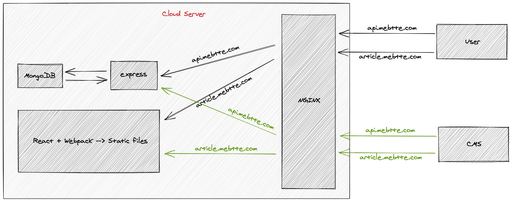
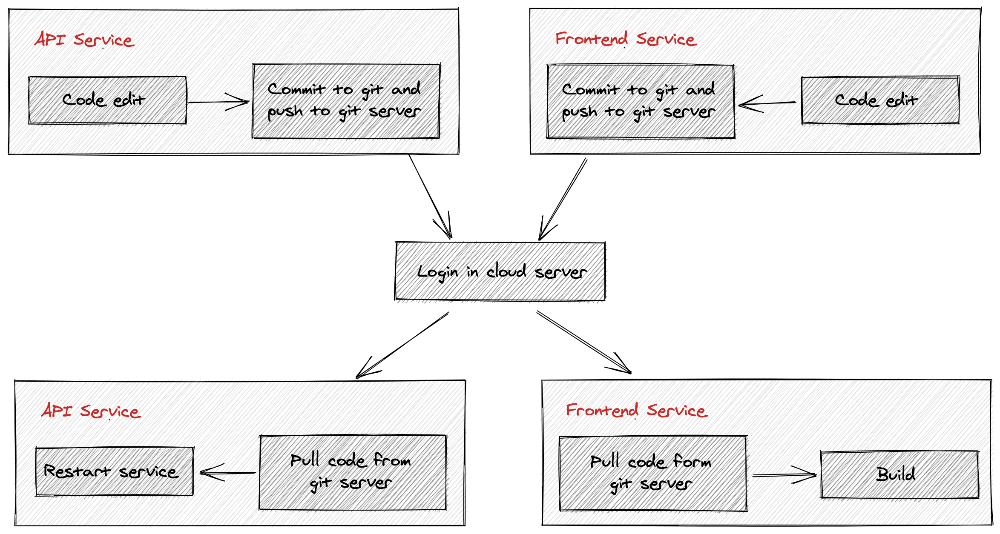
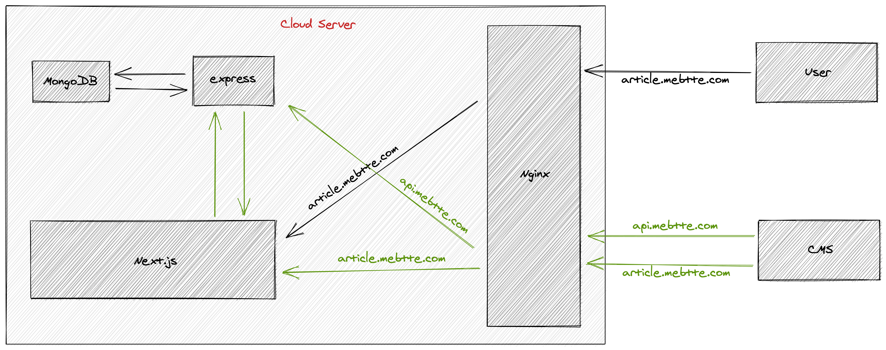
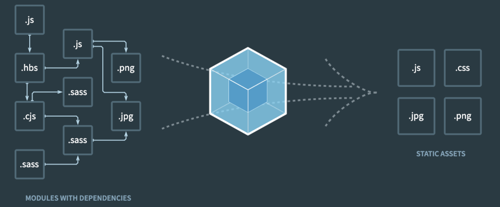
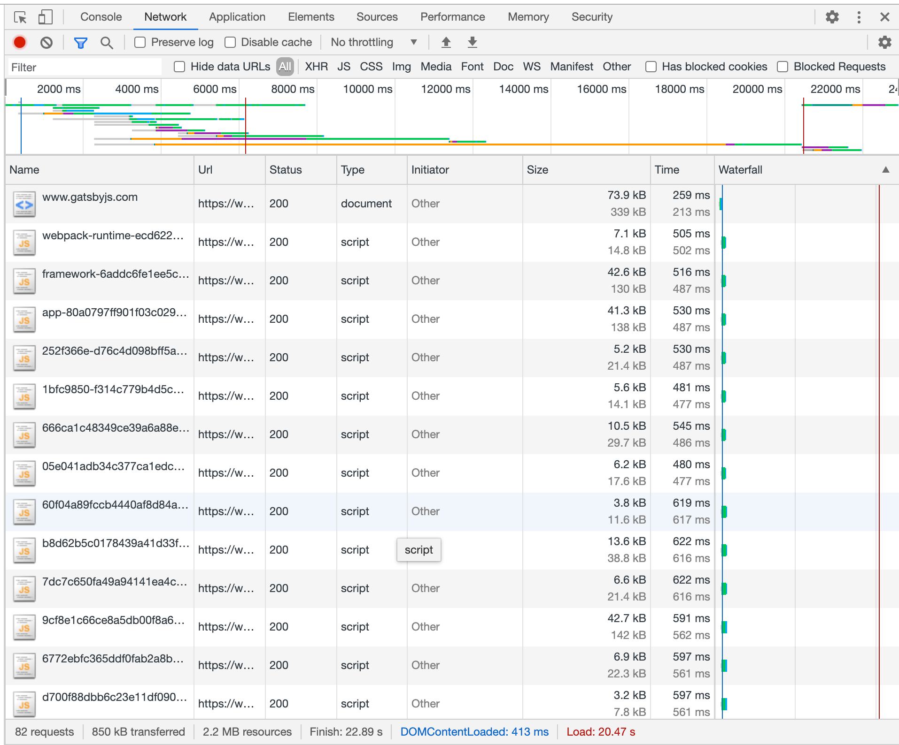
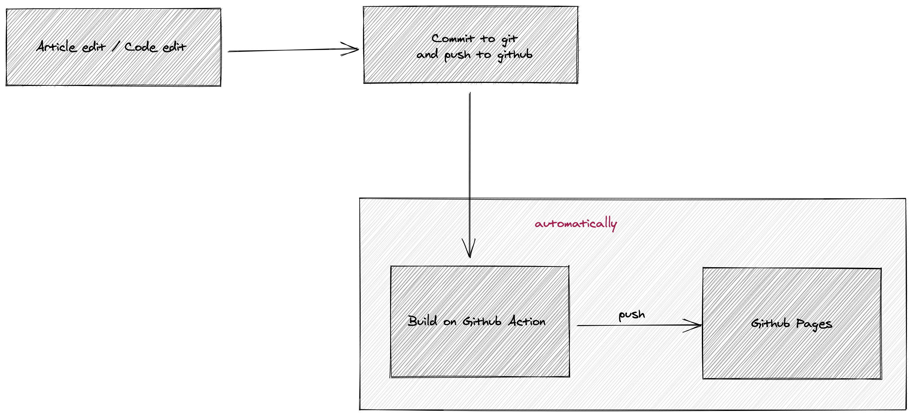

在大三的时候, 我创建了自己的博客, 跟大部分人一样, 创建博客不外乎这几个原因:

1. 作为一个程序员, 拥有博客是标配, 可以对外展示自己
1. 作为学习的记录, 总结一些技术或者经验进行分享
1. 能够体验到一个项目开发部署运维的全过程
1. 炫技(作为一个菜逼程序员, 目前还没有值得炫耀的技术)
1. ...

在维护的这几年时间里, 从发布易用性和部署便捷性的角度, 我的博客架构也变迁过多次.

## 服务端模板渲染

博客的第一个版本使用的是 [Node.js](https://nodejs.org) + [MongoDB](https://www.mongodb.com), 采用 [Express](https://expressjs.com) + [EJS](https://ejs.co) 模板渲染的模式.


使用 Node.js 作为后端是因为当时只掌握了 Node.js 这一门后端技术(或许现在也是 😑), MongoDB 因为与 Node.js 有着良好的配合性而采用.

Express 是当时 Node.js 下最热门的 Web 应用框架, EJS 是一门语法非常简单但是十分出色的 JavaScript 模板语言.

> Express 目前依然是 Node.js 中最热门的 Web 应用框架, 作为 Express 下一代框架的 [Koa](https://koajs.com), 目前下载量方面只有 Express 的二十分之一, 当然, Express 庞大的下载量离不开它作为一些工具的内置 Web 服务器, 例如 [Webpack](https://github.com/webpack/webpack-dev-server/blob/e10c2a0e5b979760de36524bd1b3414744f7b458/package.json#L42).

除了需要维护用户向的文章 EJS 模板外, 还需要维护面向 CMS(Content Management System, 内容管理系统) 的 EJS 模板, 用于文章的增删查改. 相比用户向的文章 EJS 模板, CMS 的 EJS 模板更加复杂, 文章的增删查改涉及到富文本编辑器, 做过这块的前端都知道, 富文本编辑器的开发是多么的痛苦.

在这套系统下, 发布文章的流程非常简单, 在 CMS 编辑文章然后提交到服务器, 文章就发布成功了. 部署的话略显麻烦, 因为这套系统是部署在一台云服务器上的, 由于缺少运维系统的支持, 部署需要手动登录到云服务器操作.


## 前后端分离

在上面的架构中, 由于 EJS 只是一门简单的 JavaScript 模板语言, 并不支持转换最新 JavaScript 语法和特性, 在框架方面只能使用最基础的全局引入. 为了能够使用 JS 的[新特性](https://www.ecma-international.org/publications-and-standards/standards/ecma-262/)和 [React](https://reactjs.org), 于是调整到了前后端分离架构.



调整架构后, 原来的 Express 移除了 EJS 模板渲染的功能变成了纯粹的 JSON API 服务. 新增了一个前端项目负责前端页面的渲染, 使用 React + Webpack 的方式, 通过暴露构建后的静态资源提供给用户, 同时也提供 CMS 页面.

这个架构下会产生两个域名, 一个是 API 服务 `api.mebtte.com`, 一个是前端静态资源服务 `mebtte.com`, 但两个服务依然运行在同一个云服务器上, 所以需要增加一层 [NGINX](https://www.nginx.com) 服务, 根据域名反向代理到对应服务.

实际上 API 服务和前端资源服务可以做到只需一个域名从而移除 NGINX 服务的, 比如 API 服务可以使用 `mebtte.com/api`, 同时前端资源服务由 Express 提供. 但是 API 服务除了提供博客相关的 API 外还有其他项目的 API, 所以我不想挂载在 `mebtte.com` 这个域名上, 所以分成了两个域名.

这套系统跟之前一样, 发布文章只需要在 CMS 编辑并提交就可以了. 部署方面, API 服务和前端资源服务都需要登录到云服务器拉取代码进行重启或者构建, 依旧很麻烦.



## React 服务端渲染

前后端分离的架构上线后不久, 就发现了一个很严重的问题, 搜索引擎是不支持索引前端渲染的. 搜索引擎爬虫一般是下载 HTML 然后解析收录 HTML 里面的内容, 然而前端渲染是由 JS 请求接口获得数据后生成 HTML 的, 爬虫并不会执行页面的 JS, 所以对于爬虫来说, 前端渲染的页面只是像下面这样的一个空页面:

```html
<html>
  <head>
    <title>文章标题</title>
  </head>
  <body>
    <div id="root">
      <!-- React 应用挂载节点 -->
    </div>

    <!-- webpack 打包后的脚本, 实际内容由脚本生成 -->
    <script src="path/bundle.js"></script>
  </body>
</html>
```

所以, 必须在爬虫解析之前就已经生成带有内容的 HTML, 也就是说 HTML 要在服务端生成.

因为前端项目使用的是 React, 为了尽可能小的改动, 所以要做 React 服务端渲染, 调研了几种 React 服务端渲染方案后, 最终选用了 [Next.js](https://nextjs.org).



上面的架构中, 当用户访问文章页面时, Next.js 会在云服务器内部向 Express 服务请求文章数据, 然后进行 React 服务端渲染后将渲染后的 HTML 返回给用户, 即使是搜索引擎爬虫也可以解析到文章内容进行索引了.

同时, 发布文章的流程不变, 在 CMS 中编辑并提交即可. 部署流程稍微有些变动, Next.js 需要维护一个进程, 所以前端项目由之前的构建改成了重启服务.

## React 预渲染

上面的架构平稳运行一段时间后, 发生了一个严重的线上问题, 在迁移云服务器时, 由于忘了备份 MongoDB, 导致 MongoDB 上的文章数据丢失了.

> 正确的做法应该是定时备份, 而不是在迁移前进行备份. 即使不迁移云服务器也应该定时备份, [因为云服务器厂商也不是百分之一百可靠](https://www.zhihu.com/question/288640327).

于是我开始思考上面的架构是否合理:

1. 数据库的维护需要成本和精力, 而且只有文章数据需要保存, 数据量非常小, 能否移除数据库
1. 对于访客来说, 访问每一篇文章看到的页面都是一样的, 但每访问一次都需要在服务端渲染一遍, 是否有必要
1. CMS 系统上文章的富文本编辑器非常难用, 能不能有更好的编辑方式

在查阅一些资料后, 我了解到[静态博客](https://www.google.com/search?q=%E9%9D%99%E6%80%81%E5%8D%9A%E5%AE%A2). 静态博客的流程是这样的, 先写一套文章模板, 然后获取文章数据提前构建所有文章页面(HTML/CSS/JS), 最后提供构建的静态资源服务就可以了, 完全避免每访问一次文章页面都需要在服务端渲染一次的问题, 而且只有在构建阶段才需要获取文章数据.




静态博客生成器的话我简单了解了一下 [Hexo](https://hexo.io) 和 [Jekyll](https://jekyllrb.com), 由于之前使用的是 React, 迁移到这两个的话成本比较高, 所以我选择了基于 React 的 [Gatsby](https://www.gatsbyjs.com).

在文章编写方面, 之前的富文本编辑器最终生成的是 HTML, 在排版和样式方面比较难自定义, 而且在写文章的时候比较难用. 因为之前写一些文档的时候用过 [Markdown](https://www.markdownguide.org), 感觉用 Markdown 来写文章应该是个不错的选择. 这里有个问题是之前使用数据库可以保存文章的编辑记录, 编辑出错的话可以回滚, 那使用 Markdown 怎么实现呢? 答案是把 Markdown 文件添加到前端项目, 然后提交到 Git, 这样的话用 Markdown 编写文章也有历史记录, 加上 Markdown 是文本文件, 通过 Git 可以很轻松地查看到每次的修改差异.

使用 Markdown 保存文章的话, 那就可以移除 MongoDB 服务了, 而且只有构建阶段才需要访问文章数据, 根本不需要 API 服务, 直接读取文件就行了, 于是有了新的架构.


上面架构中, 已经不需要 API 服务 / MongoDB 服务以及移除了 CMS 系统, 而 NGINX 只提供文章页面的静态资源服务. 现在文章数据(Markdown/Image/...)是作为项目的一部分, 所以编辑文章和部署合为一体, 任何修改需要提交到 Git 并登录到云服务器拉取最新代码, 构建之后就可以了, 不需要重启任何服务.

## 模板预渲染

在之前的架构中, 编辑文章只需要到 CMS 上修改就可以生效, 在 React 预渲染的架构中, 编辑文章要想生效就必须要登录到云服务器进行构建, 这个过程是非常繁琐且耗时的. 经历了多次这个过程后, 我终于受不了开始寻找自动化构建的方案.

一个成熟的产品一般都会有自动化构建和部署系统, 但是对于个人来说, 维护这些系统本身就是一种负担, 加上这些系统还不一定能够在低配置的云服务中跑起来, 所以想自己部署自动化系统是行不通的, 那可不可以使用第三方服务呢?

后面在 Github 上接触到了 [Github Pages](https://pages.github.com) + [Github Action](https://github.com/features/actions). Github Pages 是一个静态资源服务, 只要将文件提交到 Github 就可以通过一个 URL 访问, 而且是支持自定义域名的. Github Action 简单来说就是当 Git 仓库发生变化时可以执行自定义脚本.

回到我的博客, 首先没有隐私数据, 所以 Git 仓库设为公开是可以的, 对于公开仓库这两个服务 Github 是免费的, 也就是说我的博客可以免费使用这两个服务. 然后我的博客经过之前的改造, 只需要一个静态服务器就可以了, Github Pages 可以充当这个角色, 而且支持自定义域名. 因为文章数据现在使用 Markdown 保存且会提交到 Git, 所以编辑文章会导致 Git 仓库发生变化, 这样的话就可以触发 Github Action 进行构建, 然后推送到 Github Pages.

自动化部署的问题可以通过 Github 解决, 但是对于 Gatsby 我用的不是很舒服, Gatsby 构建会生成大量的分包, 以至于打开页面会产生大量的 HTTP 请求(参看下图, [gatsbyjs.com](https://www.gatsbyjs.com) 本身是由 Gatsby 生成).



而且 Gatsby 包含了 React 和 Webpack, 使得打包出来的页面体积偏大, 其实我的博客界面非常简单以及很少使用 JS, 所以使用 Gatsby 也是一种浪费.

> 之前想偷懒才迁移到 React, 后面发现文章页面非常简单, JS 本身就很少用到, React 用到的地方就更少了.

于是我打算移除 Gatsby 回到最基础的模板渲染, 具体就是自己写一个 [构建脚本](https://github.com/mebtte/animal-photosynthesis/blob/master/scripts/build.js), 通过 EJS 模板渲染文章数据产生文章页面.


于是可以得到全新的架构:


可以发现, 完全没了云服务器的身影, 整个博客已经被 Github 托管. 现在, 发布文章或者修改代码只需要提交到 Git 后推送到 Github, 剩下的都是自动化处理.



这就完了吗? 不一定, 之后博客的架构可能还会变, 毕竟**生命不息, 折腾不止**.
