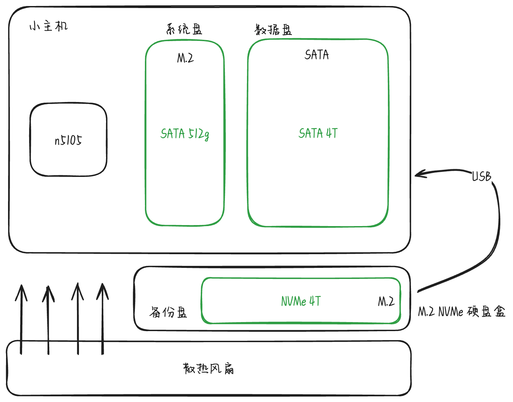
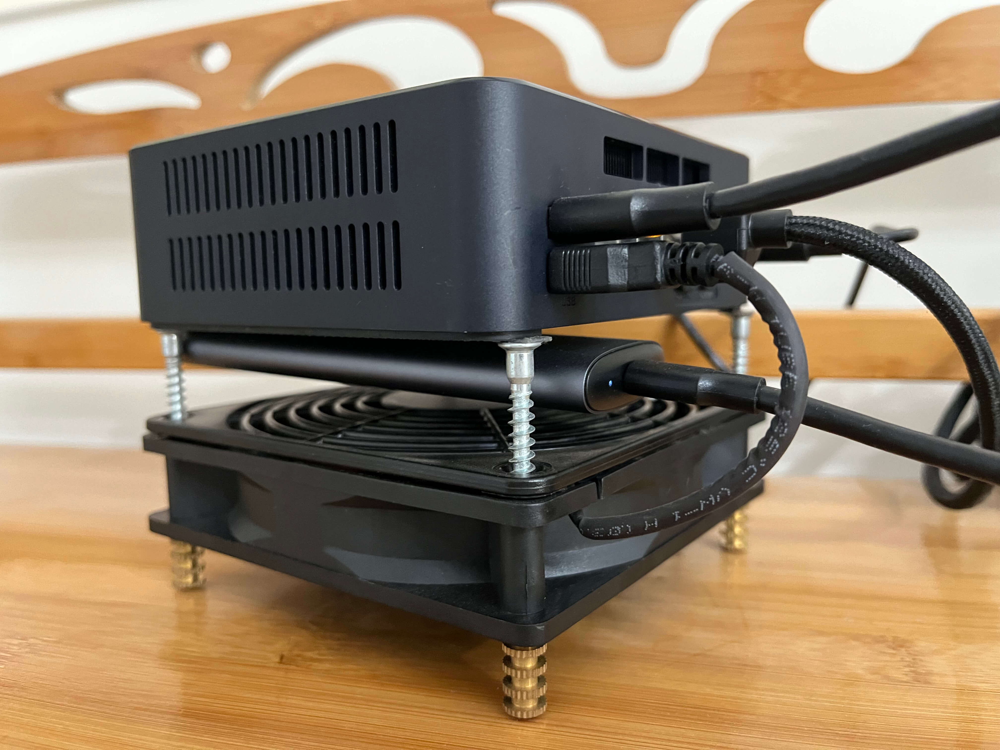

折腾 NAS 也差不多两年的时间了, 一开始的 [Mac Mini + 硬盘柜的方案](/remote_accessible_nas_by_mac_mini), 到后来直接购买成品 NAS, 再到现在的小主机 + 外接硬盘的方案. 小主机 + 外接硬盘的方案已经稳定运行半年多了, 目前体验还可以.

首先说下我的需求, 主要是影音 + 数据备份, 对容量和性能的要求不高, 所以这套方案所有硬件以及组合如下:

- 一台 n5105 的小主机
- 一条 M.2 SATA 512G 固态
- 一块 2.5 寸 SATA 4T 固态
- 一条 M.2 NVMe 4T 固态
- 一个 M.2 NVMe 硬盘盒
- 一个散热风扇

一般来说 M.2 NVMe 的固态才是潮流, 不过在购买小主机的时候没注意参数, 后面才发现只支持 SATA 固态. 小主机本身有内置风扇, 不过转码的时候机身还是会发烫, 所以额外搞了个外置风扇, 同时还能给外置的 M.2 NVMe 固态硬盘散热.

这套方案只有三个硬盘, 512g 的作为系统盘, 两条 4T 一条作为数据盘另一条作为数据盘的备份, 所以实际可用空间是 4T. 虽然有点少, 不过对于我这种轻 NAS 用户来说足够了.

用功率计测过, 待机时整体功耗不超过 8w, 满载 20w 出头, 加上全固态和静音风扇, 完全没有噪音污染, 只不过稍微有点灯光污染(主机+硬盘盒+网线).

软件方面, 操作系统选择了 Ubuntu Server, 盘位太少就没必要搞什么 trueNAS/Unraid, 而且 Ubuntu 用起来也顺手. 服务全部使用 Docker 托管, 配合 Portainer 可以很方便地在浏览器进行管理.

其他的话, 影视服务选择的是 [Jellyfin](https://jellyfin.org), 音乐服务是自己开发的方案[知了](https://github.com/mebtte/cicada), 备份服务选择的是 [Syncthing](https://syncthing.net)

不像成品 NAS 自带远程访问, 自建 NAS 往往需要自己解决远程访问的问题. 我这里采用的是 frp + vps 的方案, 通过 frp 将需要公网访问的服务反向代理到具有公网 IP 的 VPS, 加上域名解析就可以通过域名访问对应的服务.

> 暴露服务到公网总是有风险的!!!

为什么我会抛弃成品 NAS 选择纯固态的方案, 首先大多数成品 NAS 都使用机械硬盘, 因为我的网口在房间里, 机械硬盘的噪音足以影响休息. 其实这台小主机是支持 wifi 的, 最开始的方案是外接机械硬盘柜, 然后放到阳台避免噪音污染的. 但是 wifi 体验下来有两个问题, 第一是速度太慢了, 第二总是断流, 莫名其妙地断开连接导致服务不可用, 需要等待 wifi 自动重连才恢复正常. 所以后面才换到目前这种全固态方案, 放在房间内使用网线连接, 没有噪音污染.

> 现在陆陆续续有成品纯固态 NAS 推出, 不过现阶段的性价比还是太低了.

其次, 机械硬盘实在是太笨重了, 加上成品 NAS 动则四盘位六盘位的体积, 实在不好摆放, 目前这套方案体积非常小巧, 完全不占用地方.

说一下容量的问题, 目前 4T 的容量确实是捉襟见肘. 不过小主机有多个 USB 的接口, 电源功率也还足够, 后续插多几个外接固态问题也不是很大.

然后是备份的问题, 虽然我做了本地备份, 如果数据特别重要的话, 本地备份总是不够的. 之前看到过一个案例, 某位博主的家里被水淹了导致 NAS 完全报废, 幸运的是他有一份异地备份从而能够完整地恢复数据. 我们可能也会遇到同样的问题, 一堆鸡蛋放在同一个篮子里总是不安全的, 所以我目前的方案是把重要的数据通过 [duplicati](https://www.duplicati.com) 加密分片后上传到网盘. 当然, 网盘作为异地备份也不是一个安全的选项, 如果后面有时间的话, 可以考虑维护两个 NAS, 分放两地互为备份.

不同于大多数方案选用的 RAID, 本地备份我用的是 cron + rsync 的方式. 首先我的盘位不多, 无论哪种 RAID 方案都不太合适. 其次, RAID 有可能将一份数据分散在多盘, 这对于数据恢复来说是非常有难度的.
