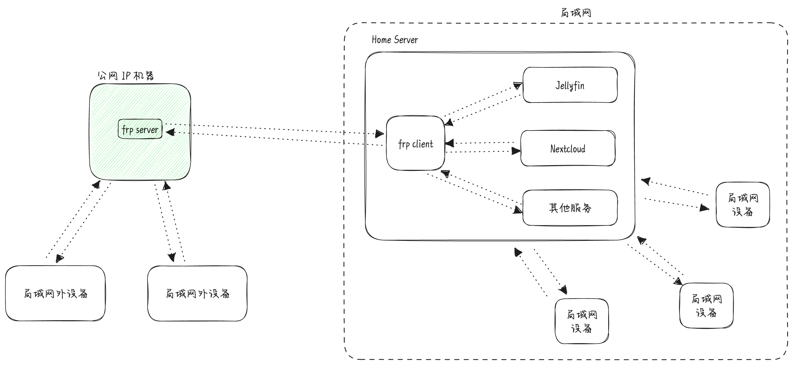

前段时间开始折腾 NAS, 或者说 Home server, 试了很多方案, 最后采用了 Ubuntu Server + Docker 的方式, 下面是我用 Docker 部署的一些服务.

## Portainer

Docker 在 CLI 的情况下使用, 命令和参数经常需要查文档. [Portainer](https://www.portainer.io) 是一款可视化的工具, 能够很方便地对 Docker 进行管理.

通过浏览器我们可以很方便地操作容器/镜像/网络/..., 此外还支持 Docker Compose(在 Portainer 中称为 Stack). Portainer 有两个版本, 对于个人使用来说免费的 Community Edition 就可以了.

## Nextcloud

[Nextcloud](https://nextcloud.com) 是一个网盘服务, 可以让我们自建类似于 Google Drive 和百度网盘这样的服务, 同时还支持通过 WebDAV 将网盘挂载到本地或者通过手机 APP 对文件进行管理.

Nextcloud 有丰富的插件系统, 比如 File sharing 可以让我们分享文件给别人, Versions 可以让文件像 git 一样有版本的概念, 可以随时回滚. 不过也正是因为这样, 导致 Nextcloud 的前端和后端都很臃肿, 占用很多资源, 能够明显感觉到很多操作慢半拍, 希望后续能够优化吧.

## Jellyfin

[Jellyfin](https://github.com/jellyfin/jellyfin) 是一个影音服务, 通过 Jellyfin 可以使用浏览器或者 APP 访问到硬盘上的媒体文件. Jellyfin 的客户端几乎支持全平台, 特别是在电视安装之后, 再也不用忍受满屏的广告和会员专属内容了.

此外 Jellyfin 还会自动识别媒体并刮削, 生成漂亮的海报墙, 不过 Jellyfin 自带的刮削不太好用, 配合 [jellyfin-plugin-metashark](https://github.com/cxfksword/jellyfin-plugin-metashark) 使用可以从豆瓣进行刮削.

## Cicada

[知了](https://github.com/mebtte/cicada)是我自己开发的一个音乐服务, 因为版权的问题现在任一一个音乐平台都无法涵盖我要听的音乐, 在知了可以上传任何喜欢的音乐, 不用担心没有版权或者音乐被下架的问题.

知了现在只支持 PWA, 除了 iOS/iPadOS 外, 其他平台都与原生 APP 无异.

## MySQL/MongoDB

作为一个开发者, 很多项目需要用到数据库, 在 Home server 跑数据库的话就不需要在本机启动了, 切换设备的话也可以访问同一个数据库实例.

## qBittorrent

[qBittorrent](https://www.qbittorrent.org) 是一个 P2P 的下载工具, 像一些影视资源的话可以挂在上面下载.

## Syncthing

[Syncthing](https://syncthing.net) 是一个文件同步服务, 可以将文件在不同的设备间进行同步. 将其他设备的重要文件和 Home server 进行同步, 这样设备损坏或者丢失就不用担心数据无法找回了, 而且 Syncthing 支持文件版本, 误删或者错误修改文件都可以回退.

## Duplicati

[Duplicati](https://www.duplicati.com) 是一个在线备份的工具, 备份的数据会经过本地切片和加密, 然后通过网络备份到各种云服务, 加上本地备份(RAID/rsync/...), 重要数据就实现了两地三备份的基本准则.

## AList

[AList](https://alist.nn.ci) 是一个网盘聚合的服务, 可以将各种网盘整合成一个网盘, 并且可以对外提供 WebDAV 服务.

不过我用的比较少, 毕竟将数据存在网盘不是一个好主意.

## frp

对于大部分家用宽带来说是没有公网 IP 的, 这就使 Home server 部署的服务只能在局域网内访问. [frp](https://gofrp.org) 是一个内网穿透的服务, 将服务端部署到有公网 IP 的机器, Home server 部署客户端, 这样就能够通过公网 IP 访问到 Home server 的服务了.

frp 虽然有官方的 Docker 镜像, 不过却没有使用文档, 所以就利用 Github Action 自己封装了[一个](https://github.com/mebtte/docker/blob/master/frp/readme.md).

## Watchertower

通常情况下更新容器, 我们需要以下操作:

1. 拉取最新镜像
2. 删除正在运行的容器
3. 以相同参数创建容器

当容器数量多了之后, 每个容器都重复这样的操作是非常繁琐的. [Watchtower](https://github.com/containrrr/watchtower) 可以自动化上面的操作, 它会在后台检查镜像是否有更新, 更新存在的话自动拉取新的镜像, 然后移除旧的容器并以相同参数创建新的容器.
