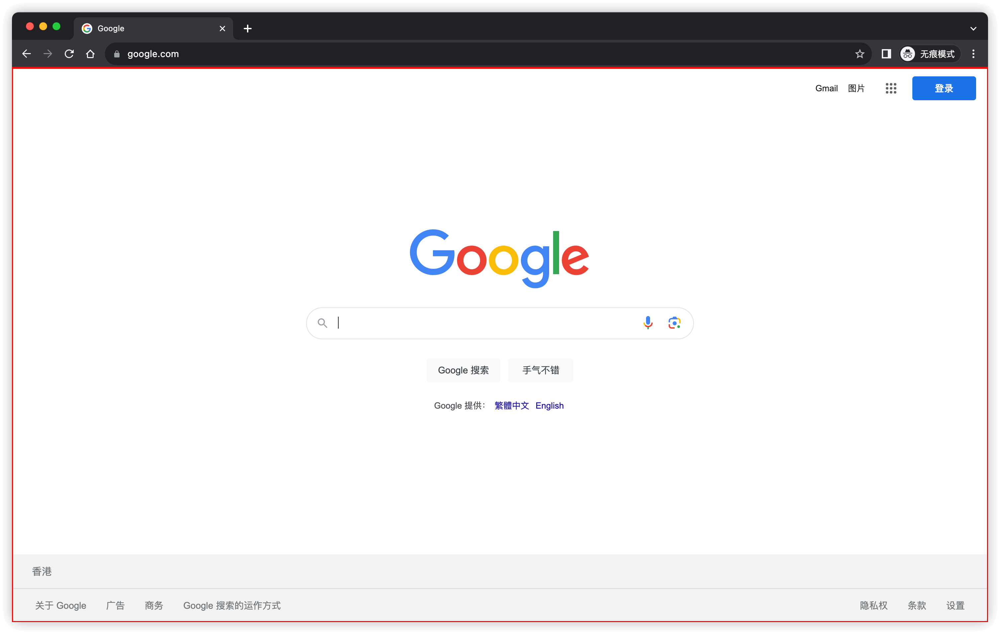
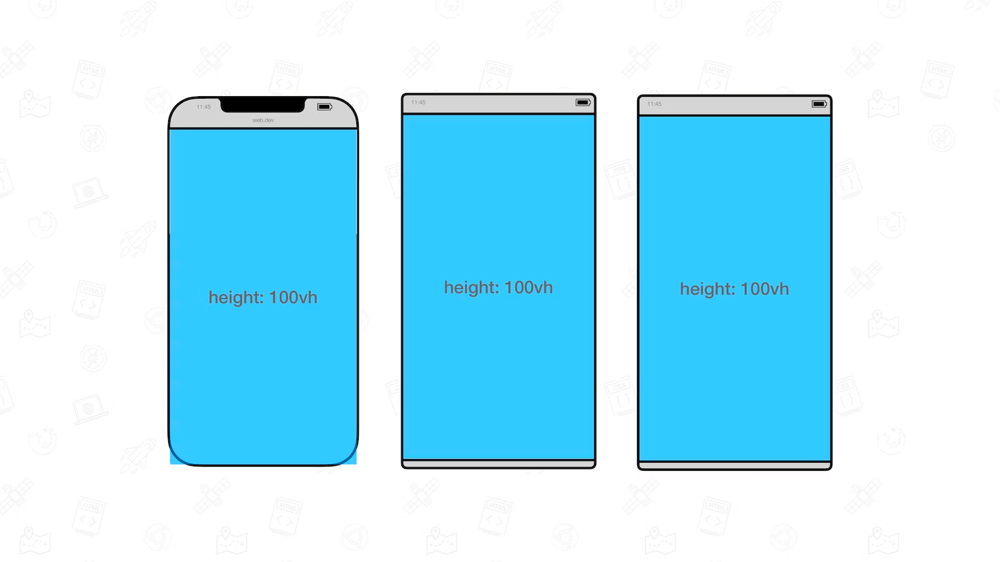

进入主题之前, 先来了解一下现有的 CSS 长度单位, 可以分为绝对长度单位和相对长度单位.

## 绝对长度单位

### `px`

现代显示器是由一颗颗像素组成的, 以我的显示器为例, 分辨率为 2560x1664, 也就是说这块显示器横向有 2560 个像素, 纵向有 1664 个像素, 显示器的像素我们称为物理像素.

CSS 中的像素 `px` 我们称为逻辑像素, 它并不总是和物理像素一一对应的, **同等尺寸下**现代显示器的分辨率越来越高, 如果逻辑像素和物理像素一一对应的话, 那么同样大小的区域在高分辨率的显示器下就会越小, 如下图所示:

> 显示器有个指标 [PPI](https://zh.wikipedia.org/wiki/PPI), 越大表示同等尺寸下像素点越多

除了显示尺寸的问题外, 一个物理像素对应一个逻辑像素的显示效果是比较差的, 容易产生锯齿感. 所以现代操作系统都会提供缩放功能, 多个物理像素对应一个逻辑像素, 这样的话显示效果会比较细腻, 比如 macOS:

也就是说我这块显示器物理像素是 2560x1664, 逻辑像素是 1470x956, 所以 CSS 中 `1px` 约等于 1.74 个物理像素.

在浏览器 API 中, 我们可以通过 `window.devicePixelRatio` 获取到物理像素与逻辑像素的比值, 不过这个值似乎并不准确, [规范描述](https://drafts.csswg.org/cssom-view/#dom-window-devicepixelratio)中这是个双精度浮点数, 而在 MacBook 下测试所有浏览器都返回整数, 似乎对该值做了向上取整的操作.

### 其他绝对长度单位

绝对长度单位只需要知道 `px` 就可以了, 其他单位要不使用非国际单位, 对于我们来说难以理解, 比如英寸 `in`, 要不使用频率非常低, 比如毫米 `mm`, 但最主要的是这些单位都可以用 `px` 来表示, 比如 `1in === 96px`, `1mm === 3.78px`.

## 相对长度单位

### 相对于上层元素

| 单位 | 描述                                                                                                                                                     |
| ---- | -------------------------------------------------------------------------------------------------------------------------------------------------------- |
| em   | 当用在 [font-size](https://developer.mozilla.org/docs/Web/CSS/font-size) 时表示相对于父元素的 `font-size`, 其他 CSS 属性中使用时相对于自身的 `font-size` |
| rem  | 相对于根元素 `html` 的 `font-size`                                                                                                                       |

### 相对于字体

| 单位 | 描述                |
| ---- | ------------------- |
| ex   | 小写字符 `x` 的高度 |
| ch   | 数字 `0` 的宽度     |

不同的字体设计存在差异, 所以 `ex` 和 `ch` 的大小是跟具体字体相关的.

### 相对于行高

| 单位 | 描述                           |
| ---- | ------------------------------ |
| lh   | 当前元素 `line-height`         |
| rlh  | 根元素 `html` 的 `line-height` |

### 相对于视区(Viewport)

Viewport 指的是浏览器窗口中页面的可渲染区域, 也就是下图中的红框部分.

| 单位 | 描述                                                                                                                                           |
| ---- | ---------------------------------------------------------------------------------------------------------------------------------------------- |
| vw   | `1vw` 表示 Viewport 宽度的 1%                                                                                                                  |
| vh   | `1vh` 表示 Viewport 高度的 1%                                                                                                                  |
| vmin | `1vmin` 表示 `Math.min(Viewport.width, Viewport.height)` 的 1%                                                                                 |
| vmax | `1vmax` 表示 `Math.max(Viewport.width, Viewport.height)` 的 1%                                                                                 |
| vi   | 逻辑单位, 取值与 [writing-mode](https://developer.mozilla.org/docs/Web/CSS/writing-mode) 相关, `1vi` 表示 Viewport 内联元素流动方向上长度的 1% |
| vb   | 逻辑单位, 取值与 `writing-mode` 相关, `1vb` 表示 Viewport 块级元素流动方向上长度的 1%                                                          |

> `vi` 和 `vb` 相关的 `writing-mode` 可以参考之前的文章 [CSS 书写模式和逻辑属性](https://mebtte.com/css_writing_modes_and_logical_properties)

Viewport 的大小和浏览器窗口相关, 所以以上单位会随着浏览器窗口大小的改变而改变.

以上是现有的 CSS 长度单位, 在 [CSS Values and Units Module Level 4](https://www.w3.org/TR/css-values-4) 中给视区增加了状态, 那什么是视区状态以及为什么要增加状态呢?

相对于 Viewport 的长度单位(`vw`/`vh`/...)在桌面浏览器上表现很好, 但是在移动设备上却存在一些问题. 在移动设备上为了尽可能地显示更多的内容, 浏览器会将地址栏/工具栏等元素覆盖在 Viewport 上或者使 Viewport 移位, 如下图所示:

然后往下滚动的过程中地址栏/工具栏等元素会逐渐消失或者隐藏, Viewport 也逐渐**完全**展示, 可以使用移动设备访问这个[例子](./viewport_units.html). 这就导致了相对于 Viewport 的单位在移动端表现是不符合预期的.

为了解决这个问题, CSS 指定了 Viewport 的状态:

- 大视区(LV, Large Viewport): Viewport 的**最大**展示区域, 也就是导航栏/工具栏之类的浏览器元素**收起**的时候
- 小视区(SV, Small Viewport): Viewport 的**最小**展示区域, 也就是导航栏/工具栏之类的浏览器元素**展开**的时候
- 动态视区(DV, Dynamic Viewport): 始终是 Viewport 的展示区域, 也就是处于 Large Viewport 时等于 Large Viewport, 处于 Small Viewport 时等于 Small Viewport

同时基于以上的状态新增了 `lvw`/`lvh`/`lvi`/`lvb`/`lvmin`/`lvmax`/`svw`/`svh`/`svi`/`svb`/`svmin`/`svmax`/`dvw`/`dvh`/`dvi`/`dvb`/`dvmin`/`dvmax` 18 个长度单位. 虽然数量很多, 但是可以根据以上状态分成三类:

### 大视区 `lv*`

| 单位  | 描述                                                                                         |
| ----- | -------------------------------------------------------------------------------------------- |
| lvw   | `1lvw` 表示 Large Viewport 宽度的 1%                                                         |
| lvh   | `1lvh` 表示 Large Viewport 高度的 1%                                                         |
| lvmax | `1lvmax` 表示 `Math.max(LargeViewport.width, LargeViewport.height)` 的 1%                    |
| lvmin | `1lvmin` 表示 `Math.min(LargeViewport.width, LargeViewport.height)` 的 1%                    |
| lvi   | 逻辑单位, 取值与 `writing-mode` 相关, `1lvi` 表示 Large Viewport 内联元素流动方向上长度的 1% |
| lvb   | 逻辑单位, 取值与 `writing-mode` 相关, `1lvb` 表示 Large Viewport 块级元素流动方向上长度的 1% |

### 小视区 `sv*`

| 单位  | 描述                                                                                         |
| ----- | -------------------------------------------------------------------------------------------- |
| svw   | `1svw` 表示 Small Viewport 宽度的 1%                                                         |
| svh   | `1svh` 表示 Small Viewport 高度的 1%                                                         |
| svmax | `1svmax` 表示 `Math.max(SmallViewport.width, SmallViewport.height)` 的 1%                    |
| svmin | `1svmin` 表示 `Math.min(SmallViewport.width, SmallViewport.height)` 的 1%                    |
| svi   | 逻辑单位, 取值与 `writing-mode` 相关, `1svi` 表示 Small Viewport 内联元素流动方向上长度的 1% |
| svb   | 逻辑单位, 取值与 `writing-mode` 相关, `1svb` 表示 Small Viewport 块级元素流动方向上长度的 1% |

### 动态视区 `dv*`

| 单位  | 描述                                                                                           |
| ----- | ---------------------------------------------------------------------------------------------- |
| dvw   | `1dvw` 表示 Dynamic Viewport 宽度的 1%                                                         |
| dvh   | `1svh` 表示 Dynamic Viewport 高度的 1%                                                         |
| dvmax | `1dvmax` 表示 `Math.max(DynamicViewport.width, DynamicViewport.height)` 的 1%                  |
| dvmin | `1dvmin` 表示 `Math.min(DynamicViewport.width, DynamicViewport.height)` 的 1%                  |
| dvi   | 逻辑单位, 取值与 `writing-mode` 相关, `1dvi` 表示 Dynamic Viewport 内联元素流动方向上长度的 1% |
| dvb   | 逻辑单位, 取值与 `writing-mode` 相关, `1dvb` 表示 Dynamic Viewport 块级元素流动方向上长度的 1% |

`lv*`/`sv*` 可能使用场景很少, 更多情况下还是使用 `dv*`. 像一些移动端的页面我们为了撑满一屏会使用 `height: 100vh`, 现在使用 `height: 100dvh` 会更符合预期.

最后就是兼容性问题, 目前从 [Can I use](https://caniuse.com/?search=large%2C%20small) 上看不太乐观, 生产环境下还是要避免使用.

### 参考

- [Viewport concepts](https://developer.mozilla.org/docs/Web/CSS/Viewport_concepts)
- [The large, small, and dynamic viewport units](https://web.dev/viewport-units)
- [CSS values and units](https://developer.mozilla.org/docs/Learn/CSS/Building_blocks/Values_and_units)
- [CSS 书写模式和逻辑属性](https://mebtte.com/css_writing_modes_and_logical_properties)
