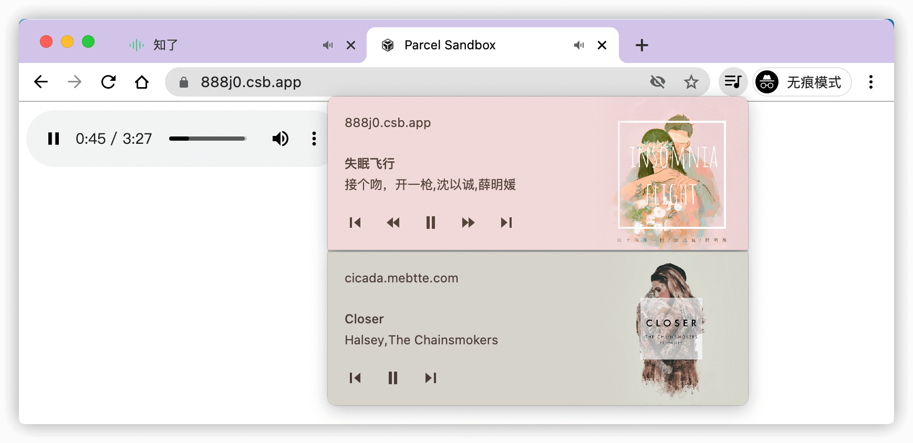
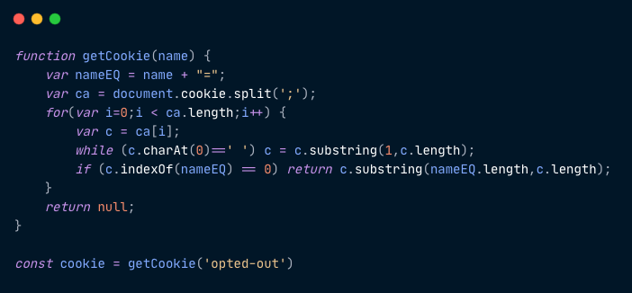
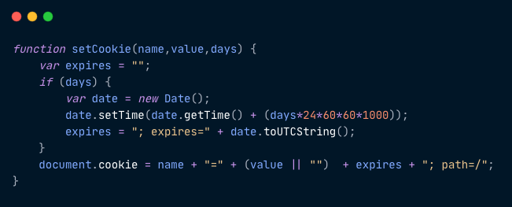
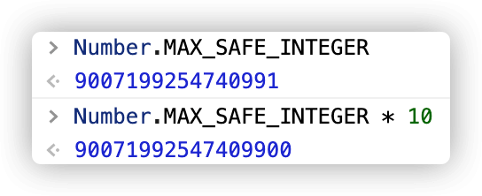

## Media Session API

如果想要控制页面上的 `audio`/`video`, 只能通过浏览器自带控制组件或者由开发者自己实现控制组件, 而且当页面处于无法点击状态时(比如切换到其他 Tab 或最小化浏览器窗口), 那么将无法实现控制 `audio`/`video`.

`Media Session API` 可以暴露页面 `audio`/`video` 的控制, 实现系统媒体中心控制页面的 `audio`/`video`, 包括正在播放媒体的基本信息(标题/作者/封面)以及操作(播放/暂停/快进/快退/下一个媒体/上一个媒体).

<iframe
  title="media_session"
  src="https://codesandbox.io/embed/mediasession-888j0?fontsize=14&hidenavigation=1&theme=dark"
></iframe>

上面的例子实现了一个基本的 `MediaSession`. 基本信息通过全局对象 `MediaMetadata` 实例化, 其中 `artwork` 可以设置多个值, 浏览器根据出现的场景自动选择最优尺寸, 然后赋值给 `navigator.mediaSession.metadata` 实现设置. 媒体的控制通过 `navigator.mediaSession.setActionHandler` 方法设置, `play`/`pause`/`seekbackward`/`seekforward`/`previoustrack`/`nexttrack` 分别对应 `播放`/`暂停`/`快退`/`快进`/`上一个媒体`/`下一个媒体` 操作. 当媒体播放后, 浏览器会将基本信息和操作与系统映射.

比如在 Windows10 下, 音量控制附近会出现媒体控制面板.


在 Android 系统下, 状态栏将会出现媒体控制面板.


某些浏览器头部也会出现媒体控制面板.



#### 兼容性及参考

- [Can I use 传送门](https://caniuse.com/?search=mediaSession)
- [Media Session API](https://developer.mozilla.org/docs/Web/API/Media_Session_API)
- [Media Session Standard](https://w3c.github.io/mediasession/#the-mediasession-interface)

---

## CookieStore API

目前, 浏览器可用的存储方式有 `cookie`/`sessionStorage`/`localStorage`/`IndexedDB`, 后三者都暴露了十分友好的 API 供开发者访问, 只有 cookie 例外. 回想一下, 平时我们都是怎么操作 cookie 的. 比如想要获取某个 cookie, 因为 `document.cookie` 返回所有 cookie 联合的字符串, 所以必须要手动解析才能获取到某个 cookie 的值.



如果想要添加一个 cookie, 那么需要像下面一样将 cookie 转换成字符串然后赋值给 `document.cookie`.



是不是觉得很奇怪, 明明 `document.cookie` 是所有 cookie 的集合, 但是添加一个 cookie 却是直接给 `document.cookie` 赋值. 还有另一个奇怪的点, 有些时候添加一个 cookie 根本不生效, 但是浏览器并不会给出任何的错误信息, 所以只能在 `setCookie` 之后通过 `getCookie` 判断是否生效.

```js
setCookie('name', 'value', 1);
if (getCookie('name')) {
  console.log('success to setCookie');
} else {
  console.log('fail to setCookie');
}
```

然而, 删除一个 cookie 更奇怪, 我们无法直接删除, 而是让 cookie 过期.


基于以上的问题推出了新的 CookieStore API.

首先, 在 window 上添加了一个名为 `cookieStore` 的对象, 然后 `cookieStore` 对象上挂载 `get/set/delete` 三个方法分别对应单个 cookie 的 `获取/添加/删除` 操作. 需要注意的是, `get/set/delete` 返回的都是 `Promise`, 所以需要处理异常.

```js
/** 获取一个 cookie */
try {
  // 根据 name 获取
  const cookie = await window.cookieStore.get('name');
  // 获取根据条件获取
  const cookie = await window.cookieStore.get({
    value: 'xxx',
  });
  if (cookie === null) {
    console.log('name is a emtpy cookie');
  } else {
    console.log(cookie);
    /**
     * cookie 包含以下字段
     * { domain, expires, name, path, sameSite, secure, value }
     * 如果某些字段未设置则为 null
     */
  }
} catch (error) {
  // do with error
}
```

```js
/** 添加一个 cookie, 修改一个 cookie 跟之前一样通过覆盖实现 */
try {
  /**
   * 可配置的字段如下
   * { domain, expires, name, path, sameSite, secure, value }
   */
  await window.cookieStore.set({
    name: 'name',
    value: 'value',
    expires: Date.now() + 1000 * 60 * 60 * 24, // 一天后过期
  });
} catch (error) {
  // do with error
}
```

```js
/** 删除一个 cookie */
try {
  await window.cookieStore.delete('name');
} catch (error) {
  // do with error
}
```

同时, cookieStore 还提供了 `getAll` 的方法, 用于获取 cookie 列表.

```js
try {
  // 根据 name 获取, 因为 cookie 可以存在同名的 cookie
  const cookieList = await window.cookieStore.getAll('name');
  // 或者根据条件获取
  const cookieList = await window.cookieStore.getAll({
    value: 'xxx',
  });
  // 如果没有条件, 则返回所有 cookie
  const cookieList = await window.cookieStore.getAll();
  // ...
} catch (error) {
  // do with error
}
```

以前想要监听 cookie 变化, 只能通过定时器定时检查 cookie, 而 `cookieStore` 直接提供了监听 cookie 变化的能力.

```js
cookieStore.addEventlistener('change', (event) => {
  const {
    changed, // 发生变化的 cookie 数组
    deleted, // 删除的 cookie 数组
  } = event;
  // ...
});
```

#### 兼容性及参考

- [Can I use 传送门](https://caniuse.com/?search=cookieStore)
- [Introducing: The Async Cookie Store API](https://medium.com/nmc-techblog/introducing-the-async-cookie-store-api-89cbecf401f)
- [Cookie Store API](https://wicg.github.io/cookie-store)

---

## Shape Detection API

#### 兼容性及参考

- [Can I use 传送门](https://caniuse.com/?search=barcodedetector)
- [Accelerated Shape Detection in Images](https://wicg.github.io/shape-detection-api)

---

## Top-level await

以前 `await` 关键字只允许在 `async function` 的内部使用, `top-level await` 可以让我们直接在 `async function` 外使用 `await` 关键字.

```js
// module-a.js
(async function() {
  const { default: axios } = await import('axios');
  const response = await axios.request('https://registry.npm.taobao.org/react');
  console.log(response.data.name); // react
})();
```

使用 `top-level await` 上面的脚本可以直接移除 `async function`.

```js
// module-a.js
const { default: axios } = await import('axios');
const response = await axios.request('https://registry.npm.taobao.org/react');
console.log(response.data.name); // react
```

如果一个模块使用了 `top-level await`, 那么引用这个模块的其他模块将会等待这个模块 `resolve`.

```js
// a.js
console.log(1);
const { default: axios } = await import('axios');
const response = await axios.request('https://registry.npm.taobao.org/react');
console.log(2);

export default response.data.name;

// b.js
import name from './a.js';

console.log(name); // react
```

上面的代码, 输出顺序是 `1 2 react`, 也就是说, b 模块将会等待 a 模块 `resolve` 才会继续执行. 同理, 当 a 模块 `reject`, b 模块也会无法正常工作. 要想 b 模块正常工作, 那么需要对 a 模块添加错误处理.

```js
// a.js
let name = 'default name';

try {
  const { default: axios } = await import('axios');
  const response = await axios.request('https://registry.npm.taobao.org/react');
} catch (error) {
  // do with error
}

export default name;

// b.js
import name from './a.js';

console.log(name); // 没有发生错误输出 react, 发生错误输出 default name
```

`top-level await` 非常适合某些场景.

### 条件引入模块

我们知道 `static import` 是无法实现根据条件引入, 比如下面的代码是不合法的.

```js
if (process.env.NODE_ENV === 'production') {
  import a from 'a.js';
} else {
  import a from 'a_development.js';
}
```

通过 `top-level await` 配合 `dynamic import` 可以模拟条件静态引入.

```js
let a;

if (process.env.NODE_ENV === 'production') {
  a = await import('a.js');
} else {
  a = await import('a_development.js');
}
```

### 依赖回退

当我们引入一个静态模块时, 如果模块加载失败, 那么引用这个模块的其他模块都无法正常工作.

```js
import $ from 'https://cdn.example.com/jquery.js';

// 如果 https://cdn.example.com/jquery.js 加载失败, 那么下面的代码都无法正常工作
// do with $
```

通过 `top-level await` 配合 `dynamic import` 可以实现依赖的回退操作.

```js
// jquery_wrapper.js
let $;
try {
  $ = await import('https://cdn_a.example_a.com/jquery.js');
} catch (error) {
  $ = await import('https://cdn_b.example_b.com/jquery.js');
}

export default $;

// example.js
import $ from 'path_to/jquery_wrapper.js';

// do with $
```

### 资源初始化

以前, 当一个资源需要异步操作才能初始化时, 通常会有以下写法.

```js
// ws.js
let ws;

async function getWs() {
  if (!ws) {
    const url = await getUrl();
    ws = new Websocket(url);
  }
  return ws;
}

export default {
  sendMessage: async (message) => {
    const ws = await getWs();
    return ws.sendMessage(message);
  },
};
```

> 注意, 上面的代码只是实例, 实际应用中还需要大量的错误处理

上面的代码中, 同步的 `sendMessage` 方法因为异步的 `getWs` 方法被迫变成异步方法, 使用 `top-level await` 可以避免这种问题.

```js
const url = await getUrl();
const ws = new Websocket(url);

export default ws;
```

#### 兼容性及参考

- [Can I use 传送门](https://caniuse.com/?search=top-level%20await)
- [tc39/proposal-top-level-await](https://github.com/tc39/proposal-top-level-await)

---

## BigInt

在 JavaScript 中, 整数的范围是 `[Number.MIN_SAFE_INTEGER, Number.MAX_SAFE_INTEGER]`, 也就是负 2 的 53 次方减 1 到 2 的 53 次方减 1, 如果超出这个范围将不能保证其精度, 比如:



如果想要精确地表示超出安全整数, 通常做法是转换成字符串, 然后实现各种字符串运算的方法(相信不少人都做过数字字符串相加的一道算法题, 比如 `'123' + '789' = '912'`).

`BigInt` 可以表示任意大的整数, 即使超出 `SAFE_INTEGER` 的范围依然能够保证精度. 声明一个 `BigInt` 可以在 number 后面添加 `n` 或者通过 `BigInt` 方法:

```js
const a = 123n;
const b = BigInt(123);
const c = BigInt('123');
```

上面的 `a` / `b` / `c` 都表示 `123n`. `BigInt` 支持 `+` / `-` / `*` / `/` / `**` / `%` 运算符, 但是不能与其他类型混合运算:

```js
const a = 1n + 2n; // 3n
const b = 2n - 1n; // 1n
const c = 3n * 3n; // 9n
const d = 4n / 2n; // 2n
const e = 2n ** 2n; // 4n
const f = 5n % 3n; // 2n

/** 除数不能为 0n */
const g = 2n / 0n; // Uncaught RangeError: Division by zero

/** 不能与其他类型运算 */
const h = 2n + 1; // Uncaught TypeError: Cannot mix BigInt and other types

/** 运算结果将会忽略小数 */
const i = 3n / 2n; // 1n
const k = -3n / 2n; // -1n
```

`BigInt` 可以与 number 进行转换, 如果 `BigInt` 超过 `SAFE_INTER` 的范围, 那么转换后的 number 将会丢失精度:

```js
const a = BigInt(Number.MAX_SAFE_INTEGER);
const b = a + a;
const c = Number(b); // c 不能保证准确
```

`BigInt` 同样支持比较操作, 并且能够与 number 进行比较:

```js
/** 与 number 不严格相等 */
1n == 1; // true
1n === 1; // false

2n > 1; // true
2 > 1n; // true
2n >= 2; // true
```

`BigInt` 也有一些局限性, 首先不支持调用 `Math` 对象上的方法, 其次不支持 `JSON.stringify`, 如果想要序列化, 可以实现 `BigInt` 的 `toJSON` 方法:

```js
BigInt.prototype.toJSON = function() {
  // BigInt toString 不会带上 n, 例如 2n.toString() === '2'
  return this.toString();
};

JSON.stringify({ value: 2n }); // { "value": "2" }
```

需要注意的是, `BigInt` 和 `Symbol` 一样是个普通方法, 不是一个构造方法, 所以无法通过 `new` 实例化:

```js
const a = new BigInt(1); // Uncaught TypeError: BigInt is not a constructor
```

> JavaScript 一共有 7 种数据类型 `undefined` / `null` / `boolean` / `number` / `string` / `symbol` / `object`, `BigInt` 是第 8 种数据类型, `typeof 1n` 的值是 `bigint`, 而且属于基本类型.

#### 兼容性及参考

- [Can I use 传送门](https://caniuse.com/?search=bigint)
- [BigInt - JavaScript | MDN](https://developer.mozilla.org/docs/Web/JavaScript/Reference/Global_Objects/BigInt)

## Numeric separators

通常情况下, 如果一个数字特别大, 我们会在显示界面添加分隔符显得更有可读性:


> 现在通常是千位分隔符, 应该是源于英语中的 thousond/million/billion/trillion/..., 每增加 3 位都有一个专有名词(https://en.wikipedia.org/wiki/Names_of_large_numbers). 对于我来说更偏向于万位分隔符, 可能是小学数学课养成的习惯.

但是在 JavaScript 层面, 无论一个数多大我们都只能连写, 比如 `1032467823482.32134324`, 需要认真数的情况下才能得知准确的值.

现在, `Numeric separators` 特性允许在数字字面量之前插入 `_` 分隔符, 使数字字面量更具可读性.

```js
const a = 123_456;
const b = 123.345_789;
```

`_` 分隔符可以出现在整数部分, 也可以出现在小数部分. 除了十进制, 分隔符同样可以出现在其他进制:

```js
const a = 0b101_101; // 二进制
const b = 0o765_432; // 八进制
const c = 0xfed_dba_987; // 十六进制
```

上面的代码是每隔 3 位添加分隔符, 其实分隔符是可以随意添加的, 但是需要注意的是, 分隔符只能在`数字之间`添加, 不能在数字开头/结尾/进制标志/小数点/科学计数法符号两边添加, 也不能连续两个分隔符, 下面分隔符的位置都是`错误`的:

```js
_123; // 开头, 这其实是一个合法的变量名
123_; // 结尾

/** 进制标志 */
0_b101; // 进制中间
0x_fd9; // 进制后面

/** 科学计数法 */
1.23_e14; // 科学计数法前面
1.23e_14; // 科学计数法后面

123__456; // 连续两个分隔符
```

数字分隔符只是为了提高代码可读性, 带有分隔符的数字在转换成字符串的时候不会带上分隔符, 同样地, 带有 `_` 字符串也不能正确地转换成数字:

```js
(123_456.123_456).toString(); // 123456.123456
Number('123_456.123_456'); // NaN
Number.parseInt('123_456', 10); // 123
Number.parseFloat('123_456.123_456', 10); // 123
```

还有一点, `Numeric separators` 同样适用于 `BigInt`.

#### 兼容性及参考

- [Can I use 传送门](https://caniuse.com/?search=Numeric%20separators)
- [Numeric separators](https://tc39.es/proposal-numeric-separator/)
- [ECMAScript feature: numeric separators](https://2ality.com/2018/02/numeric-separators.html)

---

## CSS 颜色方法新的语法

CSS 中提供了 4 个`颜色方法`, 分别是 `rgb` / `rgba` / `hsl` / `hsla`. 以前每个方法的参数都需要用`逗号`分隔, 现在 `rgb` / `hsl` 新的语法可以省略参数中的`逗号`而直接使用`空格`分隔.

```css
color: rgb(1, 2, 3);
/* 等同于 */
color: rgb(1 2 3);

color: hsl(1, 2%, 3%);
/* 等同于 */
color: hsl(1 2% 3%);
```

省略逗号的同时, `rgb` / `hsl` 都支持第 4 个参数, 表示透明度, 从而替换 `rgba` 和 `hsla`.

```css
color: rgba(1, 2, 3, 0.4);
/* 等同于 */
color: rgb(1 2 3 / 0.4);

color: hsla(1, 2%, 3%, 0.4);
/* 等同于 */
color: hsl(1 2% 3% / 0.4);
```

其中, `/` 两侧的空格可有可无.

#### 兼容性及参考

- [Can I use 传送门](https://caniuse.com/mdn-css_types_color_space_separated_functional_notation)
- [No-Comma Color Functions in CSS](https://css-tricks.com/no-comma-color-functions-in-css)
