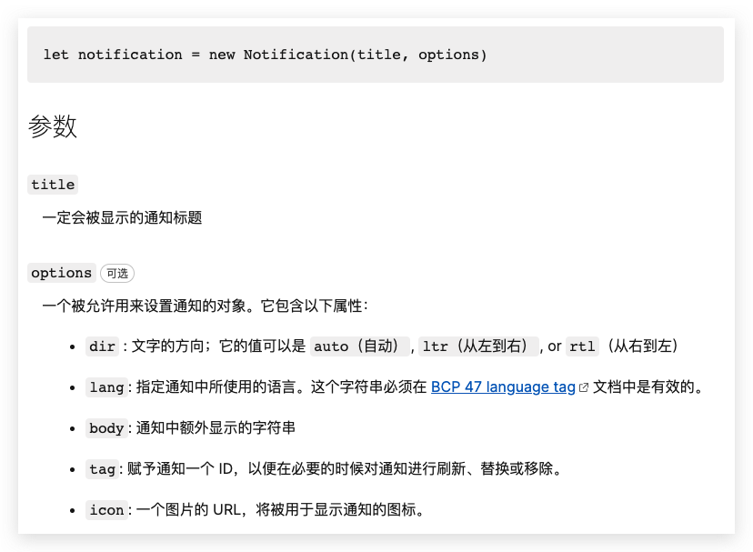

实现浏览器离线推送, 主要涉及到三个 [Web API](https://developer.mozilla.org/zh-CN/docs/Web/API):

- [Notification](https://developer.mozilla.org/zh-CN/docs/Web/API/notification)
- [Service Worker](https://developer.mozilla.org/zh-CN/docs/Web/API/Service_Worker_API)
- [Push](https://developer.mozilla.org/zh-CN/docs/Web/API/Push_API)

## Notification

Notification API 用于展示通知, 通知是系统级别的, 所以会呈现在其他应用之上, 即使焦点不在页面上.


因为通知是敏感权限, 所以需要用户授权, 且在 HTTPS 环境下或在 localhost 域名下生效. Notification API 挂载在 `globalThis.Notification` 对象下, 我们可以通过 `Notification.permission` 属性和 `Notification.requestPermission` 方法判断和获取权限.

> 这里用 `globalThis.Notification` 表示是因为 Notification API 在 Web Worker 中可用.

`Notification.permission` 有三种情况, `default` 表示尚未申请权限, `granted` 表示已授予权限, `denied` 表示已拒绝授予权限, 通常只有在 `default` 的情况下我们才会调用 `Notification.requestPermission` 请求通知权限:

```js
if (Notification.permission === 'granted') {
  window.alert('已获取通知权限, 无需再次获取');
} else if (Notification.permission === 'denied') {
  window.alert('已拒绝通知权限, 需要重置请求权限再获取');
} else {
  window.Notification.requestPermission().then((result) => {
    if (result === 'denied') {
      return window.alert('已拒绝通知权限');
    }
    if (result === 'default') {
      return window.alert('已忽略通知权限申请');
    }

    window.alert('已获取通知权限');
  });
}
```

如果在 `denied` 的情况下仍然申请权限, 结果永远是 `denied`, 这是为了避免权限申请弹窗频繁弹出影响用户体验.


获取通知权限后就可以通过类 `Notification` 构造通知, 一旦 `Notification` 被实例化就会被展示.



Notification 实例可以监听以下事件:

- click: 当用户点击通知时触发
- show: 当通知显示时触发
- close: 当通知被关闭时触发
- error: 当通知遇到错误时触发

比如我们想用户点击通知时打开新的页面, 就可以监听 `click` 事件:

```js
notification.addEventListener('click', () => {
  window.open(url);
  notification.close();
});
```

点击事件回调的最后我们要手动调用 `close` 方法关闭通知, 否则通知会一直存在系统的通知栏里. 如果通知没有监听点击事件, 用户点击通知是没有任何效果也不会消失的. 还要一点要注意的是, 当页面被关闭后, 通知也是不会消失的, 此时的通知事件监听已经被释放, 所以用户点击通知会打开站点首页的默认行为.

这里有个 Notification 的 <a href="./notification.html">DEMO</a>.

## Service Worker

Service Worker 是 [Web Worker](https://developer.mozilla.org/zh-CN/docs/Web/API/Web_Workers_API) 的一种变体,
