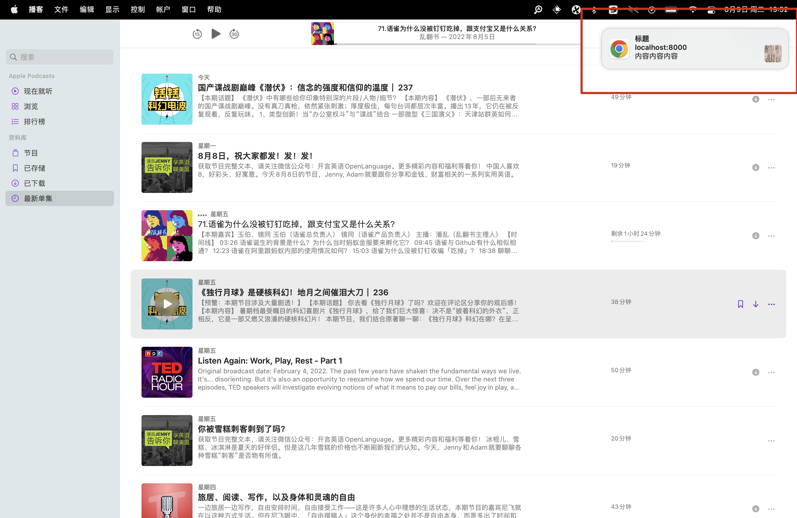
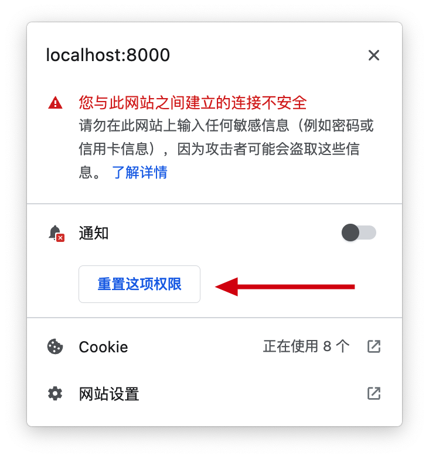

实现浏览器离线推送, 主要涉及到三个 [Web API](https://developer.mozilla.org/zh-CN/docs/Web/API):

- [Notification](https://developer.mozilla.org/zh-CN/docs/Web/API/notification)
- [Push API](https://developer.mozilla.org/zh-CN/docs/Web/API/Push_API)
- [Service Worker](https://developer.mozilla.org/zh-CN/docs/Web/API/Service_Worker_API)

## Notification

Notification API 用于展示通知, 通知是系统级别的, 所以会呈现在其他应用之上, 即使焦点不在页面上.



因为通知是敏感权限, 所以需要用户授权, 且在 HTTPS 环境下或在 localhost 域名下生效. Notification API 挂载在 `globalThis.Notification` 对象下, 我们可以通过 `Notification.permission` 属性和 `Notification.requestPermission` 方法判断和获取权限.

> 这里用 `globalThis.Notification` 表示是因为 Notification API 在 Web Worker 中可用.

`Notification.permission` 有三种情况, `default` 表示尚未申请权限, `granted` 表示已授予权限, `denied` 表示已拒绝授予权限, 通常只有在 `default` 的情况下我们才会调用 `Notification.requestPermission` 请求通知权限:

```js

```

如果在 `denied` 的情况下仍然申请权限, 结果永远是 `denied`, 这是为了避免权限申请弹窗频繁弹出影响用户体验.



<a href="./notification.html">DEMO</a>
