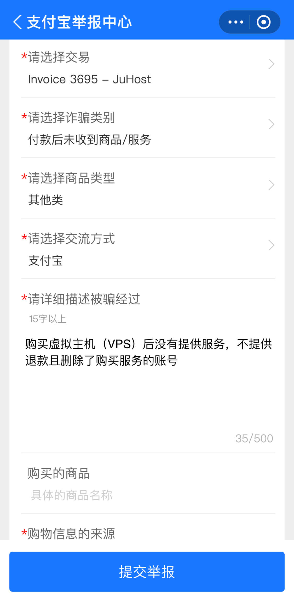

这两周用于内网穿透的腾讯云新加坡的小主机开始变得不稳定, 带宽和丢包率一会高一会低, 所以想换个机器.

忘了不知道在哪看到过 JuHost 的宣传, 所以对它有印象. 上官网看了一下, 主要是用于内网穿透, Level 1 的机器感觉还可以.


于是就注册了账号, 使用支付宝购买了 Level 1 的机器, 购买后在后台看到机器的状态一直处于准备中, 所以就去干别的事情了.


大概二十分钟后, 收到了 JuHost 的邮件, 表示我是高风险账号, 无法给我提供服务.


登录到后台发现机器的状态从准备中变成了被封禁, 于是我在工单询问是什么情况. 大概意思如下:

```
我: 为什么我的账号是高风险类别?
JuHost: 我也不知道
我: 那就帮我退款吧!
JuHost: 72 小时后再来找我吧!
```


我对 72 小时这个关键词很有印象, 因为官网写着 3 天内退款保证, 他们让我 72 小时后再来我就怀疑他们是钻这个的空子.


我已经对退款不报希望了, 毕竟没必要为了这点钱浪费精力, 结果今天再登录 JuHost, 发现账号都没了.


就感觉不仅骗你, 还要耍你, 所以直接在支付宝举报了, 等待后续中...


