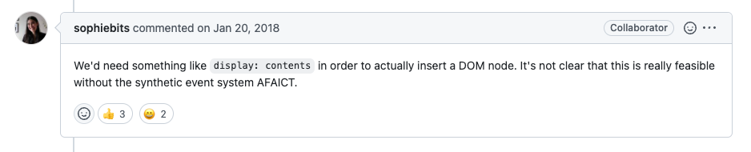
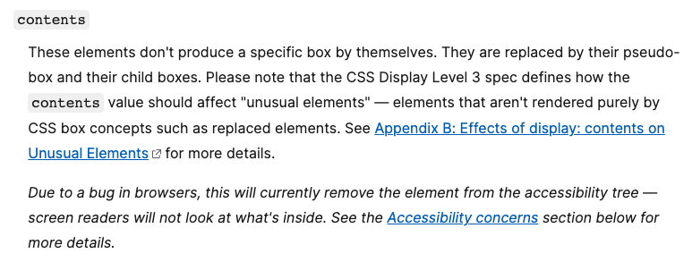
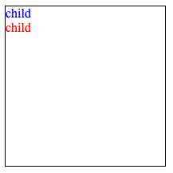
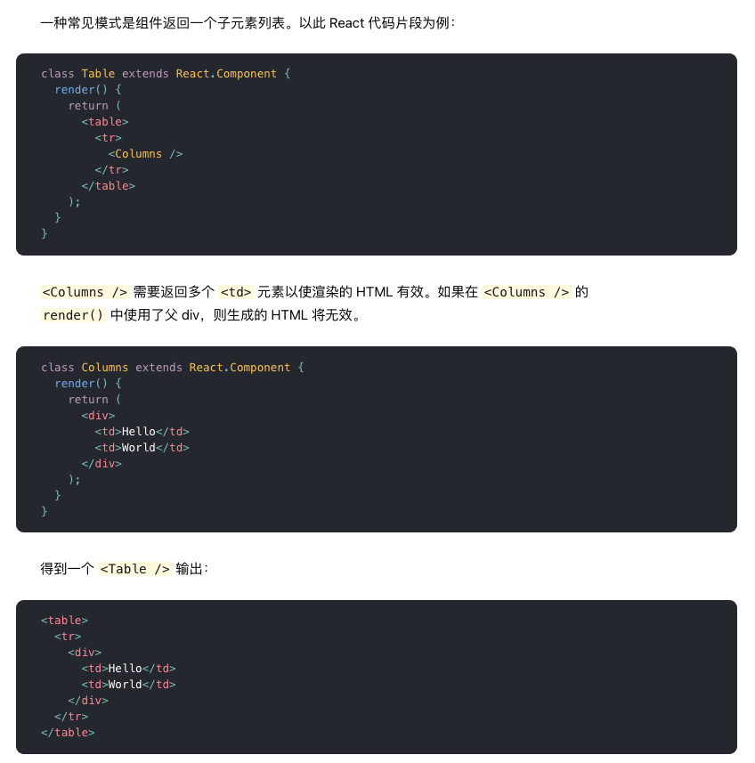
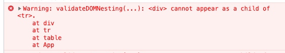

[React Fragment](https://reactjs.org/docs/fragments.html) 支持**不添加额外节点**的情况下对子元素进行分组, 在文档上中 `Fragment` 的 Props 只有 `key`, 我们给 Fragment 添加任何事件监听例如 `onClick` 都是没有效果的.

```jsx
<Fragment onClick={() => alert('click from fragment')}>
  <button type="button">yes</button>
  <button type="button">no</button>
</Fragment>
```

通常情况下我们会把 Fragment 的事件监听分配给各个子节点:

```jsx
const onClick = () => alert('click from fragment');
return (
  <Fragment>
    <button type="button" onClick={onClick}>
      yes
    </button>
    <button type="button" onClick={onClick}>
      no
    </button>
  </Fragment>
);
```

不过这种写法不太优雅, 特别是子节点自身就有同名事件监听的情况下:

```jsx
const onClick = () => alert('click from fragment');
const onClickYes = () => {
  alert('click from yes');
  onClick();
};
const onClickNo = () => {
  alert('click from no');
  onClick();
};
return (
  <Fragment>
    <button type="button" onClick={onClickYes}>
      yes
    </button>
    <button type="button" onClick={onClickNo}>
      no
    </button>
  </Fragment>
);
```

React 仓库有一个讨论以上情况的 [issue](https://github.com/facebook/react/issues/12051), 遗憾的是 React 官方暂没有打算在 Fragment 上添加事件监听, 不过有一个讨论引起了我的注意:



于是在 MDN 上查阅了 `display: contents`:



简单来说, 一个 `display=contents` 的节点, 自身表现相当于 `display=none` 但是**子节点会照常渲染**, 我们看个例子:

```html
<div
  class="parent"
  style="width: 200px; height: 200px; border: 1px solid black;"
>
  <div class="child" style="color: blue;">child</d>
  <div class="child" style="color: red;">child</div>
</div>
```

上面的 html 渲染结果会是这个样子:



如果我们给 parent 添加 `display: contents` 就会取消渲染, 但是 child 正常渲染:

<iframe
  title="display_contents"
  src="https://codepen.io/mebtte/embed/wvmwzBj?default-tab=html%2Cresult"
>
</iframe>

`display=contents` 虽然不会渲染但是保留了其他特性, 包括事件监听, 根据这个特点, 我们可以用来模拟 `Fragment`:

```jsx
<div
  style={{ display: 'contents' }}
  onClick={() => alert('click from fragment')}
>
  <button type="button" onClick={() => alert('click from yes')}>
    yes
  </button>
  <button type="button" onClick={() => alert('click from no')}>
    no
  </button>
</div>
```

这样实现的 Fragment 虽然达到了不可见的效果, 不过依然存在 DOM 结构中, 在一些特殊场景下依然会导致问题, 比如官方文档中 table 的[例子](https://zh-hans.reactjs.org/docs/fragments.html#motivation):





所以 `display: contents` 并不能很好地解决这个问题.

## 封装组件

React Fragment 是 [16.2](https://reactjs.org/blog/2017/11/28/react-v16.2.0-fragment-support.html) 推出的, 在这之前, 我一直用 [react-aux](https://github.com/gajus/react-aux) 实现 `Fragment` 的功能, 它的原理很简单:

```jsx
// https://github.com/gajus/react-aux/blob/master/src/ReactAux.js
module.exports = function Aux(props) {
  return props.children;
};
```

同时, React 自身提供了对 children 的遍历方法 [Children.map](https://reactjs.org/docs/react-api.html#reactchildrenmap), 所以是不是可以在 react-aux 的基础上对 children 进行遍历操作注入事件监听?

测试多次后得到了以下组件:

```jsx
function Fragment(props) {
  const { children, ...rest } = props;
  return Children.map(children, (child) => {
    const externalProps = {};
    Object.keys(rest).forEach((propName) => {
      /**
       * 只需要处理 on 开头的 props
       * 忽略非事件监听
       */
      if (propName.startsWith('on')) {
        externalProps[propName] = (event) => {
          /**
           * 模拟事件捕获/冒泡
           * 捕获先触发 Fragment 的事件监听, 后子节点
           * 冒泡先触发子节点的事件监听, 后 Frgment
           */

          /**
           * 如果子节点自身有同名事件监听
           * 按照捕获或者冒泡的顺序触发
           * 需要注意把 event 传递
           */
          const emitChild = () => {
            if (child.props[propName]) {
              child.props[propName](event);
            }
          };

          const emit = (capture) => {
            if (!capture) {
              emitChild();
            }

            /**
             * 触发 Fragment 的事件监听
             * 同样地把 event 传递
             */
            rest[propName](event);

            if (capture) {
              emitChild();
            }
          };

          emit();
        };
      }
    });

    /**
     * 克隆原有的子节点
     * 改写原来的 props
     */
    return cloneElement(child, {
      ...child.props,
      ...externalProps,
    });
  });
}
```

值得注意的是事件处理方法有 `捕获` 和 `冒泡` 两种方式, 需要额外处理 Fragment 和子节点的触发顺序. 此外, 如果通过 `child.props.onClick = x` 这样的方式改写 props 是不会生效的, 所以需要利用 React 节点的克隆方法 [cloneElement](https://reactjs.org/docs/react-api.html#cloneelement) 改写 props.

下面例子中, Fragment 的事件处理会在子节点身上触发, 捕获和冒泡的触发顺序也正确, 以及支持嵌套:

<iframe
  src="https://codesandbox.io/embed/fragment-with-event-listener-polj0j?fontsize=14&hidenavigation=1&theme=dark"
  title="fragment_with_event_listener"
></iframe>

当然, 没有特殊需求的情况还是建议使用 React 提供的 Fragment, 毕竟上面的封装也会导致一部分的性能损失.

### 进一步阅读

- [复习 DOM 事件](https://mebtte.com/review_dom_event)
- [display - CSS: Cascading Style Sheets | MDN](https://developer.mozilla.org/en-US/docs/Web/CSS/display)
- ["display contents" | Can I use... Support tables for HTML5, CSS3, etc](https://caniuse.com/?search=display%20contents)
