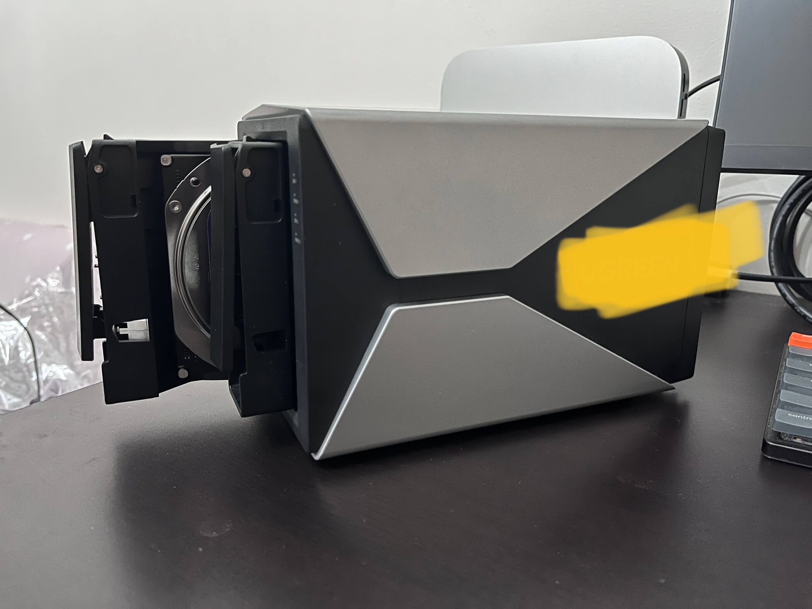
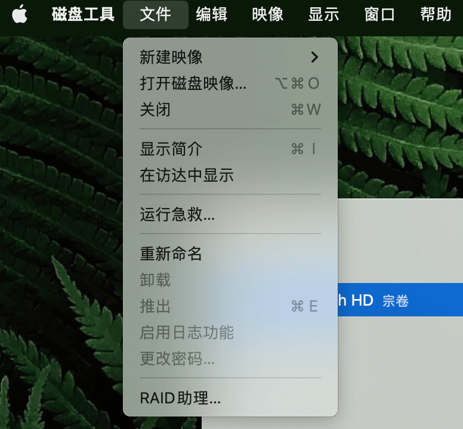
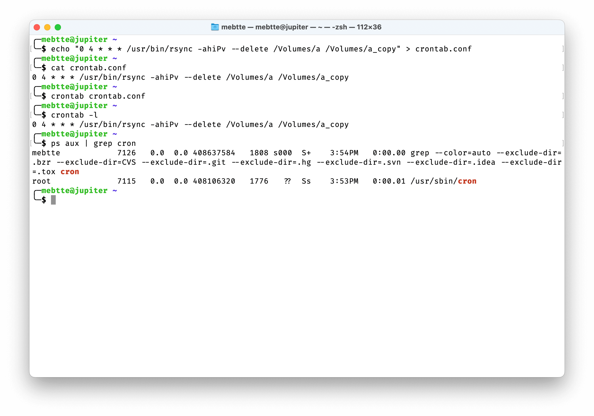
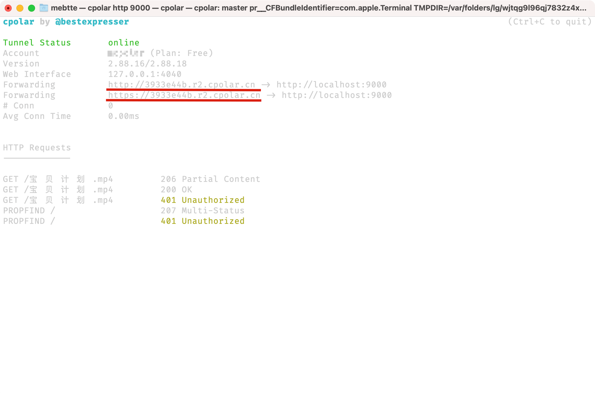

一般情况下我都是把影视资源放在网盘上, 第一是网盘空间大, 第二是随时随地可以观看(手机/平板/电脑).

前两个月「爱死机」出了第三季, 于是下载并放到网盘上打算晚点看. 当我忙完打开网盘想观看时, 发现被标注成「违规文件」无法观看, 也无法下载.

加上之前了解过 NAS, 所以想自己搞一个 NAS 用来存储文件, 这样就可以避免文件被审查的问题.

[NAS(Network Attached Storage)](https://zh.wikipedia.org/wiki/%E7%BD%91%E7%BB%9C%E9%99%84%E6%8E%A5%E5%AD%98%E5%82%A8) 可以简单理解成网盘, 比如外接一个移动硬盘, 我们需要通过数据线来连接, NAS 是通过网络连接远程的硬盘.

从技术角度看, NAS 就是一台服务器, 通过网络协议给其他计算机(手机/电脑/平板等等)提供存储服务.

本来想购买成品 NAS 的, 不过像群晖/威联通这些品牌机价格都比较高, 于是想自建一台 NAS, 首先性价比高一点, 其次自由度也更好一些, 没有成品 NAS 的一些功能限制.

自建 NAS 的话首先需要一台可以 24x7 工作的服务器, 因为我的性能要求不高, 主要考虑的是稳定性和功率(电费), 所以想到了以前折腾过的树莓派, 万万没想到的是以前 200 出头的树莓派竟然被炒到接近 1000, 足足翻了四五倍, 看了一下其他机器感觉也不太靠谱, 于是想等段时间价格下来之后再购买搭建 NAS 的, 结果等到现在树莓派的价格依然没有降下来.

前几天想起这个事的时候, 望了一眼平时在桌面积灰的 Mac mini, 这难道不是比树莓派更好的选择吗? 而且平时也是不关机的.


服务器搞定了, 还需要准备硬盘, 我的存储容量需求不是很高, 手上刚好有一块旧笔记本电脑拆下来的 2.5 寸机械硬盘, 因为要做备份所以要额外入手一块机械硬盘, 放置这两块硬盘还需要一个硬盘柜.

> 同等价格下机械硬盘的容量比固态硬盘大得多, 而且机械硬盘也比固态硬盘稳定, 数据恢复也更加容易.




上面说到 NAS 是通过网络协议给其他设备提供服务的, NAS 有很多种网络协议, 比如 [FTP](https://zh.wikipedia.org/wiki/%E6%96%87%E4%BB%B6%E4%BC%A0%E8%BE%93%E5%8D%8F%E8%AE%AE)/[NFS](https://zh.wikipedia.org/wiki/%E7%BD%91%E7%BB%9C%E6%96%87%E4%BB%B6%E7%B3%BB%E7%BB%9F)/[SMB](https://zh.wikipedia.org/wiki/%E4%BC%BA%E6%9C%8D%E5%99%A8%E8%A8%8A%E6%81%AF%E5%8D%80%E5%A1%8A) 等等. 作为 Web 开发人员, 我对这些协议不太熟悉, 所以我选用的是 [WebDAV](https://zh.wikipedia.org/wiki/%E5%9F%BA%E4%BA%8EWeb%E7%9A%84%E5%88%86%E5%B8%83%E5%BC%8F%E7%BC%96%E5%86%99%E5%92%8C%E7%89%88%E6%9C%AC%E6%8E%A7%E5%88%B6) 协议.

> SMB 最开始是由微软开发并在 Windows 上使用的, 后来由 [Andrew Tridgell](https://zh.wikipedia.org/wiki/%E5%AE%89%E5%BE%B7%E9%AD%AF%C2%B7%E5%9E%82%E9%B3%A9) 通过逆向工程移植到了 \*nix 平台下, 实现了跨操作系统的文件共享, 这就是著名的 [Samba](https://zh.wikipedia.org/wiki/Samba). 说到 AT, 就不得不说他和 [git](https://zh.wikipedia.org/wiki/Git) 的故事. 在 git 之前, Linux 内核通过一款名为 [BitKeeper](http://www.bitkeeper.org) 的商业版本控制系统进行维护, BitKeeper 的公司 BitMover 为 Linux 社区提供免费授权. 在 2005 年的时候 AT 对 BitKeeper 进行反编译并写了一个小程序连接 BitKeeper 的仓库, 此行为被 BitMover 发现并撤回了对 Linux 社区的免费授权, Linux 内核开发团队和 BitMover 磋商无果, 于是就有了 Linus 十天开发出 git 的故事. 此外, AT 也是 [rsync](https://zh.wikipedia.org/wiki/Rsync) 的作者之一.

WebDAV 是在 HTTP 协议的基础上添加了额外的方法进行文件操作, 比如 COPY 方法进行文件复制 / MOVE 方法进行文件移动等等, 因为是基于 HTTP 协议, 所以 WebDAV 也可以通过 HTTPS 进行通信, 在公网情况下能够保证传输安全.

通过 NGINX 可以提供 WebDAV 服务, 不过 [homebrew](https://brew.sh/) 上的 NGINX 并不是完整版本, 没有包含 WebDAV 服务, 如果想要提供 WebDAV 服务的话需要自行编译. 自行编译比较麻烦, 而且 NGINX 本身也附带了一些我不需要的功能, 所以我没有选用 NGINX, 而是 GitHub 上的一个 [WebDAV](https://github.com/hacdias/webdav) 服务.

我的是 M1 版本的 Mac mini, 所以在 [Releases](https://github.com/hacdias/webdav/releases) 找到 darwin-arm64 包下载并解压.


在终端我们可以直接在执行这个程序:


在 macOS 一般情况下我们会把可执行命令放到 `/usr/local/bin` 下, 因为环境变量 `PATH` 已经包含了这个目录, 所以我们可以直接使用 webdav 命令而不用补全路径:

> macOS `/usr/bin` 目录被锁定用户无法进行操作, 不过提供了备用目录 `/usr/local/bin`, 如果这个目录不存在的话可以通过命令 `sudo mkdir /usr/local/bin && sudo chmod 755 /usr/local/bin` 创建.


我们先接入磁盘再部署 webdav 服务, 将硬盘放入硬盘柜再将硬盘柜连接到 Mac mini, 通过「磁盘工具」分别对两个硬盘进行格式化, 这里我用的是 APFS, 如果有加密需求的话可以选择加密格式.


两个盘一个命名 `a`, 另一个命名 `a_backup`, `a_backup` 作为 `a` 的备份. 这里为什么不组建 [RAID](https://zh.wikipedia.org/wiki/RAID) 呢? 这里有几个原因:

1. 我这款硬盘柜不支持硬件 RAID
2. 两块硬盘互为镜像的 RAID1 降低写入速度的同时降低硬盘使用寿命, 而且我的旧硬盘是 1T, 新硬盘是 4T, 组成 RAID1 后只有 1T 的可使用空间
3. 要存放的数据不是很重要, 不需要实时备份

所以我这里用的方式是定时备份.



定时备份的话需要借助 [cron](https://zh.wikipedia.org/zh-cn/Cron), macOS 自带了 crontab 和 cron 管理定时任务, 不需要额外安装, 需要注意的是要赋予 cron 完全磁盘访问权限, 具体操作是将 cron 程序拖入到「完全磁盘访问权限」列表中, 不然 cron 执行备份任务会报没有权限的错误:


此外还需要 [rsync](https://zh.wikipedia.org/wiki/Rsync), rsync 可以同步两个目录, 如果目标文件已存在则会跳过, 跟 `cp` 相比可以节省数据传输量. 一般情况下 macOS 都带有 rsync, 如果没有的话可以自行安装.

我的备份计划是每天一次, 因为备份会占用大部分磁盘的读写, 所以放在凌晨 4 点尽量避免日常使用:

```txt
0 4 * * * /usr/bin/rsync -ahiPv --delete /Volumes/a /Volumes/a_copy
```



> 默认情况下 macOS 会把磁盘挂在在 /Volumes 与磁盘同名的目录下, 比如 a 磁盘挂载目录就是 /Volumes/a

接下来就可以部署 webdav 服务了, 根据[项目说明](https://github.com/hacdias/webdav#readme)写好配置文件, 一般情况下我们会把配置文件放在 `/etc` 目录下并赋予相应的文件权限:

```yaml
# /etc/webdav.yaml
address: 0.0.0.0
port: 9000
auth: true
users:
  - username: mebtte
    password: 'your password'
    scope: /Volumes/a/webdav # a 磁盘的 webdav 目录
    modify: true
```


通过命令 `webdav --config /etc/webdav.yaml` 启动 webdav 服务后, 通过本机的访达可以测试连接:


如果像上面一样成功打开, 并且访达的侧边栏新增 `localhost` 的话, 说明 webdav 服务已经成功跑起来了, 现在可以像操作本地目录一样操作 `localhost` 目录, 别的设备通过局域网连接到 webdav 同样也可以进行操作:


这里我们通过命令行启动 webdav, 会有两个问题:

1. 终端被意外关闭 webdav 也会被停止
2. 重启后需要手动启动 webdav

所以我们需要将 webdav 封装成服务, 这样就可以自动启动并且可以后台运行. macOS 原生服务配置比较复杂, 我这里用的是 [supervisor](http://supervisord.org), 通过 `homebrew` 可以很容易地安装并启动 supervisor service:

```bash
brew install supervisor
brew services restart supervisor
```

简单来说, `supervisor` 可以帮助我们管理哪些程序需要开机启动并且在后台运行. 我们将 webdav 的配置放在 `/opt/homebrew/etc/supervisor.d` 目录下, 重新加载 supervisor 会自动读取该目录下 `*.ini` 的配置:

```txt
# webdav.ini
[program:webdav]
user = mebtte
command = /usr/local/bin/webdav --config /etc/webdav.yaml
```

```bash
mkdir -p /opt/homebrew/etc/supervisor.d
cd /opt/homebrew/etc/supervisor.d
vim webdav.ini
# 将上面配置写入并保存
```

通过 `supervisorctl reload` 重新加载配置, 再通过 `supervisorctl status` 查看状态, 不出意外的话可以看到 webdav 已经正常运行了, 我们关闭终端或者重启之后, supervisor 依然会帮我们在后台运行 webdav.


如果 `supervisorctl reload` 之后提示恶意软件警告, 可以在系统设置的「安全性与隐私」中忽略警告:


到目前为止, 我们运行的 webdav 服务只能在本地局域网内访问到, 要想非局域网内访问就需要将 webdav 服务暴露在公网上. 如果运营商给的是公网 IP, 那么在路由器设置端口转发就可以了.

> 即使有些运营商给的是公网 IP, 但是重新拨号后会分配另一个公网 IP, 这种情况下需要在端口转发的基础上额外配置 [DDNS](https://zh.wikipedia.org/wiki/%E5%8B%95%E6%85%8BDNS)

实际上, 更多的人的网络拓扑结构和我的一样, 运营商分配的是一个局域网 IP, 在这之上的小区路由才有公网 IP, 甚至有的小区路由也有可能是个局域网 IP.


这种网络结构下就需要通过[内网穿透](https://zh.wikipedia.org/zh-cn/NAT%E7%A9%BF%E9%80%8F)的技术了. 内网穿透的原理是借助一台有公网 IP 的机器, 内网机器与之建立隧道, 按照一定的规则访问公网 IP 的机器, 这台机器会自动转发给内网机器从而实现网络穿透.


公网 IP 的机器一般可以购买云服务器, 配置不需要好但是带宽要高, 因为内网穿透的速度取决于所有设备中最慢的那个, 而内穿穿透的软件有很多, github 上有个[仓库](https://github.com/anderspitman/awesome-tunneling)维护了一份列表.

不过内网穿透我没有选择自己搭建一套, 而是选择了 [cpolar](https://www.cpolar.com) 这个现成的服务, cpolar 提供了免费套餐.

和 webdav 一样, 我们需要把 cpolar [下载](https://www.cpolar.com/download)解压后放到 `/usr/local/bin` 目录, 按照文档配置 `token` 后, 执行命令 `cpolar http 9000` 暴露 webdav 服务, 通过控制台输出的信息找到域名, 在访达对这个域名进行连接:




依葫芦画瓢, 我们同样对 cpolar 新建一个 supervisor 的配置文件:

```txt
[program:cpolar]
user = mebtte
environment = HOME="/Users/mebtte"
command = /usr/local/bin/cpolar http 9000
```

```bash
cd /opt/homebrew/etc/supervisor.d
vim cpolar.ini
# 将上面的配置写入并保存
```

然后执行 `supervisorctl reload`, 因为 cpolar 是 supervisor 帮我们运行的, 所以我们无法看到输出的域名信息, 而且 cpolar 每次启动都会随机一个域名, 这时就需要打开 cpolar 的[控制面板](https://dashboard.cpolar.com/status)查看域名信息, 根据面板上展示的域名访问即可.


如果不想每次启动都随机域名的话, 可以选择 cpolar 的付费套餐支持固定域名.

> 访问内网服务还可以通过 VPN 的方式, 不过这种方式工程量和成本都很高, 一般情况下只有企业采用.

公网访问的情况下速度会比本地访问差很多, 所以一般我不用访达连接 webdav 服务, 因为访达需要将文件完整下载后才能打开, 大文件容易造成访达卡死, 这里的话桌面设备推荐使用 [Cyberduck](https://cyberduck.io), 移动设备使用 [nPlayer](https://nplayer.com) 进行访问.

最后在 macOS 设置「断电后自动启动」, 这样意外停电来电的时候会自动启动 Mac mini, 加上 supervisor 服务实现了全流程自动化.


NAS 除了提供文件存储服务以外, 基本任何服务都能以内网穿透的方式暴露出去, github 上有个 [awesome-selfhosted](https://github.com/awesome-selfhosted/awesome-selfhosted#readme) 的项目记录了大量可自主部署的服务, 比如下载服务/照片自动备份服务, 有时间可以慢慢折腾.
