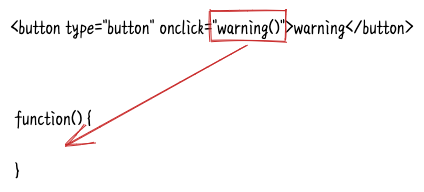
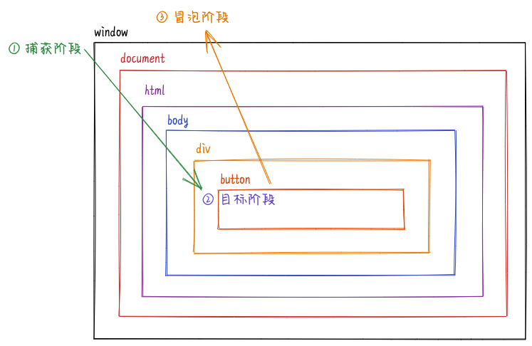
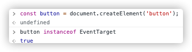

最近面试时发现很多前端对 DOM 事件不熟悉, 甚至完全没有了解过相关的概念, 所以趁着这个机会, 自己也整理并复习一下 DOM 事件相关的知识点.

DOM 事件指的是文档上的元素会主动或者被动地触发一些特定的行为, 然后可以使用 JavaScript 对这些行为进行监听, 当这些行为触发时会自动执行对应的脚本. 例如一个 `button` 元素, 当被点击时我们想弹出一个警告, 可以这样:

```html
<button type="button" onclick="window.alert('warning')">
  warning
</button>
```

上面是通过元素的 `onclick` 属性添加点击事件的处理, 其他事件同样可以通过元素的 `on*` 属性添加事件监听, 比如监听鼠标按下 `onmousedown`, 获得焦点 `onfocus`, 完整的事件列表可以查看 [https://developer.mozilla.org/docs/Web/Events](https://developer.mozilla.org/docs/Web/Events), 注意 `on*` 属性的拼写都是**小写**.

如果脚本很长的话, 我们可以抽离成一个方法:

```html
<button type="button" onclick="warning()">warning</button>
<script>
  function warning() {
    window.alert('warning1');
    window.alert('warning2');
  }
</script>
```

注意, `onclick` 的值是 `warning()` 而不是 `warning`, 我们可以理解成 `onclick` 的值是函数体, 当函数体是一个变量 (`warning`) 而不是一个调用 (`warning()`) 时当然不会有任何效果.



把 HTML 和 JavaScript 混合在一起不符合职责分离的约定, 而且拓展性也不好, 所以一般会在 JavaScript 中添加事件监听:

```html
<button type="button">warning</button>
<script>
  document.querySelector('button').onclick = function () {
    window.alert('warning1');
    window.alert('warning2');
  };
</script>
```

如果想取消事件监听则将 `on*` 置为 `null` 就行了.

```javascript
document.querySelector('button').onclick = null;
```

上面添加事件监听的方式有个缺点, 元素每种事件类型只能添加一个监听函数, 稍微不注意的话旧的事件监听可能会被覆盖, 所以添加事件监听更常用的是使用元素的 `addEventListener` 方法:

```html
<button type="button">warning</button>
<script>
  const button = document.querySelector('button');
  button.addEventListener('click', function () {
    window.alert('warning1');
  });
  button.addEventListener('click', function () {
    window.alert('warning2');
  });
</script>
```

`addEventListener` 允许对元素每种事件类型添加多个事件监听, 如果想取消事件监听的话则可以使用 `removeEventListener` 方法:

```html
<button type="button">warning</button>
<script>
  const button = document.querySelector('button');

  const warning1 = function () {
    window.alert('warning1');
  };
  const warning2 = function () {
    window.alert('warning2');
  };

  // 添加事件监听
  button.addEventListener('click', warning1);
  button.addEventListener('click', warning2);

  // 取消事件监听
  button.removeEventListener('click', warning1);
  button.removeEventListener('click', warning2);
</script>
```

要想正确地取消事件监听, `removeEventListener` 的参数要和 `addEventListener` **完全一致**. 除了事件类型和事件处理函数两个参数以外, `addEventListener` 还有第三个可选参数, 这个我们稍后谈到, 如果指明了第三个参数, 那么第三个参数也要一致才能正确地取消事件监听.

在事件处理函数中, `this` 永远指向添加事件监听的节点:

```html
<button type="button">warning</button>
<script>
  document
    .querySelector('button')
    .addEventListener('click', function () {
      console.log(this === warningNode); // true
    });
</script>
```

如果是个箭头函数, 那要切记箭头函数没有自己的 `this`.

## 事件流

事件发生后会生成一个事件对象 `event`, `event` 会分为三个阶段在文档内传递:

1. 捕获阶段 (Capture), `event` 从 `window` 向下经过层层子元素传递到目标元素;
2. 目标阶段 (Target), `event` 在目标元素触发;
3. 冒泡阶段 (Bubble), `event` 从目标元素向上经过层层父元素传递到 `window`.

比如有下面的 DOM 结构:

```html
<div>
  <button type="button">warning</button>
  <p>
    <a href="https://mebtte.com">mebtte.com</a>
  </p>
</div>
```

当点击 `button` 时, `click` 事件对象 `event` 首先从 `window` 经过 `document -> html -> body -> div ` 向下传递到 `button`, 然后在 `button` 触发, 最后从 `button` 经过 `div -> body -> html -> document ` 向上传递到 `window`.



同样地, 当 `a` 被点击时, 事件对象是这样传递的 `window -> document -> html -> body -> div -> p -> a -> p -> div -> body -> html -> document -> window`.

<iframe
  title="event_listener_default_phase"
  src="https://codepen.io/mebtte/embed/abyYMbQ?default-tab=html%2Cresult"
></iframe>

我们来看一下上面的例子, 给 `div` 添加一个 `click` 事件监听, 按照事件传递的特性, 当点击 `button` 时事件对象 `event` 会在捕获和冒泡两个阶段各经过一次 `div`, 也就是说点击 `button` , `div` 的 `click` 监听函数会触发两次, 上面的例子会弹出两次 `alert`. 实际上面的例子只弹出了一次 `alert`, 这是因为默认情况下, 目标元素以外的事件监听函数只作用于**冒泡阶段**.

如果想在**捕获阶段**触发, 元素的 `on*` 属性是无法做到的, 只能通过 `addEventListener` 方法, 当第三个参数为 `true` 或 `{ capture: true }` 时, 事件监听函数就会作用在**捕获阶段**.

<iframe
  title="event_listener_at_capture"
  src="https://codepen.io/mebtte/embed/NWvYJRg?default-tab=html%2Cresult"
></iframe>

如果想知道事件目前处于哪个阶段, 可以通过事件对象 `event` 的 `eventPhase` 属性:

| 值  | 描述             |
| --- | ---------------- |
| 1   | 捕获阶段         |
| 2   | 目标阶段         |
| 3   | 冒泡阶段         |
| 0   | 事件已被传递完毕 |

通过 `eventPhase`, 我们可以判断某个事件是自身触发的还是子节点触发的:

<iframe
  title="event_phase"
  src="https://codepen.io/mebtte/embed/ExvEMQz?default-tab=html%2Cresult"
></iframe>

除了 `eventPhase`, `event` 对象还有一些常用的属性:

- `target`, 触发事件的元素.
- `currentTarget`, 事件正在流经的元素.
- 还有一些只在特定事件才有的属性, 比如鼠标事件的坐标 `clientX/clientY`, 键盘事件的键 `key` 等等.

## 事件代理/事件委托

有一个很长的列表 `ul`, 我们想知道用户点击的是哪一个列表项 `li`, 可以给每一个列表项 `li` 添加一个点击事件监听, 不过这样的话, 当列表很长时会占用比较多的内存空间.

利用事件冒泡的特性, 所有列表项 `li` 的点击事件都会冒泡到父元素 `ul`, 我们只需要给 `ul` 添加一个点击事件监听, 通过 `event.target` 判断是哪个列表项, 可以达到节省内存的目的, 这种做法称为**事件代理**或者**事件委托**.

<iframe
  title="event_delegation"
  src="https://codepen.io/mebtte/embed/jOLeZLv?default-tab=html%2Cresult"
></iframe>

## 阻止默认行为

某些事件会触发浏览器的默认行为, 比如点击 `a` 会发生跳转, 键盘按下 `cmd + f` 会打开浏览器的搜索功能等等. 但在一些特殊情况下, 我们并不想触发浏览器的默认行为, 可以通过事件对象的 `preventDefault` 方法阻止默认行为. 比如点击 `a` 不发生跳转:

<iframe
  title="prevent_default"
  src="https://codepen.io/mebtte/embed/eYEPyPj?default-tab=html%2Cresult"
></iframe>

`addEventListener` 可以指定第三个参数的 `passive` 属性, 表示事件处理函数不会调用 `event.preventDefault` ( 即使调用了也会被忽略 ), 在[某些情况](https://developer.mozilla.org/docs/Web/API/EventTarget/addEventListener#%E4%BD%BF%E7%94%A8_passive_%E6%94%B9%E5%96%84%E7%9A%84%E6%BB%9A%E5%B1%8F%E6%80%A7%E8%83%BD)下可以优化浏览器的性能.

## 阻止事件的传递

有一个卡片 `div`, 当点击时会跳转到卡片详情, 所以我们给卡片 `div` 添加了一个 `click` 的跳转处理, 同时卡片 `div` 内部有个收藏按钮 `button`, 当点击 `button` 会触发收藏的逻辑. 实际上, 由于事件传递的特性, `button` 的点击事件会冒泡的 `div`, 导致收藏的同时跳转到卡片详情. 这种情况下我们就需要阻止事件的传递, 通过事件对象的 `stopPropagation` 方法, 可以阻止事件冒泡:

<iframe 
  title="stop_propagation"
  src="https://codepen.io/mebtte/embed/mdMzXYp?default-tab=html%2Cresult"
></iframe>

上面的例子中, 在 `button` 的点击处理函数中调用 `event.stopPropagation` 阻止了事件的冒泡, 从而避免触发 `div` 的点击处理函数.

`stopPropagatiion` 除了可以阻止事件的冒泡, 在捕获阶段也可以**阻止事件的向下捕获**. 想一下, 如果想禁用整个页面的点击事件应该要怎么做? 可以自行尝试一下, 答案在文章后面.

## 不会冒泡的事件

事实上, 并不是所有的事件类型都会冒泡, 比如 `mouseenter/mouseleave`, audio/video 的 `play/pause`, 以及 `focus/blur` 等等. 如果想判断一个事件是否会冒泡, 可以通过事件对象的 [bubbles](https://developer.mozilla.org/docs/Web/API/Event/bubbles) 属性, 当为 `false` 表示当前事件不会冒泡. 调用 `event.stopPropagation` 后 `bubbles` 也会被赋值为 `false`.

## 一次性监听

上面说到, 如果想取消事件监听的话需要调用 `removeEventListener`, 并且参数要和 `addEventListener` 的一致. 当我们只想触发事件处理函数一次时, 就需要在函数末尾调用 `removeEventListener`, 如果觉得繁琐的话, 可以使用 `addEventListener` 第三个参数的 `once` 属性, 当为 `true` 时函数触发一次后会自动取消监听.

```html
<button type="button">warning</button>
<script>
  document
    .querySelector('button')
    .addEventListener(
      'click',
      () => window.alert('只会触发一次'),
      {
        once: true,
      },
    );
</script>
```

## 阻止其他事件处理函数的调用

事件对象还提供了 `stopImmediatePropagation` 方法, 用来阻止剩余事件处理函数的调用. 比如我们给 `button` 依次添加 `click` 事件监听函数 `fn1` `fn2` `fn3` `fn4`, 当 `click` 事件发生时会依次调用 `fn1` `fn2` `fn3` `fn4`, 如果我们在 `fn2` 中调用 `stopImmediatePropagation`, 那么剩余的事件处理函数不会被调用, 也就是说 `fn3` `fn4` 不会被调用.

<iframe 
  title="stop_immediate_propagation"
  src="https://codepen.io/mebtte/embed/ZEJwKMR?default-tab=html%2Cresult"
></iframe>

## 主动触发事件

通过实例化 `Event` 对象以及元素的 `dispatchEvent` 方法我们可以主动触发元素相应的事件处理函数:

<iframe
  title="dispatch_event"
  src="https://codepen.io/mebtte/embed/PoKVjOO?default-tab=html%2Cresult"
></iframe>

上面的例子中, 当点击按钮时通过实例化一个 `click` 的 `Event` 对象, 然后调用 `a.dispatchEvent` 方法实现了触发 `a` 的点击事件. 需要注意的是, `dispatchEvent` 触发的事件是不被浏览器信任的, 不受信任的事件不会触发浏览器的默认行为, 上面的例子就是 `a` 的 `click` 处理函数被触发, 但是浏览器没有发生跳转. 我们可以通过事件对象的 [isTrusted](https://developer.mozilla.org/docs/Web/API/Event/isTrusted) 属性判断事件是用户还是脚本触发的.

需要注意的是, `dispatchEvent` 触发的事件处理函数是**同步**调用, 上面的例子中会先弹出 `a click` 后弹出 `after dispatch event`.

## 自定义事件

除了监听浏览器提供的事件类型外, `addEventListener` 还可以监听自定义事件类型, 不过自定义事件类型只能通过 `dispatchEvent` 进行触发:

```html
<button type="button">button</button>

<script>
  const button = document.querySelector('button');
  button.addEventListener('custom-event-type', () =>
    window.alert('dispatch'),
  );

  const event = new Event('custom-event-type');
  button.dispatchEvent(event);
</script>
```

同时, `Event` 还可以设置 `bubbles` 属性, 当为 `true` 时事件会产生冒泡行为:

```javascript
const event = new Event('custom-event-type', { bubbles: true });
```

## EventTarget

实际上, 元素的 `addEventListener` `removeEventListener` `dispatchEvent` 方法都继承于 `EventTarget`:



此外, 浏览器还提供了 `CustomEvent`, 通过添加 `detail` 属性可以在 `Event` 的基础上可以携带数据. 使用 `EventTarget` 和 `CustomEvent` 我们可以很方便地实现一个事件触发器 (EventEmitter):

```javascript
const eventemitter = new EventTarget();
eventemitter.addEventListener('custom-event', (event) =>
  /** 通过 detail 属性获取数据 */
  console.log(event.detail),
);

/** 通过 detail 属性携带数据 */
const customEvent = new CustomEvent('custom-event', {
  detail: 'data-from-event',
});
eventemitter.dispatchEvent(customEvent);

console.log('123');
```

上面说到 `dispatchEvent` 触发的事件监听函数调用是同步的, 所以这里是先输出 `data-from-event` 再输出 `123`, 如果想要异步调用的话我们可以改造一下:

```javascript
const eventemitter = new EventTarget();

eventemitter.aysncDispatchEvent = (event) =>
  window.setTimeout(() => eventemitter.dispatchEvent(event), 0);

eventemitter.addEventListener('custom-event', (event) =>
  console.log(event.detail),
);
eventemitter.aysncDispatchEvent(
  new CustomEvent('custom-event', {
    detail: 'data-from-event',
  }),
);
console.log('123');
```

现在会先输出 `123` 后输出 `data-from-event`.

## 禁用整个页面的点击事件

<iframe 
  title="forbid_click_globally"
  src="https://codepen.io/mebtte/embed/xxLyWGR?default-tab=html%2Cresult"
></iframe>

## 事件是否可以取消

禁用整个页面的点击事件是通过在 `window` 上添加一个捕获阶段点击处理函数, 通过调用 `event.stopPropagation` 阻止事件向下捕获, 从而阻止了页面上元素点击事件的触发. 然而对于 `scroll` 事件, 这种方式却不生效. 通过下面的例子, 可以发现 `event.stopPropagation` 确实阻止了滚动事件的向下捕获 (body 在捕获阶段的 scroll 处理函数没有触发), 但是滚动行为并没有被阻止.

<iframe
  src="https://codesandbox.io/embed/exciting-tamas-orwf0?fontsize=14&hidenavigation=1&theme=dark"
  title="scroll_capture_stop_propagation"
></iframe>

这是因为 `scroll` 属于不可取消事件, 不可取消事件是无法阻止实际行为发生的, 即使通过 `event.preventDefault` 也是无法阻止的. 我们可以通过事件对象的 [cancelable](https://developer.mozilla.org/docs/Web/API/Event/cancelable) 属性判断当前事件是否可以被取消.

此外 `scroll` 还有特殊的表现, 文档滚动时会冒泡, 而文档内元素滚动时则不会.


## 进一步阅读

- [React 合成事件](https://reactjs.org/docs/events.html)
- [Vue 事件处理](https://v3.cn.vuejs.org/guide/events.html)
