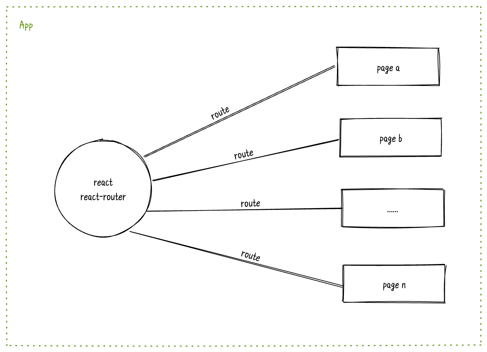
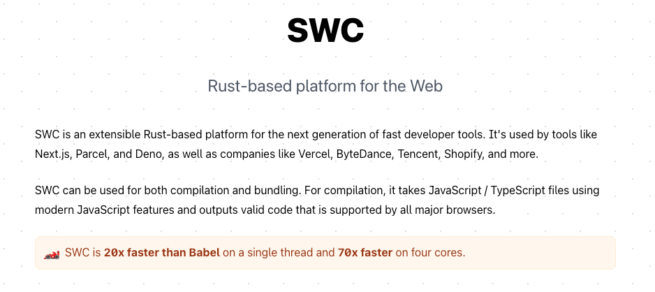

在我负责的业务里面, 有个项目用于存放运营活动页面, 通常情况下每次运营活动都会相应地搭配一个或数个活动页面.
这个项目使用 react 构建 UI, 活动页面没有 SEO 的需求, 所以采用的是浏览器渲染.
同时使用前端路由, 每个活动页面都是 react-router 的子路由.
随着时间的增长, 已经包含超过 150 个活动页面, 所有的页面加上基础的容器组件构成了一个超大的单体应用.

但是这个项目的架构并不合理.

首先, 各个活动页面之间并没有联系, 由于这是一个单体应用, 导致打开任何一个活动页面都会加载整个应用, 所以随着页面的增加, 应用的体积也会越来越大.
为了避免这种情况, 需要进行代码分割, 每个页面作为一个模块进行动态加载(dynamic import), 例如使用 [react-loadable](https://github.com/jamiebuilds/react-loadable) 或者 [lazy](https://reactjs.org/docs/react-api.html#reactlazy) + [Suspense](https://reactjs.org/docs/react-api.html#reactsuspense) 的方式.

其次, 所有活动页面共用相同的依赖, 像是一些本地模块(components/utils/...)或者 npm package.
很多过期的活动页面只需要让运营或者用户能够访问到就可以, 其实已经不再需要维护了, 当修改本地模块或者升级 npm package 版本遇到不兼容的情况时, 需要修改所有调用的代码, 也包括不再维护的页面, 页面数量的增加会导致维护成本越来越高.
比如这个项目 react 的版本依然是 16, [升级到 18](https://reactjs.org/blog/2022/03/08/react-18-upgrade-guide.html) 的话需要调整大量已过期页面的 class component.

最后是打包的问题. 这个项目使用 webpack 构建, 生产环境下 150+ 页面需要 10 分钟以上的打包时间.

基于以上问题考虑, 我们创建了一个新的项目用于后面的活动页面, 这里有个[仓库](https://github.com/mebtte/activity-project-template)用于展示最小的[在线 DEMO](https://activity-project-template.vercel.app)(Served by [Vercel](https://vercel.com)).

首先, 新的项目使用 [Parcel](https://parceljs.org) 进行打包.
之所以使用 Parcel, 有这几个原因:

- 支持 HTML 文件作为入口. 在 HTML 作为入口的情况下, 可以为每个活动页面建立自己的 HMTL 文件, 这样使得每个活动页面都是独立的子应用, 避免旧项目所有活动页面耦合的问题. 使用 webpack 也可以做到多个活动页面独立, 每个页面单独一个入口并添加页面对应的 `html-webpack-plugin` 或者一个页面对应一份 webpack 配置(webpack 配置支持数组), 不过这种方法会让 webpack 的编译速度大打折扣, 并且会导致修改代码后的增量编译非常慢.
- 相对于 webpack, Parcel 的配置更加简单, 多数情况下可以做到零配置. 在这个项目上我们只添加了额外的插件, 而且新加页面的情况下完全不用修改配置.
- Parcel 底层使用 [SWC](https://github.com/swc-project/swc) 作为编译器, SWC 使用 [Rust](https://www.rust-lang.org) 编写, 多核情况下编译速度是 [babel](https://babeljs.io) 的 70 倍.

因为每个新页面都要创建对应的 `HTML` 和 `JS` 文件, 这种重复性的工作适合使用脚本减少工作量, 所以编写了新建页面的[脚本](https://github.com/mebtte/activity-project-template/blob/master/scripts/new_page/index.js), 通过 `npm run new-page` 就可以新建页面.

在旧项目上, 因为每个页面都是 `react-router` 的子路由, 所以必须使用 react 编写.
但是, 新项目每个页面都是彼此独立的子应用, 不必受制于其他页面使用的框架或者库, 可以实现 A 页面用的是 react, 而 B 页面用的是 vue.
所以新建页面的脚本预置了 react/vue/vanilla 三种模板, 当然, 也可以手动新建页面使用任何框架或者库.

<video src="./new_page.mp4" alt="通过脚本使用模板新建页面"></video>

页面增加导致的维护成本越来越高的问题, 也就是已完结的活动因为仍需要访问到页面, 所以不能删除页面源码, 修改过期页面涉及到的公共模块导致我们需要持续性地维护这些过期的页面, 页面数量越多, 维护的成本越高.

所以, 我们提出了归档的概念.
像这些过期的页面, 我们将编译后的产物提交到 git, 然后删除源码, 保证了页面的正常访问和避免了后续维护.
同时, 过期页面后续作为静态资源, 后续不需要重复编译, 避免了页面的累积导致编译时间越来越长的问题.

同样地, 我们使用[脚本](https://github.com/mebtte/activity-project-template/blob/master/scripts/archive.js)来进行归档, 归档的流程是这样的:

1. 选择要进行归档的页面
2. 利用 Parcel API 只编译归档的页面
3. 将构建后的产物复制到 Parcel 的静态目录
4. 移除归档页面的源码

<video src="./archive.mp4" alt="归档一个页面"></video>

由于开发模式下 Parcel 不支持自动索引静态资源的 `index.html`, 所以要手动补全路径. 在测试和线上环境我们使用 nginx 提供静态资源服务, nginx 会自动索引 `index.html`, 所以访问 `b.mebtte.com/bbb` 和 `b.mebtte.com/bbb/index.html` 是一致的.

为了降低维护成本, 避免同时维护新旧两个项目, 旧项目的活动页面会在全部活动结束后迁移到新的项目, 然后进行归档. 比如旧项目的域名是 a.mebtte.com, 新项目的域名是 b.mebtte.com, 在页面迁移到新项目并归档后, 只需要将 a.mebtte.com 通过 HTTP 301 重定向到 b.mebtte.com, 由于迁移过程中保证了页面的路径不变, 从而重定向后的 URL 能够正确地访问到页面, 实现了无缝切换.
