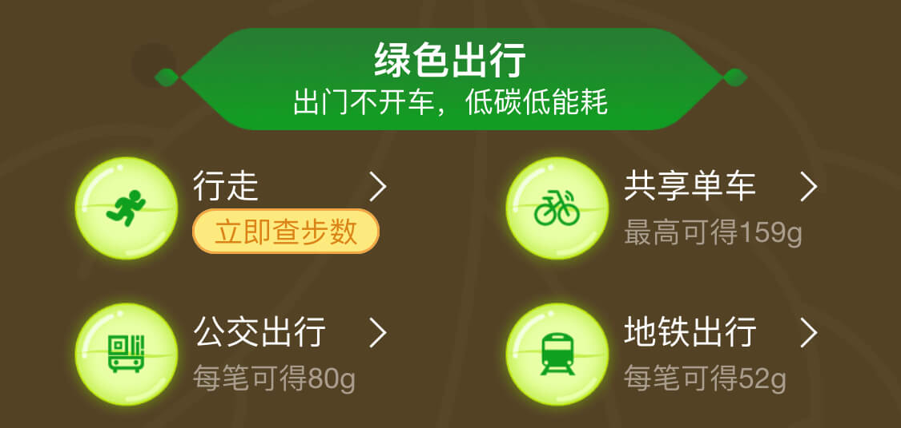
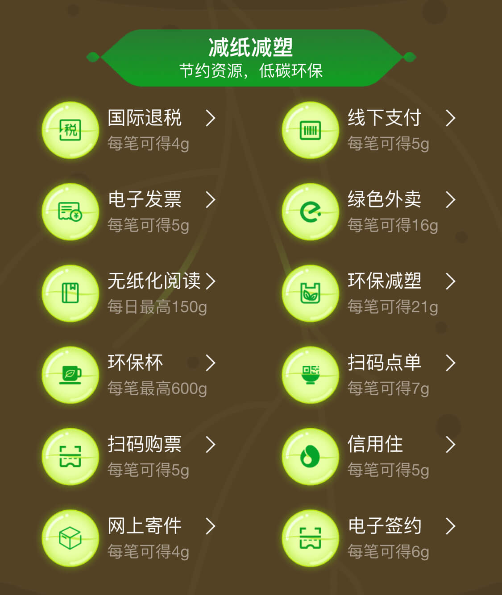

假如你是一个支付宝的开发, 一天产品提出了一个叫做`蚂蚁果园`功能需求

> 给每个用户分配一棵虚拟的苹果树, 当使用支付宝进行一笔线下付款后, 产生一份能量. 用户可以收集能量, 果树随着能量值增加而长大, 当能量达到某个值的时候, 用户可以消耗能量值兑换苹果一份.

你分析了一下这个功能, 画了个流程图, 然后就开始动手实现


```js
线下付款() {
  原有线下付款逻辑;
  产生能量;
}
```

功能上线后反响不错, 产品想进一步推广这个功能, 提出了新的需求, 在原有基础上, 生活缴费也能产生能量. 你发现这个逻辑跟线下付款流程是一样的, 所以有下面的实现

```js
线下付款() {
  原有线下付款逻辑;
  产生能量;
}

生活缴费() {
  原有生活缴费逻辑;
  产生能量;
}
```

又过了几天, 产品跑过来跟你说"蚂蚁果园这个功能火了, 我们决定全力推广, 这里有个列表, 上面的操作都可以产生能量





于是就有了这样的实现

```js
线下付款() {
  原有线下付款逻辑;
  产生能量;
}

生活缴费() {
  原有生活缴费逻辑;
  产生能量;
}

公交出行() {
  原有公交出行逻辑;
  产生能量;
}

共享单车() {
  原有共享单车逻辑;
  产生能量;
}


国际退税() {
  原有国际退税逻辑;
  产生能量;
}

// ...
// 在各个原有逻辑上添加产生能量的逻辑
```

在功能更新上线后的不久, 产品又提出了一个`蚂蚁猪圈`的功能

> 给每个用户分配一头虚拟的猪, 在蚂蚁果园产生能量的同时产生一份饲料, 用户可以收集饲料, 猪随着饲料值的增加而长大, 当饲料值达到某个值的时候, 用户可以消耗饲料值兑换猪肉一份.

你发现饲料和能量产生的逻辑是一样的, 于是有这样的实现

```js
线下付款() {
  原有线下付款逻辑;
  产生能量;
  产生饲料;
}

生活缴费() {
  原有生活缴费逻辑;
  产生能量;
  产生饲料;
}

公交出行() {
  原有公交出行逻辑;
  产生能量;
  产生饲料;
}

共享单车() {
  原有共享单车逻辑;
  产生能量;
  产生饲料;
}


国际退税() {
  原有国际退税逻辑;
  产生能量;
  产生饲料;
}

// ...
// 在各个原有逻辑上添加产生能量和产生饲料的逻辑
```

过了几天产品又跑了过来说由于猪肉涨价, 导致`蚂蚁猪圈`的成本大幅上升, 为了控制成本, 需要临时将`蚂蚁猪圈`下线, 等猪肉价格降下来以后再重新上线.

没有办法, 你只好将产生饲料的代码移除, 等到`蚂蚁猪圈`重新上线时再恢复产生饲料的代码.

---

上面的实现存在一个问题, 就是不同业务之间耦合严重. 比如线下付款, 产生能量和产生饲料应该分属付款业务, 蚂蚁果园业务和蚂蚁猪圈业务, 但是果园和猪圈业务代码被嵌入到付款业务里, 造成的问题就是每次果园或者猪圈业务的调整, 都会修改付款业务的代码, 这样操作容易给付款业务引入 BUG. 另外一点就是代码维护困难, 比如明天产品要增加`蚂蚁牛圈`的功能, 后天增加`蚂蚁菜园`的功能, 大后天下线`蚂蚁果园`功能, 通通都要修改线下付款的代码, 这样的代码维护起来极其困难.

对于这类问题, 可以通过业务代码分离和消息队列(Message Queue)解决.

### 业务代码分离

业务代码分离指的是每个业务实现自己的服务, 业务相关的接口放在各自的服务. 比如上面的例子, 可以分成付款, 果园和猪圈三个服务

```js
付款服务 {
  线下付款() { ... }
  生活缴费() { ... }
  公交出行() { ... }
  ...
}

蚂蚁果园服务 {
  产生能量() { ... }
  收集能量() { ... }
  兑换苹果() { ... }
  ...
}

蚂蚁猪圈服务 {
  产生饲料() { ... }
  收集饲料() { ... }
  兑换猪肉() { ... }
  ...
}
```

将不同业务分离成独立服务后, 服务之间怎样进行沟通呢? 通常情况是通过各种 rpc, 但在这个场景下, MQ 更合适.

### 消息队列

在果园的场景下, MQ 的作用相当于一个消息中心.


```js
付款服务 {
  线下付款() {
    线下付款操作;
    通知消息队列"某个用户完成一笔线下付款";
  }
  ...
}

蚂蚁果园服务 {
  监听"某个用户完成一笔线下付款" {
    蚂蚁果园服务.产生能量();
  }
  ...
}
```

当用户完成一笔线下付款后, 会向消息队列发送一个"某个用户完成一笔线下付款"的消息, 果园服务在监听"某个用户完成一笔线下付款"消息的情况下, 收到消息后调用产生能量接口给用户产生能量.

通过消息队列, 实现了支付服务和蚂蚁果园服务解构.

这里有个问题, 为什么支付服务不直接通知果园服务, 而是要通过消息队列呢?

首先, 如果由支付服务直接通知果园服务, 这样的话支付服务依然跟果园服务相关联, 没有完全解构. 其次, 在消息队列作为中介的情况下, 加入猪圈服务我们不需要修改支付服务的代码.


```js
付款服务 {
  线下付款() {
    线下付款操作;
    通知消息队列"某个用户完成一笔线下付款";
  }
  ...
}

蚂蚁果园服务 {
  监听"某个用户完成一笔线下付款" {
    蚂蚁果园服务.产生能量();
  }
  ...
}

蚂蚁猪圈服务 {
  监听"某个用户完成一笔线下付款" {
    蚂蚁猪圈服务.产生饲料();
  }
  ...
}
```

对比一下可以发现, 在加入猪圈服务的情况下, 只需要猪圈服务主动监听消息, 完全不需要修改支付服务的任何代码就能实现线下付款产生饲料.

同理, 后续什么`蚂蚁菜园`, `蚂蚁牛圈`等一系列功能增加, 同样无需修改支付服务的代码, 这一系列功能下线也是一样. 对于`生活缴费`, `公交出行`和`共享单车`等其他可以产生能量/饲料的操作, 只需要增加消息类型, 在原有逻辑添加触发消息的操作, 在其他服务监听消息完成对应的操作就可以了.

```js
付款服务 {
  线下付款() {
    线下付款操作;
    通知消息队列"某个用户完成一笔线下付款";
  }

  生活缴费() {
    生活缴费操作;
    通知消息队列"某个用户完成一笔生活缴费";
  }

  公交出行() {
    公交出行操作;
    通知消息队列"某个用户完成一次公交出行";
  }

  ...
}

蚂蚁果园服务 {
  监听"某个用户完成一笔线下付款" {
    蚂蚁果园服务.产生能量();
  }

  监听"某个用户完成一笔生活缴费" {
    蚂蚁果园服务.产生能量();
  }

  监听"某个用户完成一次公交出行" {
    蚂蚁果园服务.产生能量();
  }

  ...
}

蚂蚁猪圈服务 {
  监听"某个用户完成一笔线下付款" {
    蚂蚁猪圈服务.产生饲料();
  }

  监听"某个用户完成一笔生活缴费" {
    蚂蚁猪圈服务.产生饲料();
  }

  监听"某个用户完成一次公交出行" {
    蚂蚁猪圈服务.产生饲料();
  }

  ...
}
```

#### 参考

- 什么是消息队列？[https://juejin.im/post/5cb025fb5188251b0351ef48](https://juejin.im/post/5cb025fb5188251b0351ef48)
