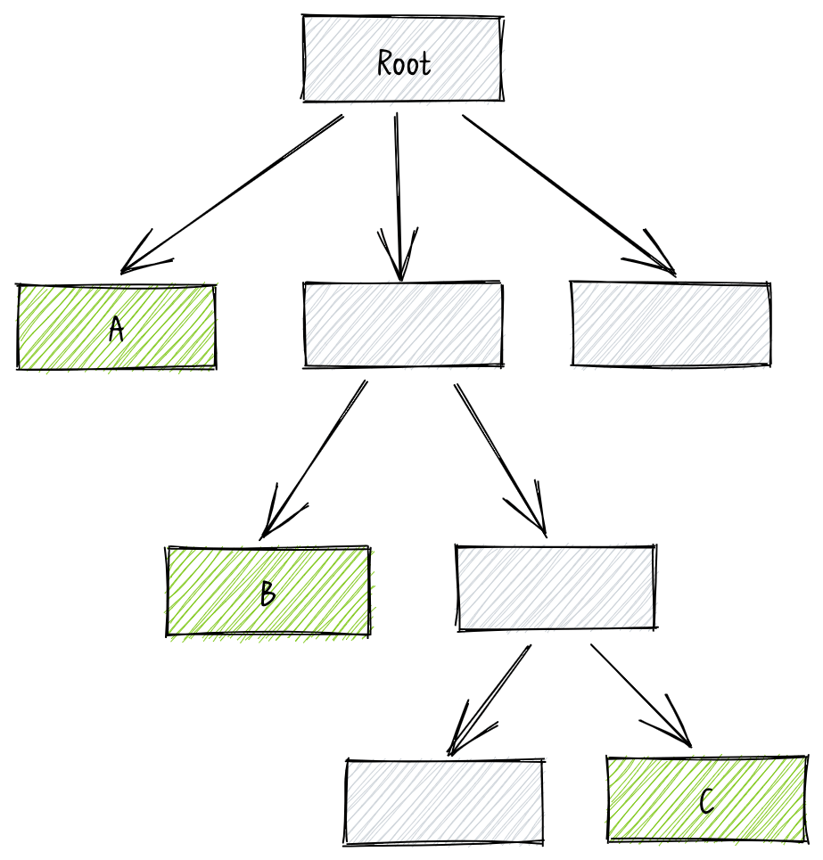

## 使用 function 作为 useState 的初始值

计算机科学中存在一个[求值策略](https://zh.wikipedia.org/wiki/%E6%B1%82%E5%80%BC%E7%AD%96%E7%95%A5)的问题, 简单来说就是什么时候计算参数的值, 比如以下伪代码:

```txt
function fn(n) {
  return n * 2
}

x = 1
y = fn(x + 1)
```

`fn(x + 1)` 中的 `x + 1` 是什么时候计算的呢? 目前有两种流派, 第一种是**传值引用**, 先对参数计算, 然后执行函数, 也就是 `y = fn(x + 1) = fn(2)`. 第二种是**传名引用**, 把函数内用到参数的地方替换成具体的参数表达式, 函数运行时再进行计算, 可以表示为:

```txt
x = 1
y = f(x + 1) = fn() {
  return (x + 1) * 2
}
```

传值引用实现起来比较简单, 但会有性能损耗, 比如 `fn(x + 1, x + 2, x + 3)` 后面两个的参数实际上不会用到也会进行计算. 传名引用可以做到按需计算, 但是实现起来比较复杂. 在 JavaScript 中采用的是传值引用.

> JavaScript 也可以模拟传名引用, 具体可以查看阮一峰老师的 [Thunk 函数的含义和用法](https://www.ruanyifeng.com/blog/2015/05/thunk.html)

回到 React 相关的话题, 来看下面这个例子, `Input` 组件的初始值从 `localStorage` 获取, 后续根据用户输入更新:

```jsx
const Input = () => {
  const [value, setValue] = useState(
    localStorage.getItem('initial_value') || '',
  );
  const onChange = (event) => setValue(event.target.value);

  return (
    <input type="text" value={value} onChange={onChange} />
  );
};
```

假设用户输入了 `abcde` 这串字符, 那么一共读取 `localStorage` 多少次?

答案是 6 次. 可能有人会认为只有初始化的 1 次, 但是上面说到 JavaScript 是传值引用, `useState` 是一个函数, 所以每次调用的参数 `localStorage.getItem("initial_value") || ""` 都会计算一遍, 所以一共读取了 6 次 `localStorage`. 我们可以稍微改造一下验证是否正确, 将 `localStorage.getItem` 的调用替换成自定义函数 `getInitialState`:

<iframe
  src="https://codesandbox.io/embed/use-state-is-a-function-all-pyvnen?fontsize=14&hidenavigation=1&theme=dark"
  title="use_state_is_a_function_all"
  allow="accelerometer; ambient-light-sensor; camera; encrypted-media; geolocation; gyroscope; hid; microphone; midi; payment; usb; vr; xr-spatial-tracking"
  sandbox="allow-forms allow-modals allow-popups allow-presentation allow-same-origin allow-scripts"
></iframe>

当输入 `abcde` 这串字符, 可以看到 `getInitialState` 被调用了 6 次. 假如 `getInitialState` 计算量特别大的话将产生明显的性能问题.

`useState` 可以接受值作为初始值外, 还可以接受函数并自动调用该函数进行获得初始值, 所以上面的例子可以使用 function 作为 useState 的初始值进行优化:

```jsx
import { useState } from 'react';

function getInitialState() {
  return localStorage.getItem('initial_value') || '';
}

const Input = () => {
  const [value, setValue] = useState(getInitialState);
  const onChange = (event) => setValue(event.target.value);

  return (
    <input type="text" value={value} onChange={onChange} />
  );
};

export default Input;
```

优化后的例子无论用户输入多少次都只有在初始化时读取 `localStorage` 一次.

## 合理使用 useCallback 和 useMemo

之前分析过这个问题, <a href="/use_callback_misunderstanding" target="_blank">useCallback 的误区</a>.

## 缩小 state 影响范围

```jsx
import OtherComponent from 'other-component';

const Label = ({ label }) => <div>{label}</div>;

const InputField = () => {
  const [value, setValue] = useState('');
  const onChange = (event) => setValue(event.target.value);

  return (
    <OtherComponent>
      <Label label="姓名" />
      <input type="text" value={value} onChange={onChange} />
    </OtherComponent>
  );
};
```

观察上面例子, `value` 作为 `InputField` 的 `state` 发生变化会导致 `OtherComponent`/`Label`/`input` 重新渲染, 仔细分析可以发现, `OtherComponent` 和 `Label` 的渲染跟 `value` 没有关系, 我们可以通过 `React.memo` 避免这种无效的渲染, 不过更好的办法是将 `value` 的影响范围缩小:

```jsx
import OtherComponent from 'other-component';

const Label = ({ label }) => <div>{label}</div>;

const Input = () => {
  const [value, setValue] = useState('');
  const onChange = (event) => setValue(event.target.value);

  return (
    <input type="text" value={value} onChange={onChange} />
  );
};

const InputField = () => (
  <OtherComponent>
    <Label label="姓名" />
    <Input />
  </OtherComponent>
);
```

把 `Input` 独立成组件后, `value` 的影响范围局限在 `Input` 组件自身, 避免导致其他组件的无效渲染. 我们再看一个复杂点的例子:



一个组件表示为上图的树形结构, 假设有一个 `state` 被 `A`/`B`/`C` 所使用的, 因为 React 遵循自上到下的单项数据流, 为了保证 `A`/`B`/`C` 都能拿到 `state`, 那么 `state` 只能定义在 `Root`, 当 `state` 发生变化时整个组件树都会重新渲染. 不过仔细观察可以发现, 除了 A/B/C 外其他组件的重新渲染都是没有必要的.

那有没有办法避免这些不必要的渲染?

因为 React 父组件渲染的同时会导致子组件的渲染, 为了避免无效渲染只能将 `state` 克隆多份并下放到 A/B/C 自身, 那怎么保证 A/B/C `state` 的值是正确的以及如何及时更新?

可以通过广播. 我们可以在 `Root` 保存一份 `state` 的 `ref`, 因为 `ref` 的变化不会导致重新渲染, 然后在 A/B/C 新建各自的 `state` , `stateRef` 的值作为 props 往下传递作为 A/B/C `state` 的初始值, 当 `stateRef` 发生变化时进行广播, A/B/C 通过监听对应的广播对 `state` 进行更新.


这样的话达到了只更新对应组件的目的, 但是问题也很明显, 增加了代码的复杂度以及导致数据流难以追踪, 所以这个方法只建议用在影响范围大且更新频繁的 `state` 上.

## 组件内使用的可变变量不要放在组件外部

```jsx
let timer;

const Calculagraph = () => {
  const [seconds, setSeconds] = useState(0);
  const onStart = () => {
    window.clearInterval(timer);
    timer = window.setInterval(
      () => setSeconds((s) => s + 1),
      1000,
    );
  };
  const onPause = () => window.clearInterval(timer);

  return (
    <div>
      seconds: {seconds}
      <div>
        <button type="button" onClick={onStart}>
          start
        </button>
        <button type="button" onClick={onPause}>
          pause
        </button>
      </div>
    </div>
  );
};
```

上面是一个计时器组件, 点击 `start` 后每 100 毫秒加一, 点击 `pause` 计时暂停.

不过这个计时器组件存在一个问题, 当同时存在多个实例时, `start` 任何一个计时器都会导致其他计时器的暂停:

<iframe
  src="https://codesandbox.io/embed/caculagraph-6ms0yy?fontsize=14&hidenavigation=1&theme=dark"
  title="caculagraph"
  allow="accelerometer; ambient-light-sensor; camera; encrypted-media; geolocation; gyroscope; hid; microphone; midi; payment; usb; vr; xr-spatial-tracking"
  sandbox="allow-forms allow-modals allow-popups allow-presentation allow-same-origin allow-scripts"
></iframe>

原因在于 `Caculagraph` 是一个独立的模块, 模块顶层的 `timer` 变量是所有 `Caculagraph` 实例共用的, 所以任何一个计时器实例操作 `timer` 都会影响其他的计时器实例.

像这种组件内使用的可变变量不应该放在组件外部, 应该使用 `ref` 放在组件内部:

```jsx
import { useState, useRef } from 'react';

const Caculagraph = () => {
  const [seconds, setSeconds] = useState(0);

  const timerRef = useRef();
  const onStart = () => {
    window.clearInterval(timerRef.current);
    timerRef.current = window.setInterval(
      () => setSeconds((s) => s + 1),
      1000,
    );
  };
  const onPause = () => window.clearInterval(timerRef.current);

  // ...
};
```

上面的例子只是用来说明组件内使用的可变变量不要放在组件外部, 实际上这个组件的设计并不合理而且存在组件卸载定时器没有清除的问题, 最优代码应该是这样:

```jsx
const Caculagraph = () => {
  const [seconds, setSeconds] = useState(0);
  const [running, setRunning] = useState(false);
  const onStart = () => setRunning(true);
  const onPause = () => setRunning(false);

  useEffect(() => {
    if (running) {
      const timer = window.setInterval(
        () => setSeconds((s) => s + 1),
        1000,
      );
      return () => window.clearInterval(timer);
    }
  }, [running]);

  // ...
};
```

## 合并相关联 state 减少渲染次数

<iframe
  src="https://codesandbox.io/embed/separate-state-xl5eiz?fontsize=14&hidenavigation=1&theme=dark"
  title="separate_state"
  allow="accelerometer; ambient-light-sensor; camera; encrypted-media; geolocation; gyroscope; hid; microphone; midi; payment; usb; vr; xr-spatial-tracking"
  sandbox="allow-forms allow-modals allow-popups allow-presentation allow-same-origin allow-scripts"
></iframe>

上面的例子模拟从接口获取数据然后展示, 请求中/请求成功/请求失败都有对应的 UI, 可以看到, 无论请求成功还是请求失败都会产生 3 次渲染, 第一次渲染是组件初始化, 第二次渲染是请求成功的 `setData` 或者请求失败的 `setError`, 第三次渲染是最后的 `loading` 状态重置 `setLoading(false)`.

仔细分析可以发现, `setData`/`setError` 后面始终跟着 `setLoading(false)`, 如果把 `data`/`error` 和 `loading` 合并成一个 `state` 的话那就可以减少一次渲染.

```tsx
const useData = () => {
  const [data, setData] = useState<
    /** 请求中 */
    | {
        loading: true;
        error: null;
        value: number;
      }
    /** 请求失败 */
    | {
        loading: false;
        error: Error;
        value: number;
      }
    /** 请求成功 */
    | {
        loading: false;
        error: null;
        value: number;
      }
  >({ loading: true, error: null, value: 0 });
  const getData = useCallback(async () => {
    setData({ loading: true, error: null, value: 0 });
    try {
      await new Promise((resolve) =>
        window.setTimeout(resolve, 2000),
      );
      if (Math.random() > 0.6) {
        throw new Error('mock error');
      }
      setData({
        loading: false,
        error: null,
        value: Math.random(),
      });
    } catch (e) {
      setData({ loading: false, error: e as Error, value: 0 });
    }
  }, []);

  useEffect(() => {
    getData();
  }, [getData]);

  return { data, reload: getData };
};

const App = () => {
  const { data, reload } = useData();

  console.count('render');

  if (data.error) {
    return (
      <div>
        <div>error: {data.error.message}</div>
        <button type="button" onClick={reload}>
          reload
        </button>
      </div>
    );
  }
  if (data.loading) {
    return <div>loading...</div>;
  }
  return (
    <div>
      <div>data: {data.value}</div>
      <button type="button" onClick={reload}>
        refresh
      </button>
    </div>
  );
};
```

相比之前, 合并相关联 `state` 后减少了一次渲染.

## 不变的 props 可以提升为常量

<iframe
  src="https://codesandbox.io/embed/red-bush-p3ue5n?fontsize=14&hidenavigation=1&theme=dark"
  title="anonymous_object_as_props"
  allow="accelerometer; ambient-light-sensor; camera; encrypted-media; geolocation; gyroscope; hid; microphone; midi; payment; usb; vr; xr-spatial-tracking"
  sandbox="allow-forms allow-modals allow-popups allow-presentation allow-same-origin allow-scripts"
></iframe>

上面的例子中, 使用 `React.memo` 对 `Label` 进行了优化, 在 `Input` 中因为 `Label` 的渲染跟 `value` 没有关系, 所以 `value` 变化不会导致 `Label` 重新渲染. 不过实际情况是 `value` 变化会导致 `Label` 重新渲染.

分析这个问题我们对 `Input` 组件进行分解:

```jsx
const style = { color: 'red' };
return (
  <div>
    <Label style={style} />
    <input type="text" value={value} onChange={onChange} />
  </div>
);
```

可以发现每次渲染都会生成一个新的 `style` 对象, 前后两个 `style` 不相等导致 `React.memo` 失效.

因为每次渲染 `style` 的值是不变的, 像这种不变的 `props` 可以提升为常量从而实现优化.

```jsx
/** input.jsx */
import { useState } from 'react';

const Label = memo(({ style }) => {
  console.count('label render');

  return <div style={style}>label</div>;
});

const labelStyle = { color: 'red' };

const Input = () => {
  const [value, setValue] = useState('');
  const onChange = (event) => setValue(event.target.value);

  console.count('input render');

  return (
    <div>
      <Label style={labelStyle} />
      <input type="text" value={value} onChange={onChange} />
    </div>
  );
};

export default Input;
```
