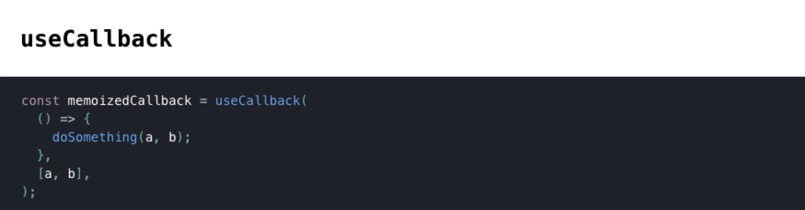

`useCallback` 接受一个回调函数和一个依赖数组作为参数, 当依赖数组的每一项都不变的情况下返回缓存过后的回调函数.

既然 `useCallback` 能够缓存函数, 那么所有的 Function 组件中的函数都用 `useCallback` 封装, 岂不是能够达到 `React` 应用优化的目的? 别急, 先看两个例子, 然后判断下面的 `App1` 和 `App2` 哪个性能更好 ?

```tsx
const App1 = () => {
  const [value, setValue] = useState('');
  const onValueChange = useCallback(
    (event: React.ChangeEvent<HTMLInputElement>) =>
      setValue(event.target.value),
    [],
  );

  return <input type="text" value={value} onChange={onValueChange} />;
};
```

```tsx
const App2 = () => {
  const [value, setValue] = useState('');
  const onValueChange = (event: React.ChangeEvent<HTMLInputElement>) =>
    setValue(event.target.value);

  return <input type="text" value={value} onChange={onValueChange} />;
};
```

`App1` 和 `App2` 的差别在于 `onValueChange` 前者用了 `useCallback`, 后者没有. 在定义中知道 `useCallback` 能够缓存函数, 当 `value` 发生变化的时候, `App1` 不会生成新的 `onValueChange`, 所以第一感觉肯定是 `App1` 的性能更好.

现在, 改写一下 `App1`, 再判断一下 `App1` 和 `App2` 哪个性能更好 ?

```tsx
const App1 = () => {
  const [value, setValue] = useState('');
  const onValueChange = (event: React.ChangeEvent<HTMLInputElement>) =>
    setValue(event.target.value);
  const dependenies = [];
  const onValueChangeInUseCallback = useCallback(onValueChange, dependenies);

  return (
    <input type="text" value={value} onChange={onValueChangeInUseCallback} />
  );
};
```

上面的 `App1` 跟开始的 `App1` 其实是一样的, 只是换了一种写法, 和 `App2` 对比一下可以发现, `App1` 比 `App2` 多了一个数组定义和一个 `useCallback` 调用, 所以跟开始的直觉相反, `App2` 比用了 `useCallback` 的 `App1` 性能更好.

所以不应该使用 `useCallback`, 因为 `useCallback` 会导致性能更差 ?

当然不是, `useCallback` 可以提高 React 的性能, 但是需要前提条件. 修改一下上面的例子, 给输入框添加了一个清除的功能:

<iframe
  src="https://codesandbox.io/embed/nousecallback-yfzkq?fontsize=14&hidenavigation=1&theme=dark"
  title="no_use_callback"
></iframe>

上面的例子中, `ClearButton` 接受 `onClear` 的 props, 当点击按钮的时候清除输入. 但是这个例子有一个问题, 就是当 `value` 发生变化的时候, 从 `Console` 可以看到 `ClearButton` 也会重新渲染. 从性能的角度来看, `value` 改变不应该导致 `ClearButton` 的重新渲染, 因为 `ClearButton` 只依赖 `onClear`, 但是 `value` 的改变会导致 `onClear` 的重新生成, 导致 `prevProps.onClear !== nextProps.onClear`, 从而导致 `ClearButton` 的重新渲染. 这个情况下 `useCallback` 就派上用场了.

<iframe
  src="https://codesandbox.io/embed/usecallback-vf9b8?fontsize=14&hidenavigation=1&theme=dark"
  title="use_callback"
></iframe>

在上面的例子中, 使用了 `useCallback` 封装了 `onClear`, 这样的话, `value` 改变不会导致 `onClear` 重新生成. 但是从 `Console` 看, 即使使用 `useCallback`, `value` 变化依然导致 `ClearButton` 重新渲染.

这个时候就要回到 `React` 的渲染上了, 对于 `React` 组件来说, **自身渲染必定导致子组件的重新渲染**, 只需要把 `onClear` 从 `ClearButton` 移除就能验证.

```tsx
const ClearButton = () => {
  console.count('clear button render');

  return <button type="button">clear</button>;
};

const App = () => {
  console.count('app render');

  const [value, setValue] = useState('');
  const onValueChange = (event: React.ChangeEvent<HTMLInputElement>) =>
    setValue(event.target.value);

  return (
    <>
      <input value={value} onChange={onValueChange} />
      <ClearButton />
    </>
  );
};
```

上面的例子中, 即使 `ClearButton` 没有任何的 `props`, `value` 变化依然导致 `ClearButton` 重新渲染. 为什么会这样呢? 再改写一下上面的 `App` 就清楚了.

```tsx
const App = () => {
  console.count('app render');

  const [value, setValue] = useState('');
  const onValueChange = (event: React.ChangeEvent<HTMLInputElement>) =>
    setValue(event.target.value);

  return React.createElement(React.Fragment, {}, [
    React.createElement('input', { value, onChange: onValueChange }, null),
    React.createElement(ClearButton, {}, null),
  ]);
};
```

`React.createElement` 第二个参数是组件的 `props`, 可以看到, 即使 `ClearButton` 没有任何的 `props`, `App` 的每次渲染依然会传递一个新的**空对象**作为它的 `props`, 这就是 `ClearButton` 重新渲染的原因.

那如何才能避免这种没有必要的渲染呢? 答案就是 Class 组件的 `shouldComponentUpdate` 生命周期和 Function 组件的 `React.memo`, `shouldComponentUpdate` 和 `React.memo` 能够让开发者手动判断组件是否需要重新渲染.

对于上面的例子, 只需要在 `ClearButton` 外面包一层 `React.memo`, 就能够避免 `ClearButton` 的重新渲染.

<iframe
  src="https://codesandbox.io/embed/usecallbackwithmemo-h74x0?fontsize=14&hidenavigation=1&theme=dark"
  title="use_callback_with_memo"
></iframe>

所以, `useCallback` 不是 `React` 性能优化的银弹, 相反, 错误的用法反而会导致负优化.

## useMemo

事实上, `useCallback` 是 `useMemo` 的一个语法糖, `useCallback(fn, dependencies)` 等同于 `useMemo(() => fn, dependencies)`. 和 `useCallback` 一样, `useMemo` 也不是用的越多越好, 那什么时候应该使用 `useMemo` 呢?

第一种情况和 `useCallback` 一样, 当子组件使用了 `shouldComponentUpdate` 或者 `React.memo`, `useMemo` 计算后的值能够保证 `props` 不变, 从而避免子组件的重复渲染.

第二种情况是值计算的性能消耗超过调用 `useMemo` 的性能消耗. 和上面 `useCallback` 的分解同理, 使用 `useMemo` 会增加一个计算函数 `fn` 的生成, 一个依赖数组 `dependencies` 的生成和一次 `useMemo` 的调用, 如果值的计算需要的性能大于 `useMemo` 的调用, 那么使用 `useMemo` 就能够达到优化效果.

#### 参考

- [When to useMemo and useCallback](https://kentcdodds.com/blog/usememo-and-usecallback)
