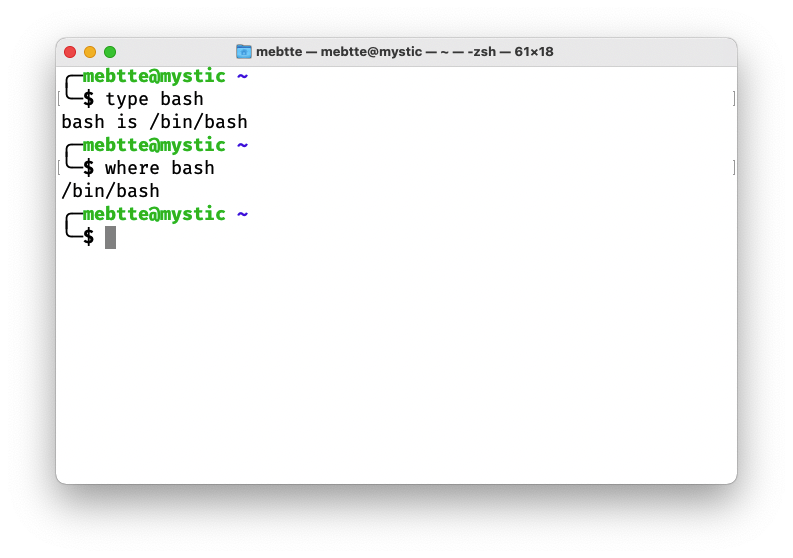
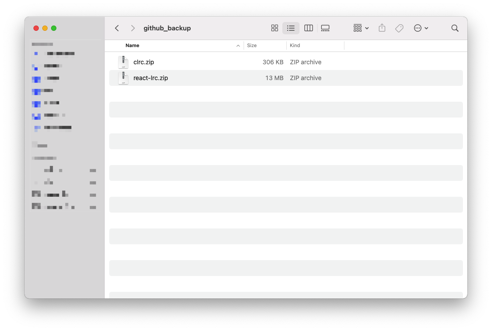
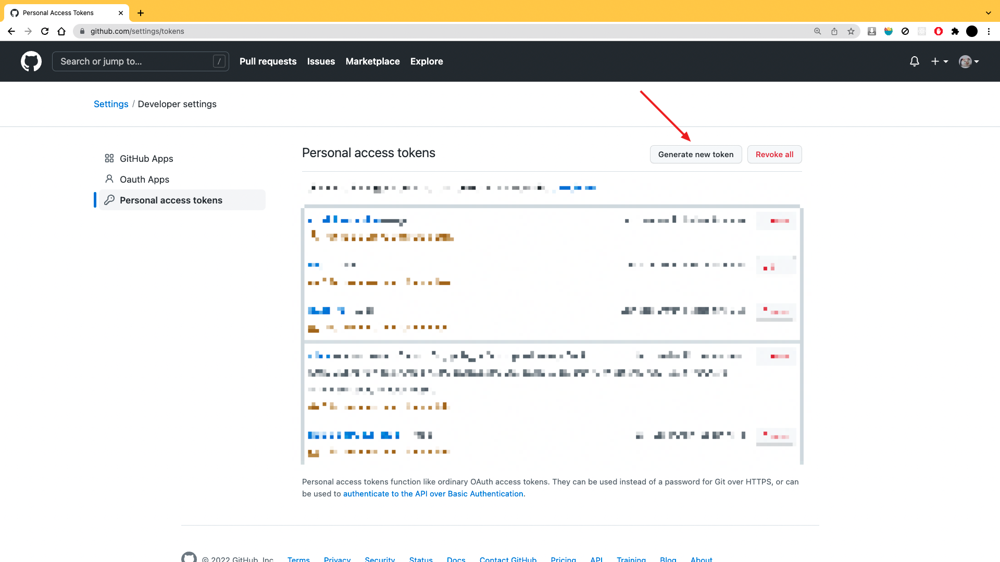
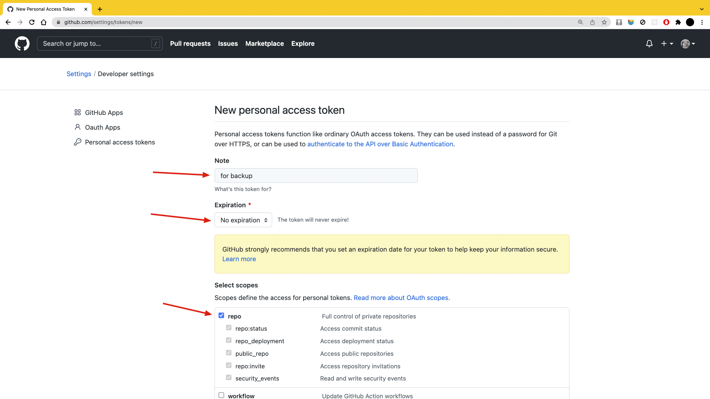
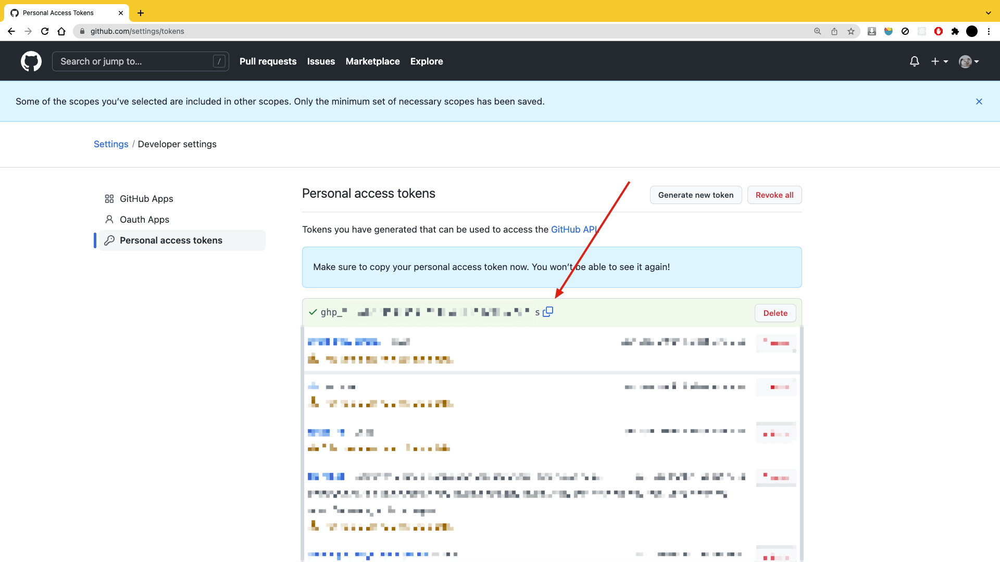
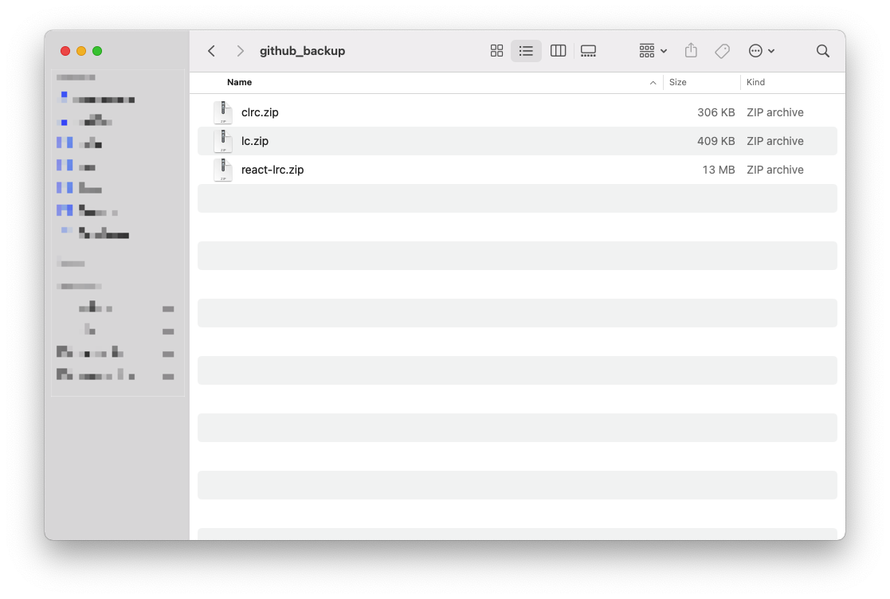

最近看到了几篇关于被 Github 被封号的帖子, 当然帖子说的不一定是真的, 也有可能是这些账号真的违反了 Github 政策. 不过俄乌战争闹得沸沸扬扬, Github 也有考虑对俄罗斯开发者进行限制, 无独有偶, 几年前 Github 就曾将伊朗的开发者账号封禁, 导致他们无法登录账号和访问代码仓库.

我在想某一天我的账号可能也会"有幸"遭到同样的对待, 那我在上面的数据怎么办? 基本上我所有代码都托管在 Github, 所以有考虑把 Github 仓库备份在本地, 毕竟在自己手上的数据才是自己的, 而且数据被误删的话也能通过备份找回来.

<iframe
  title="14:38 雷军讲述自己代码被删的故事"
  src="//player.bilibili.com/player.html?aid=243562981&bvid=BV1fv411q7sg&cid=203589945&page=1"
  scrolling="no"
  allowfullscreen="true"
></iframe>

> 这些年去中心化网络也发展的比较快, 很多人其实不放心把数据集中在几个互联网巨头手里, 这种担忧主要来源于互联网巨头对用户数据的不合理使用以及用户对数据缺乏掌控的不安全感, 希望未来能有好的方式处理这种问题吧.

备份仓库这种有规律的重复性工作, 使用脚本是最方便的. 备份流程是这样的:


如果仓库数量特别多的话, 整个备份流程下来可能会触发 Github 访问频率限制, 我们可以在每个仓库备份完成后休眠一段时间, 然后继续, 暂定休眠时间是五分钟.

```bash
# 需要备份的仓库, 用户名/仓库名
REPOSITORIES=("mebtte/clrc" "mebtte/react-lrc")

# 因为最终保存的是压缩文件
# 所以在临时目录进行操作
TMP_DIR=$(mktemp -d)
cd $TMP_DIR

# 遍历仓库备份
for repository in ${REPOSITORIES[@]}; do
  # 获取仓库名
  tmp_array=(${repository//\// })
  repository_name=${tmp_array[1]}

  # clone 仓库到本地
  git clone https://github.com/${repository}

  # 对仓库进行压缩
  zip_name=${repository_name}.zip
  zip -r $zip_name $repository_name

  # 把压缩文件移到备份目录
  # -f 强行覆盖之前的备份
  mv -f $zip_name ~/github_backup

  # 休眠等待下一个备份, 五分钟
  sleep 300
done

```

脚本运行的话有两种方式, 第一种是命令 + 脚本文件, 直接在终端执行 `bash backup_github.sh`.

第二种是 `Shebang` + 可执行权限. 如果脚本文件的首行以 `#!` 开头, 这行代码就称为 [Shebang](<https://en.wikipedia.org/wiki/Shebang_(Unix)>), Shebang 表示是哪个程序来执行这个脚本, 我们的脚本是通过 `bash` 执行的, 所以可以在脚本首行添加 `#!/bin/bash` 作为 Shebang, 如果你不知道 `bash` 路径的话, 可以通过 `type` 或者 `where` 指令查找.



又或者通过 `env` 程序帮我们查找对应命令所在的路径, 可以将 Shebang 改成 `#!/usr/bin/env bash`. 然后通过 `chmod +x backup_github.sh` 赋予脚本执行权限, 这样脚本就可以直接执行了.

```bash
./backup_github.sh
```

执行脚本后在备份目录成功看到了备份文件:



我们知道公开仓库所有人都可以 clone, 但是私有仓库 clone 是需要鉴权的, 上面的备份脚本只能备份公开仓库, 备份私有仓库的话还需要加入鉴权的逻辑. 很久之前 Github 已经废弃了账号密码的鉴权方式, 这时候就可以用上 [Github Personal Access Tokens](https://github.com/settings/tokens).







Github 支持以 `https://${token}@github.com/${username}/${repository}` 的格式进行鉴权, 将新生成的 Access Token 复制下来, 然后对备份脚本进行改造:

```bash
# 新增 Access Token 定义
ACCESS_TOKEN="access token"

# 改造 clone 地址
git clone https://${ACCESS_TOKEN}@github.com/${repository}
```

新增私有仓库进行测试, 可以看到私有仓库也成功备份了.



如果嫌弃手动备份麻烦的话, 可以配合 `crontab` 定时任务进行自动化备份.

### 参考

- [GitHub 有国界：全面封禁美国制裁地区开发者账户](https://www.infoq.cn/article/sa72sssezbpush_zh8xb)
