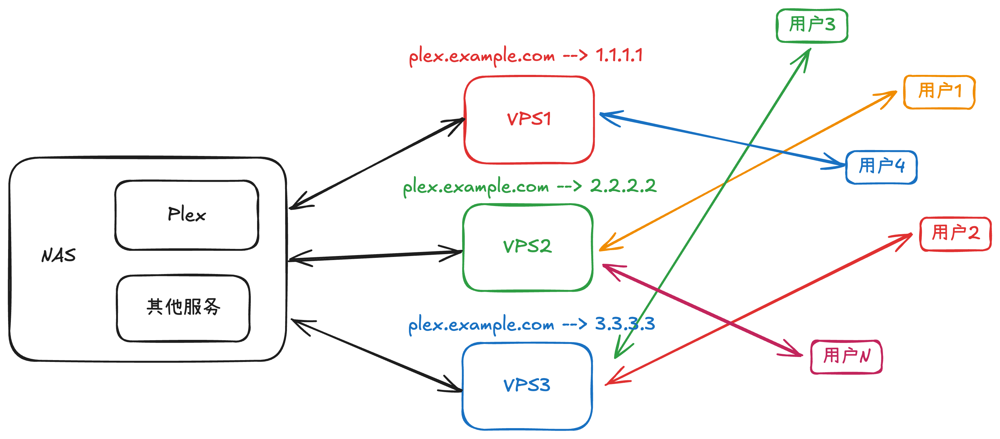

> 注意是**轮循**而不是**轮询**, 前者对应的英文是 round-robin, 后者对应 polling.

由于我的宽带没有公网 IP, 所以我的 NAS 上一些服务是通过内网穿透到具有公网 IP 的 VPS 上进行远程访问的. 这里有两个问题导致远程访问不太稳定, 一个是 NAS 和 VPS 之间的连接不稳定, 另一个是 VPS 本身不稳定, 从而导致服务不能稳定 24 小时在线, 所以我使用了三台 VPS 进行内网穿透, 当其中一台 VPS 访问不稳定时, 可以使用另外两台作为备份. 例如 [Plex](https://www.plex.tv) 服务, 为了方便访问, 每一台 VPS 都分配了唯一的域名:


当我访问 Plex 时, 我会先访问 `plex.vps1.example.com`, 如果访问出现问题我就会切换到 `plex.vps2.example.com`, 依此类推. 这种访问方式极其不优雅, 全靠人工寻找可用的服务. 这里还有个问题, 由于我总是按照 VPS1 --> VPS2 --> VPS3 的顺序进行访问, 所以就有可能出现 VPS1 流量用完而 VPS2 和 VPS3 流量完全未被消耗的情况.

为了避免这种情况, 我们可以引入负载均衡, 最简单的做法是新增 VPS4, 然后使用 VPS4 将流量均衡到另外三台 VPS.


这样子我就可以访问 `plex.example.com`, VPS4 自动将流量均衡到其他三台 VPS, 当其中某些 VPS 不可用时, 也能够保证流量分配到可用的 VPS. 但是这个方案存在三个问题:

1. VPS4 本身是个 VPS, 所有流量都经过它, 极易造成流量耗尽
2. VPS4 存在掉线风险, 掉线之后只能回退到 VPS1 --> VPS2 --> VPS3 逐台访问的方式
3. VPS4 需要额外花费以及维护成本

自建的负载均衡无法保证稳定的情况下, 我转向了商业负载均衡, 基本每个云厂商都有提供负载均衡服务, 但无一例外它们的价格都不低, 例如 Cloudflare 在 3 个终端节点的情况下, 月付费为 $10, 对于个人用户来说是不小的负担.


最后在快要放弃使用负载均衡方案的时候看到这么一篇[文章](https://blog.hyperknot.com/p/understanding-round-robin-dns), 了解到 DNS 轮循.

## 什么是 DNS 轮循

在 DNS 中, 使用 A 记录表示地址, 也就是域名映射 IP, 上面的例子中就存下以下 A 记录:

| 类型 | 名称      | 值      | TTL  |
| ---- | --------- | ------- | ---- |
| A    | plex      | 4.4.4.4 | auto |
| A    | plex.vps1 | 1.1.1.1 | auto |
| A    | plex.vps2 | 2.2.2.2 | auto |
| A    | plex.vps3 | 3.3.3.3 | auto |

当我们访问 `https://plex.vps1.example.com` 时, 会通过 A 记录 `plex.vps1` 将域名解析成 IP `1.1.1.1`, 然后向 `1.1.1.1` 所在的服务器发起 `HTTPS` 请求.

通常情况下, 相同名称的 A 记录只有一个, 但是也可以设置多个, 这就是 **DNS 轮循**.

> IP v6 同理, 不过 DNS 类型为 AAAA 记录.

我们可以通过 `nslookup` 来查询 DNS, 如果存在多条 DNS 记录则会一并列出:

```sh
> nslookup plex.example.com
Server:         8.8.8.8
Address:        8.8.8.8#53

Non-authoritative answer:
Name:   plex.example.com
Address: 1.1.1.1
Name:   plex.example.com
Address: 3.3.3.3
Name:   plex.example.com
Address: 2.2.2.2
```

在 DNS 轮循中, 每次 DNS 解析会返回 IP 列表, IP 列表的顺序是不固定的, 一般情况下客户端会对 IP 列表中的第一个发起请求, 由于 IP 列表的顺序不固定, 这就导致了请求随机分配到不同的 IP, 近似达到了负载均衡的效果.

但是这种策略也存在问题, 比如当其中某些服务器意外下线, DNS 轮循依然会返回已经下线的 IP, 当对这些 IP 发起请求时会造成服务不可用的假象.

所以现代大多数客户端不会使用以上策略, 而是会对 IP 进行优先级排序, 对高优先级的 IP 进行连接, 优先级排序大概如下:

1. 检查服务器是否在线
2. 检测在线服务器的网络延迟时间, 从低到高进行排序

> 通常情况下, 服务器的地址位置离用户越近则网络延迟越低

而且排序不是一次性的, 当网络发生变化或者与服务器连接存在问题时, 排序则会重新进行, 所以客户端总是能够连接**延迟最低**的**在线**服务器.

基于 DNS 轮循, 上面 Plex 服务的架构能够得到简化, 节省金钱成本和维护成本, 更重要的是还有负载均衡的加持.



所以在 NAS 内网穿透的场景下, 基于 DNS 轮循的负载均衡方案是最合适的选择. 不单单是这种场景, 个人用户最合适的负载均衡方案我认为也是基于 DNS 轮循.
