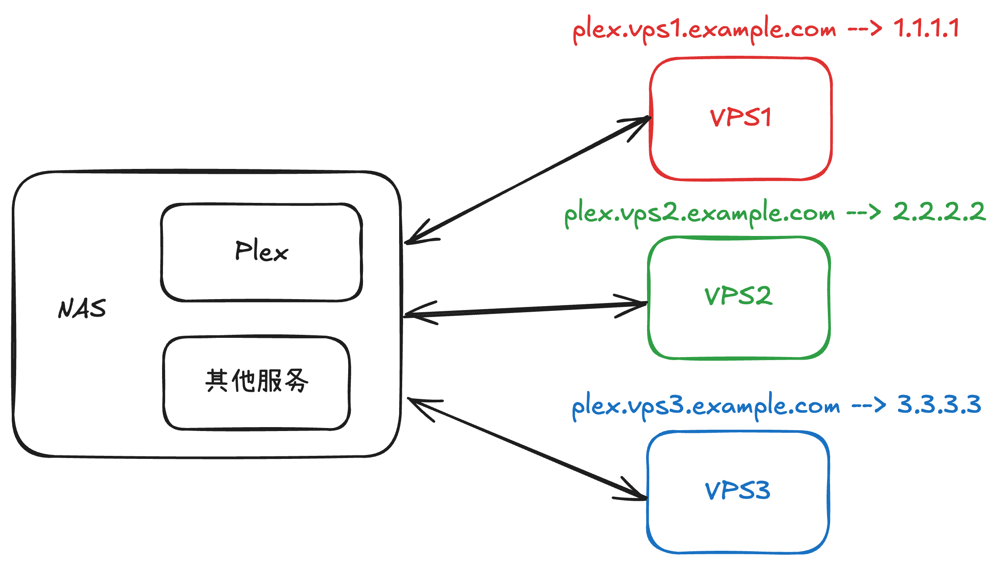
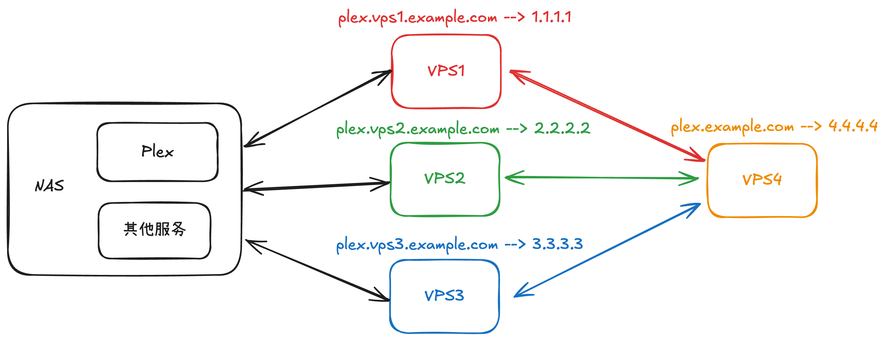
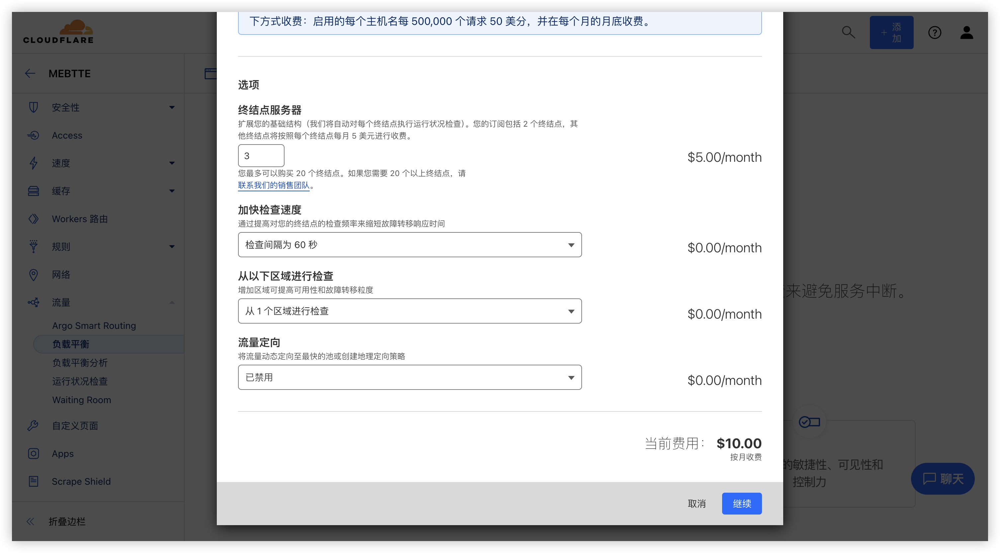

> 注意是轮循而不是轮询, 前者对应的英文是 round-robin, 后者对应 polling.

由于我的宽带没有公网 IP, 所以我的 NAS 上一些服务是通过内网穿透到具有公网 IP 的 VPS 上进行远程访问的. 这里有两个问题导致远程访问不太稳定, 一个是 NAS 和 VPS 之间的连接不稳定, 另一个是 VPS 本身不稳定, 从而导致服务不能稳定 24 小时在线, 所以我使用了三台 VPS 进行内网穿透, 当其中一台 VPS 访问不稳定时, 可以使用另外两台作为备份. 例如 [Plex](https://www.plex.tv) 服务, 为了方便访问, 内网穿透到每一台 VPS 都分配了域名映射 VPS 的 IP.

当我访问 Plex 时, 我会先访问 `plex.vps1.example.com`, 如果访问出现问题我就会切换到 `plex.vps2.example.com`, 依此类推. 这种访问方式极其不优雅, 全靠人工寻找可用的服务. 此外还有个问题, 由于我总是先访问 VPS1, 所以就有可能出现 VPS1 流量用完而 VPS2 和 VPS3 流量完全未被消耗的情况.

这时候我们可以引入负载均衡, 最简单的做法是新增 VPS4, 然后使用 VPS4 将流量均衡到另外三台 VPS.

这样子我就可以访问 `plex.example.com`, VPS4 自动将流量均衡到其他三台 VPS, 当其中某些 VPS 不可用时, 也能够保证流量分配到可用的 VPS. 但是这个方案存在三个问题:

1. VPS4 本身是个 VPS, 所有流量都经过它极易造成流量耗尽
2. VPS4 存在掉线风险, 掉线之后只能回退到 VPS 1/2/3 逐台访问的方式
3. VPS4 需要额外花费以及维护成本

自建的负载均衡无法保证稳定的情况下, 我转向了商业负载均衡, 基本每个云厂商都有提供负载均衡服务, 但无一例外它们的价格都不低, 例如 Cloudflare 在 3 个终端节点的情况下, 月付费为 $10, 对于个人用户来说算是不小的负担.

最后在快要放弃使用负载均衡方案的时候看到这么一篇[文章](https://blog.hyperknot.com/p/understanding-round-robin-dns), 了解到 DNS 轮循.

## 什么是 DNS 轮循

IP v6 同理

## 参考资料

- [什么是负载平衡？| 负载平衡器如何运作](https://www.cloudflare.com/zh-cn/learning/performance/what-is-load-balancing)
- [DNS 轮循](https://zh.wikipedia.org/wiki/DNS%E8%BD%AE%E5%BE%AA)
- [Round-robin DNS](https://en.wikipedia.org/wiki/Round-robin_DNS)
- [什么是循环 DNS？](https://www.cloudflare.com/zh-cn/learning/dns/glossary/round-robin-dns)
- [Understanding Round Robin DNS](https://blog.hyperknot.com/p/understanding-round-robin-dns)
